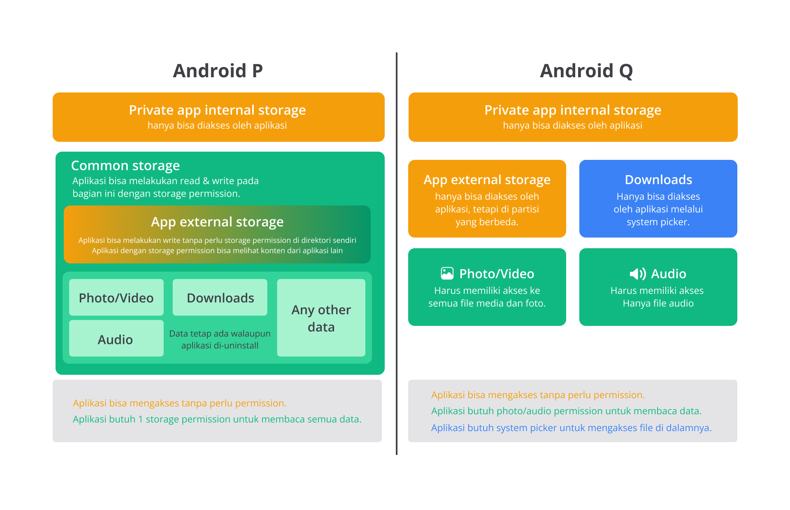
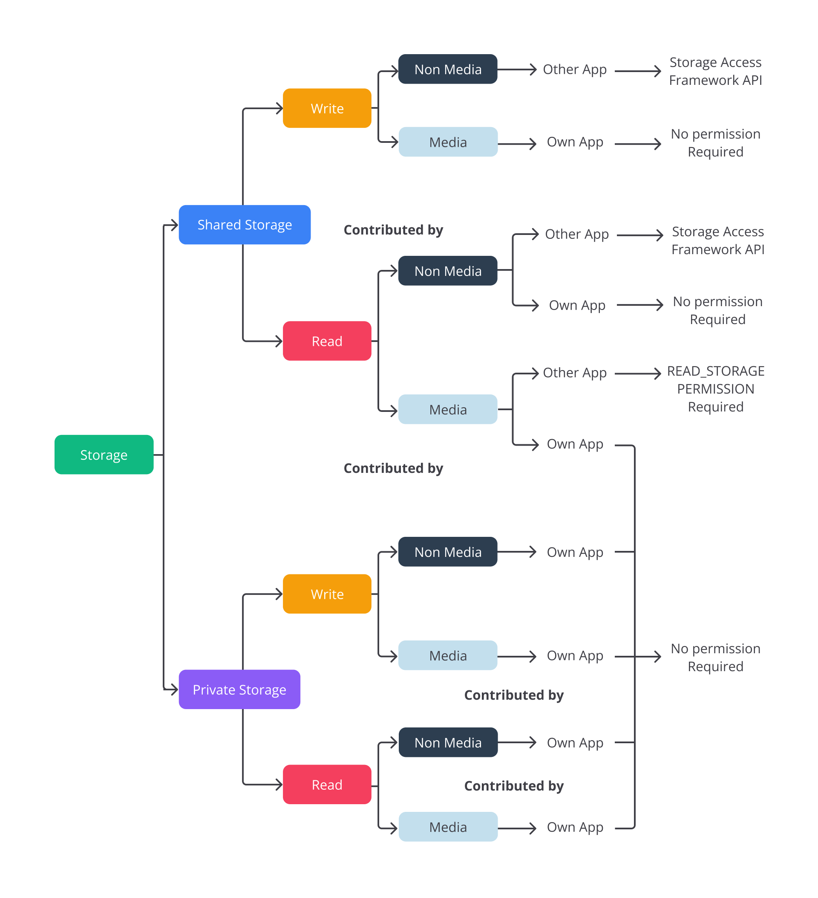

**[<< Materi Sebelumnya (Overview) <<](0-Overview.md)**

**[{{ Modul Praktik (File Storage) }}](Praktik-1-FileStorage.md)**

# File Storage

Mekanisme penyimpanan yang paling sederhana pada platform Android adalah dengan memanfaatkan mekanisme manipulasi berkas yang disediakan oleh pemrograman Java/Kotlin. **File storage cocok untuk data yang ukurannya besar**. Contohnya berkas gambar. Selain dalam bentuk gambar, Anda pun bisa menyimpan dalam bentuk lainnya, seperti suara, video, maupun teks.

Terdapat 2 macam storage yang dapat digunakan untuk menyimpan berkas, yaitu **App-Specific Storage** dan **Shared Storage**. App-Specific Storage adalah tempat penyimpanan yang dikhususkan untuk setiap aplikasi, sedangkan Shared Storage merupakan tempat penyimpanan bersama yang tercampur dan bisa diakses oleh aplikasi lain.

## Perbedaan Mekanisme Penyimpanan pada Versi Android

TL;DR: Sejak Android Q (Android 11), penggunaan storage pada Android dibatasi (berbeda) dengan adanya Scoped Storage.

Untuk mengetahui macam-macam storage pada Android lebih lanjut, kita perlu mengetahui bahwa terdapat perbedaan dalam mekanisme penyimpanan sejak Android Q (Android 11) ke atas.

Pada Android P (Android 10) ke bawah, file pada external storage masih disimpan di folder common (umum). Hanya dengan menggunakan read storage permission, aplikasi dapat dengan bebas mengakses semua file di penyimpanan bersama tanpa memerlukan izin khusus, hal inilah yang dapat menyebabkan masalah pada privasi dan keamanan. Belum lagi karena masuk ke folder umum, tidak diketahui kepemilikan dari setiap file tersebut. Sehingga ketika aplikasi sudah di-uninstall, file file tersebut masih tersisa di folder umum dan menjadi sampah.

Nah, pada Android Q (Android 11) ke atas, diperkenalkan Scoped Storage untuk memberikan pembagian yang jelas atas kepemilikan file pada shared storage. Dalam Scoped Storage, setiap aplikasi memiliki "sandbox" yang terisolasi di dalamnya untuk menyimpan dan mengakses data. Sehingga ketika aplikasi di-uninstall, file file yang di dalam app external storage juga bisa dibersihkan.

Selain itu aplikasi hanya dapat mengakses data yang dimilikinya sendiri, kecuali mendapatkan izin khusus dari pengguna untuk mengakses data dari shared storage. Yang menarik, aplikasi tidak diberikan akses ke semua file sekaligus, tetapi diberikan pilihan untuk mengakses file tertentu saja, tentunya ini dapat membantu untuk meningkatkan keamanan dan privasi pengguna.

Untuk mengetahui lebih lanjut pembagian dan izin yang diperlukan pada Android Q ke atas, bisa dilihat pada bagan di bawah ini.

## App-Specific Storage (Penyimpanan Aplikasi)

1. Berkas yang disimpan di sini **hanya** dapat diakses oleh aplikasi Anda.
2. Ketika aplikasi dicopot, sistem akan secara otomatis **menghapus semua data**.
3. Dapat **diakses** menggunakan `getFilesDir()`/`getCacheDir()` untuk penyimpanan internal `/data/data/your.package.name/files/` dan `getExternalFilesDir()`/`getExternalCacheDir()` untuk penyimpanan eksternal `/sdcard/Android/data/your.package.name/files/`.
4. **Tidak membutuhkan permission** apapun baik untuk membaca penyimpanan internal maupun external, **kecuali** untuk penyimpanan eksternal di bawah Android 4.4.
5. Penggunaan internal dan external storage **bergantung** pada kebutuhan dan rancangan aplikasi Anda. **Internal** paling baik digunakan untuk menyimpan data sensitif yang selalu available, tetapi memiliki ukuran yang terbatas. Sementara itu, **external** digunakan untuk menyimpan data yang lebih besar, namun tidak selalu available.

## Shared Storage (Penyimpanan Bersama)

1. Data dapat diakses oleh **aplikasi lain**. Biasanya berupa media seperti foto, suara, video, dan dokumen.
2. **Lokasinya** ada di `/sdcard/`.
3. Untuk mengakses **media** (seperti foto, audio, dan video) terdapat **perbedaan** pada Android Q ke atas dan Android P ke bawah.
    1. Untuk Android Q ke atas, file media dapat diakses menggunakan **MediaStore**.
    2. Untuk Android P ke bawah, file media dapat diakses menggunakan **File Provider**.
4. Untuk mengakses **non-media** (seperti dokumen dan file lain), gunakan **Storage Access Framework (SAF)**.
5. Membutuhkan **permission** READ_EXTERNAL_STORAGE untuk MediaStore di Android 11 ke atas dan tambahan permission WRITE_EXTERNAL_STORAGE untuk Android 10 ke bawah. Sedangkan untuk Storage Access Framework (SAF) tidak memerlukan permission.

## Referensi Tambahan

1. [Data and file storage overview](https://developer.android.com/guide/topics/data/data-storage)
2. [Scoped storage](https://developer.android.com/training/data-storage#scoped-storage)
3. [MediaStore](https://developer.android.com/reference/android/provider/MediaStore)
4. [Storage Access Framework (SAF)](https://developer.android.com/guide/topics/providers/document-provider)
5. [FileProvider](https://developer.android.com/reference/androidx/core/content/FileProvider)
6. [Android Data and File Storage Cheatsheet for Media](https://betterprogramming.pub/android-scoped-storage-demystified-3024a062ba24)
7. [Android Scoped Storage Demystified](https://medium.easyread.co/android-data-and-file-storage-cheatsheet-for-media-95f7f66080e3)
8. [Storage access with Android 11](https://www.youtube.com/watch?v=RjyYCUW-9tY)

**[{{ Modul Praktik (File Storage) }}](Praktik-1-FileStorage.md)**

**[>> Materi Sesudahnya (SharedPreferences) >>](2-SharedPreferences.md)**
