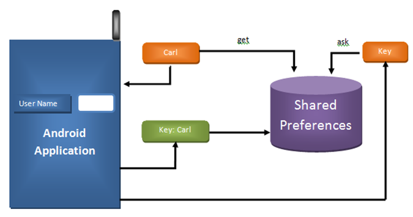
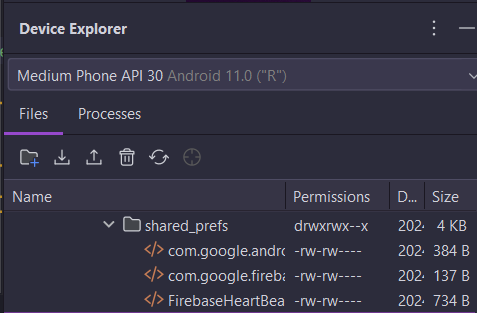
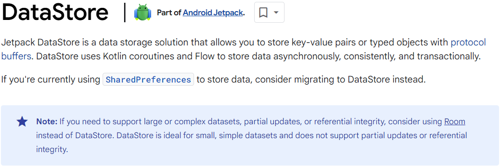

**[<< Materi Sebelumnya (File Storage) <<](1-FileStorage.md)**

**[{{ Modul Praktik (SharedPreferences) }}](Praktik-2-SharedPreferences.md)**

# SharedPreferences



SharedPreferences adalah mekanisme penyimpanan yang sederhana. Mekanisme ini mendukung struktur penyimpanan **key-value**. Apabila data yang Anda gunakan bertipe teks, angka, dan boolean, bukan data relasional. SharedPreferences bersifat atomik, artinya tiap data berdiri sendiri. Koleksi data-data tersebut berdiri sendiri dan Anda bisa dengan mudah melakukan pembacaan dan penyimpanan data.

Misalnya, jika ingin menggunakan `ID pengguna` ketika melakukan request ke server, lebih mudah membaca dan menyimpannya melalui SharedPreferences daripada menyimpan ke dalam bentuk berkas. Contoh lain, nilai pengaturan aplikasi dapat disimpan menggunakan SharedPreferences. Sebagai contohnya, Anda dapat menyimpan pengaturan tema, seperti dark mode atau light mode.

Jangan gunakan SharedPreferences untuk menyimpan data yang bersifat rahasia atau sensitif. Data yang disimpan di SharedPreferences masih tetap dapat dibaca (misal menggunakan akses `Root` atau `explorer` seperti ini).



notes: Google lebih menyarankan [DataStore](3-DataStore.md).



## Implementasi SharedPreferences

Pada dasarnya untuk mengimplementasikan SharedPreferences ada 3 hal yang harus Anda ketahui yaitu bagaimana membuat, menyimpan, dan membaca data. Berikut adalah langkah-langkahnya:

### 1. Membuat SharedPreferences

```kotlin
var context = this
var sharedPref = context.getSharedPreferences("my_reference_file", Context.MODE_PRIVATE)
```

`Context` adalah kelas abstrak yang disediakan oleh Android. Objek ini memudahkan pengembang untuk untuk mengakses sumber daya yang ada, baik dalam scope sebuah activity ataupun application. Scope dari `context` di atas adalah _scopeactivity_. SharedPreferences di atas bersifat PRIVATE hanya bisa diakses oleh aplikasi yang sama. Bila ingin diakses oleh aplikasi lain, maka gunakan `Context.MODE_WORLD_READABLE` atau `Context.MODE_WORLD_WRITEABLE`.

### 2. Menyimpan Data

```kotlin
var context = this
var sharedPref = context.getSharedPreferences("my_reference_file", Context.MODE_PRIVATE)

val editor = sharedPref.edit()
editor.putInt("my_highscore_file", 80)
editor.commit()
```

Ketika Anda menyimpan nilai dalam bentuk integer maka metode yang digunakan adalah `putInt(KEY, VALUE)`. Ini berlaku untuk tipe data lain seperti `double`, `long`, dan `boolean`. Contoh lainnya adalah penggunaan metode `putString()` untuk menyimpan data bertipe `string`. Metode `commit()` akan menyimpan data secara **synchronous**. Bila kembaliannya bernilai true, maka proses penyimpanan berjalan lancar. Namun bila false, maka telah terjadi suatu kegagalan. Selain menggunakan `commit()` Anda juga bisa menggunakan `apply()` untuk menyimpan data. Metode `apply()` akan menyimpan data secara **asynchronous**. Metode ini adalah pilihan bagus bila ada banyak data yang hendak disimpan.

### 3. Membaca Data

```kotlin
var context = this
var sharedPref = context.getSharedPreferences("my_reference_file", Context.MODE_PRIVATE)

val editor = sharedPref.edit()
editor.putInt("my_highscore_file", 80)
editor.commit()

var defaultValue = 0
var highScore = sharedPref.getInt("my_highscore_file", defaultValue)
```

Ketika hendak membaca data dari SharedPreferences, maka dapat menggunakan metode membaca yang **sesuai** dengan tipe datanya. Contohnya, bila ingin membaca data `string`, Anda dapat menggunakan metode `getString(KEY, DEFAULT_VALUE)`. Bila Anda ingin membaca data `integer`, Anda dapat menggunakan metode `getInt(KEY, DEFAULT_VALUE)`. Beberapa tipe data memerlukan default value, yaitu sebuah nilai default jika data yang disimpan belum ada nilainya.

## Referensi Tambahan

1. [Official Android Developer Documentation on SharedPreferences](https://developer.android.com/training/data-storage/shared-preferences)
2. [Persistence with SharedPreferences](https://www.vogella.com/tutorials/AndroidFileBasedPersistence/article.html)
3. [Tutorialspoint: SharedPreferences](https://www.tutorialspoint.com/android/android_shared_preferences.htm)
4. [Geeksforgeeks: SharedPreferences](https://www.geeksforgeeks.org/shared-preferences-in-android-with-examples/)
5. [DigitalOcean: SharedPreferences Example](https://www.journaldev.com/9412/android-shared-preferences-example-tutorial)
6. [SharedPreferences Example](https://blog.dot.co.id/tutorial-penggunaan-shared-preferences-pada-android-eddc300d7509)

**[{{ Modul Praktik (SharedPreferences) }}](Praktik-2-SharedPreferences.md)**

**[>> Materi Sesudahnya (DataStore) >>](3-DataStore.md)**
