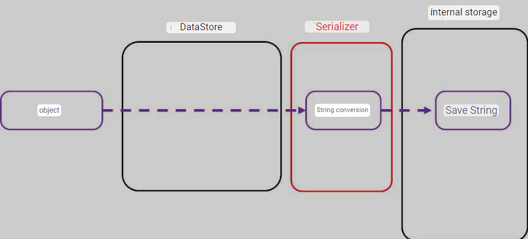

**[<< Materi Sebelumnya (SharedPreferences) <<](2-SharedPreferences.md)**

**[{{ Modul Praktik (DataStore) }}](Praktik-3-DataStore.md)**

# DataStore

DataStore menyimpan data secara asynchronously, consistently, dan transactionally, mengatasi beberapa kelemahan SharedPreferences. DataStore dapat menggunakan tipe data `protocol buffer` untuk menyimpan informasi. DataStore menggunakan `Kotlin Coroutine` dan `Flow` untuk menyimpan data.

## Preferences DataStore VS Proto DataStore

Preferences DataStore mirip dengan SharedPreferences. Ia berfungsi untuk menyimpan dan mengakses data menggunakan kata kunci (keys). Ketika mengimplementasikan Preferences DataStore ke dalam project, Anda tidak perlu mendefinisikan schema/skema terlebih dahulu. Efeknya, implementasi preferences datastore tidak mendukung `type safety`.

Proto DataStore dapat menyimpan data sebagai instance dari tipe data khusus. Ketika mengimplementasikan Proto Data Store, Anda harus mendefinisikan schema/skema menggunakan `protocol buffer` terlebih dahulu, yang memungkinkan untuk mendapatkan `type safety`.

Ketika menggunakan Proto DataStore, data menjadi lebih cepat, lebih kecil, dan lebih sederhana dibandingkan dengan format XML atau yang lainnya. Namun, secara konfigurasi, penggunaan Proto DataStore lebih rumit dibandingkan dengan Preferences DataStore karena harus mengatur schema/skema terlebih dahulu ketika menggunakan Proto DataStore. Selain itu, harus mempelajari mekanisme serialisasi baru, yakni `protocol buffer`.



Kapan kita harus menggunakan Preferences DataStore dan Proto DataStore? Jawabannya adalah kembali kepada kebutuhan masing-masing sistem. Jika Anda membutuhkan sistem penyimpanan key-values sederhana, seperti menyimpan informasi profile, pengaturan tema dark-mode, atau pengaturan sederhana lainnya, gunakanlah Preferences DataStore. Namun, jika Anda membutuhkan penyimpanan yang lebih kompleks dan cepat untuk diakses, gunakalah Protocol Buffer.

## SharedPreferences vs Preferences DataStore vs Proto DataStore

| Fitur                                                           | SharedPreferences                                            | Preferences DataStore                                  | Proto DataStore                                        |
| --------------------------------------------------------------- | ------------------------------------------------------------ | ------------------------------------------------------ | ------------------------------------------------------ |
| Async API                                                       | ✅ (hanya untuk membaca perubahan suatu nilai, via Listener) | ✅ (via Flow)                                          | ✅ (via Flow)                                          |
| Synchronous API                                                 | ✅ (namun non-safe thread ketika dipanggil dalam UI thread)  | ❌                                                     | ❌                                                     |
| Aman Ketika Dipanggil dalam UI Thread                           | ❌                                                           | ✅ (dijalankan melalui Dispatchers.IO secara otomatis) | ✅ (dijalankan melalui Dispatchers.IO secara otomatis) |
| Memberitahu Jika Terjadi Eror                                   | ❌                                                           | ✅                                                     | ✅                                                     |
| Aman dari Runtime Exception                                     | ❌                                                           | ✅                                                     | ✅                                                     |
| Memiliki Transactional API dengan Jaminan Konsistensi yang Kuat | ❌                                                           | ✅                                                     | ✅                                                     |
| Menangani Migrasi Data                                          | ❌                                                           | ✅ (dari SharedPreferences)                            | ✅ (dari SharedPreferences)                            |
| Type Safety                                                     | ❌                                                           | ❌                                                     | ✅ (menggunakan Protocol Buffer)                       |

Jika Anda perhatikan, DataStore dengan SharedPreferences memiliki perbedaan yang cukup signifikan. Namun, dalam materi kali ini, kita akan fokus pada Preferences DataStore saja. Jika Anda penasaran mengenai Proto DataStore, silakan baca beberapa referensi berikut:

1. [Proto DataStore | Android Developers Android Developers](https://developer.android.com/topic/libraries/architecture/datastore#proto-datastore)
2. [Google Protocol Buffers](https://protobuf.dev/)
3. [Working with Proto DataStore Codelabs Android](https://developer.android.com/codelabs/android-proto-datastore#0)

## Perbedaan Penting Preferences DataStore dengan SharedPreferences

1. Menangani pembaruan data secara transaksional.
2. Memperkenalkan Flow untuk mengirim pembaruan status data saat ini.
3. Tidak memiliki metode persistent data, seperti apply() dan commit().
4. Menggunakan API yang mirip dengan Map dan MutableMap dengan kunci yang diketik.

Ketika ingin mengimplementasikan Preferences DataStore ke dalam project, Anda harus menambahkan dependency Preferences DataStore terlebih dahulu ke dalam project. Hal ini tak seperti SharedPreferences yang dependency/API-nya sudah tersedia ketika Anda membangun project.

```gradle
implementation("androidx.datastore:datastore-preferences:$versiTerbaru")
```

Catatan: Untuk mendapatkan versi terbaru dari DataStore, silakan lihat di halaman [DataStore](https://developer.android.com/jetpack/androidx/releases/datastore).

## Membuat Instance Preferences DataStore

```kotlin
val Context.dataStore: DataStore<Preferences> by preferencesDataStore(name = "settings")
```

## Mendefinisikan Kata Kunci Preferences DataStore

```kotlin
val EXAMPLE_COUNTER = intPreferencesKey("example_counter")
```

Selain intPreferencesKey, Anda bisa memanfaatkan beberapa fungsi lainnya:

1. booleanPreferencesKey untuk mendefinisikan kata kunci untuk tipe data boolean.
2. doublePreferencesKey untuk mendefinisikan kata kunci untuk tipe data double.
3. floatPreferencesKey untuk mendefinisikan kata kunci untuk tipe data float.
4. longPreferencesKey untuk mendefinisikan kata kunci untuk tipe data long.
5. stringPreferencesKey untuk mendefinisikan kata kunci untuk tipe data string.
6. dll.

## Mendapatkan Nilai dari Preferences DataStore

```kotlin
val exampleCounterFlow: Flow<Int> = Context.dataStore.data
    .map { preferences ->
    // No type safety.
    preferences[EXAMPLE_COUNTER] ?: 0
}
```

## Menyimpan Nilai dari Preferences DataStore

```kotlin
suspend fun incrementCounter() {
    Context.dataStore.edit { settings ->
        // Mendapatkan nilai
        val currentCounterValue = settings[EXAMPLE_COUNTER] ?: 0

        // Mengubah nilai
        settings[EXAMPLE_COUNTER] = currentCounterValue + 1
    }
}
```

Keyword `suspend` digunakan untuk menandakan bahwa fungsi tersebut adalah fungsi yang berjalan secara asynchronous. Fungsi tersebut akan berjalan di luar thread utama (UI thread) sehingga tidak akan menghambat jalannya aplikasi.

## Menghapus Nilai dari Preferences DataStore

```kotlin
suspend fun clearCounter() {
    Context.dataStore.edit { settings ->
        settings.remove(EXAMPLE_COUNTER)
    }
}
```

## Referensi Tambahan

1. [Android Developers: DataStore](https://developer.android.com/topic/libraries/architecture/datastore)
2. [Android Developers: DataStore (2)](https://developer.android.com/jetpack/androidx/releases/datastore)
3. [SharedPreferences vs DataStore example](https://medium.com/supercharges-mobile-product-guide/new-way-of-storing-data-in-android-jetpack-datastore-a1073d09393d)
4. [DataStore in Android](https://medium.com/@manuaravindpta/datastore-in-android-838586355d0b)
5. [DataStore Example](https://proandroiddev.com/demystifying-datastore-a-comprehensive-guide-to-using-datastore-with-jetpack-compose-d89c813232d7)

**[{{ Modul Praktik (DataStore) }}](Praktik-3-DataStore.md)**
