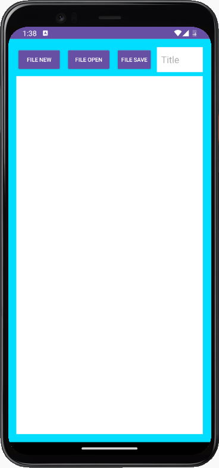
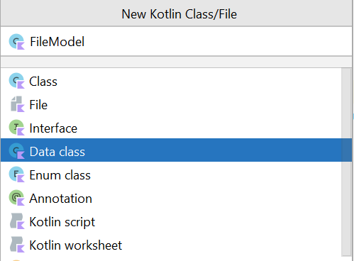
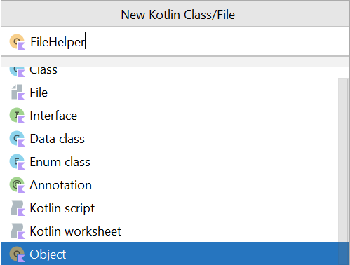

**[{{ Modul Materi (File Storage) }}](1-FileStorage.md)**

# Praktik File Storage

## Alur Praktikum

1. Mengatur tampilan pada berkas layout XML.
2. Menambahkan library ke dalam project.
3. Membuat kelas FileModel untuk menampung sementara data pengguna.
4. Membuat kelas FileHelper untuk mengatur konfigurasi penyimpanan file.
5. Mengimplementasikan FileHelper ke dalam Activity.
6. Menjalankan aplikasi.

## 1. Buat Project Baru

| Field                        | Value                |
| ---------------------------- | -------------------- |
| Nama Project                 | MyReadWriteFile      |
| Templates                    | Phone and Tablet     |
| Tipe Activity                | Empty Views Activity |
| Language                     | Kotlin               |
| Minimum SDK                  | API level 29         |
| Build Configuration Language | Kotlin DSL           |

## 2. Mengatur Tampilan

`activity_main.xml`

```xml
<?xml version="1.0" encoding="utf-8"?>
<RelativeLayout xmlns:android="http://schemas.android.com/apk/res/android"
    xmlns:tools="http://schemas.android.com/tools"
    android:id="@+id/main"
    android:layout_width="match_parent"
    android:layout_height="match_parent"
    android:background="@android:color/holo_blue_bright"
    android:padding="16dp"
    tools:context=".MainActivity">

    <EditText
        android:id="@+id/edit_file"
        style="@style/Widget.AppCompat.EditText"
        android:layout_width="match_parent"
        android:layout_height="match_parent"
        android:layout_alignParentBottom="true"
        android:layout_alignParentEnd="true"
        android:layout_alignParentStart="true"
        android:layout_below="@+id/header_linear"
        android:background="@android:color/white"
        android:gravity="top|start"
        android:inputType="textMultiLine|textNoSuggestions"
        android:padding="@dimen/tiny_margin" />
    <LinearLayout
        android:id="@+id/header_linear"
        android:layout_width="match_parent"
        android:layout_height="wrap_content"
        android:gravity="center_horizontal|start"
        android:orientation="horizontal">
        <Button
            android:id="@+id/button_new"
            style="@style/Widget.AppCompat.Button.Colored"
            android:layout_width="72dp"
            android:layout_height="match_parent"
            android:textSize="11sp"
            android:padding="0dp"
            android:layout_marginBottom="@dimen/tiny_margin"
            android:text="@string/file_new" />
        <Button
            android:id="@+id/button_open"
            style="@style/Widget.AppCompat.Button.Colored"
            android:layout_width="72dp"
            android:layout_height="match_parent"
            android:textSize="11sp"
            android:padding="0dp"
            android:layout_marginBottom="@dimen/tiny_margin"
            android:layout_marginStart="@dimen/tiny_margin"
            android:text="@string/file_open" />
        <Button
            android:id="@+id/button_save"
            style="@style/Widget.AppCompat.Button.Colored"
            android:layout_width="72dp"
            android:layout_height="match_parent"
            android:textSize="11sp"
            android:padding="0dp"
            android:layout_marginBottom="@dimen/tiny_margin"
            android:layout_marginStart="@dimen/tiny_margin"
            android:text="@string/file_save" />
        <EditText
            android:id="@+id/edit_title"
            android:layout_width="0dp"
            android:layout_height="match_parent"
            android:layout_marginBottom="@dimen/tiny_margin"
            android:layout_marginStart="@dimen/tiny_margin"
            android:layout_weight="1"
            android:background="@android:color/white"
            android:ems="10"
            android:hint="@string/title"
            android:inputType="textPersonName|textNoSuggestions"
            android:padding="@dimen/tiny_margin" />
    </LinearLayout>
</RelativeLayout>
```

---

`res/values/dimens.xml`

```xml
<resources>
    <dimen name="tiny_margin">8dp</dimen>
</resources>
```

---

`res/values/strings.xml`

```xml
<resources>
    <string name="app_name">MyReadWriteFile</string>
    <string name="file_new">File New</string>
    <string name="file_open">File Open</string>
    <string name="file_save">File Save</string>
    <string name="title">Title</string>
</resources>
```

Berikut adalah hasil tampilannya:



## 3. Membuat Data Class (FileModel)



```kotlin
data class FileModel(
    var filename: String? = null,
    var data: String? = null
)
```

## 4. Membuat Object (FileHelper)



```kotlin
internal object FileHelper {

    fun writeToFile(fileModel: FileModel, context: Context) {
        context.openFileOutput(fileModel.filename, Context.MODE_PRIVATE).use {
            it.write(fileModel.data?.toByteArray())
        }
    }
    fun readFromFile(context: Context, filename: String): FileModel {
        val fileModel = FileModel()
        fileModel.filename = filename
        fileModel.data = context.openFileInput(filename).bufferedReader().useLines { lines ->
            lines.fold("") { some, text ->
                 "$some$text\n"
            }
        }
        return fileModel
    }
}
```

## 5. Implementasi di Activity

Tambahkan `View Binding` pada `build.gradle.kts (app)` terlebih dahulu lalu `sync`.

```gradle
android {
    ...

    buildFeatures {
        viewBinding = true
    }
}
```

---

```kotlin
class MainActivity : AppCompatActivity(), View.OnClickListener {

    private lateinit var binding: ActivityMainBinding

    override fun onCreate(savedInstanceState: Bundle?) {
        super.onCreate(savedInstanceState)
        binding = ActivityMainBinding.inflate(layoutInflater)
        setContentView(binding.root)

        binding.buttonNew.setOnClickListener(this)
        binding.buttonOpen.setOnClickListener(this)
        binding.buttonSave.setOnClickListener(this)

    }

    override fun onClick(view: View) {
        when (view.id) {
            R.id.button_new -> newFile()
            R.id.button_open -> showList()
            R.id.button_save -> saveFile()
        }
    }

    private fun newFile() {
        binding.editTitle.setText("")
        binding.editFile.setText("")
        Toast.makeText(this, "Clearing file", Toast.LENGTH_SHORT).show()
    }

    private fun showList() {
        val items = fileList()
        val builder = AlertDialog.Builder(this)
        builder.setTitle("Pilih file yang diinginkan")
        builder.setItems(items) { dialog, item -> loadData(items[item].toString()) }
        val alert = builder.create()
        alert.show()
    }

    private fun loadData(title: String) {
        val fileModel = FileHelper.readFromFile(this, title)
        binding.editTitle.setText(fileModel.filename)
        binding.editFile.setText(fileModel.data)
        Toast.makeText(this, "Loading " + fileModel.filename + " data", Toast.LENGTH_SHORT).show()
    }

    private fun saveFile() {
        when {
            binding.editTitle.text.toString().isEmpty() -> Toast.makeText(this, "Title harus diisi terlebih dahulu", Toast.LENGTH_SHORT).show()
            binding.editFile.text.toString().isEmpty() -> Toast.makeText(this, "Kontent harus diisi terlebih dahulu", Toast.LENGTH_SHORT).show()
            else -> {
                val title = binding.editTitle.text.toString()
                val text = binding.editFile.text.toString()
                val fileModel = FileModel()
                fileModel.filename = title
                fileModel.data = text
                FileHelper.writeToFile(fileModel, this)
                Toast.makeText(this, "Saving " + fileModel.filename + " file", Toast.LENGTH_SHORT).show()
            }
        }
    }
}
```

## Referensi Tambahan

[Nikoloz Akhvlediani - Scoped Storage, SAF & MediaStore](https://www.youtube.com/watch?v=8Qs8jCOgEyI)

**[{{ Modul Materi (File Storage) }}](1-FileStorage.md)**
