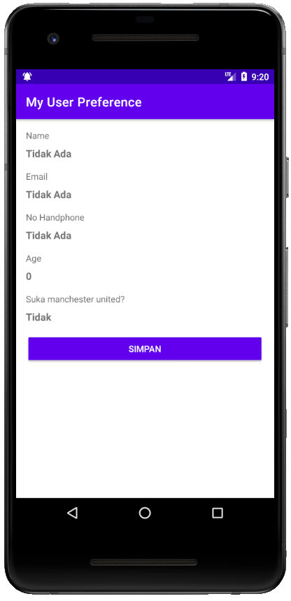
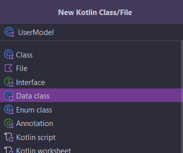
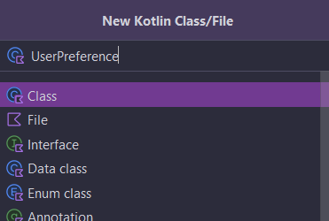

**[{{ Modul Materi (SharedPreferences) }}](2-SharedPreferences.md)**

# Praktik SharedPreferences

## Alur Praktikum

1. Membuat project baru dengan nama MySharedPreferences.
2. Mengatur tampilan pada berkas layout XML.
3. Membuat kelas model untuk menampung sementara data pengguna.
4. Membuat kelas UserPreference untuk menyimpan data pengguna menggunakan SharedPreference.
5. Mengimplementasikan UserPreference ke dalam Activity.
6. Menjalankan aplikasi.

## 1. Buat Project Baru

| Field                        | Value                |
| ---------------------------- | -------------------- |
| Nama Project                 | MySharedPreferences  |
| Templates                    | Phone and Tablet     |
| Tipe Activity                | Empty Views Activity |
| Language                     | Kotlin               |
| Minimum SDK                  | API level 29         |
| Build Configuration Language | Kotlin DSL           |

## 2. Mengatur Tampilan

`activity_main.xml`

```xml
<?xml version="1.0" encoding="utf-8"?>
<LinearLayout xmlns:android="http://schemas.android.com/apk/res/android"
    xmlns:tools="http://schemas.android.com/tools"
    android:id="@+id/main"
    android:layout_width="match_parent"
    android:layout_height="match_parent"
    android:orientation="vertical"
    android:padding="16dp"
    tools:context=".MainActivity">

    <TextView
        android:layout_width="wrap_content"
        android:layout_height="wrap_content"
        android:layout_marginBottom="8dp"
        android:text="@string/name" />
    <TextView
        android:id="@+id/tv_name"
        android:layout_width="match_parent"
        android:layout_height="wrap_content"
        android:layout_marginBottom="16dp"
        android:textSize="16sp"
        android:textStyle="bold"
        tools:text="@string/dummy_name" />
    <TextView
        android:layout_width="wrap_content"
        android:layout_height="wrap_content"
        android:layout_marginBottom="8dp"
        android:text="@string/email" />
    <TextView
        android:id="@+id/tv_email"
        android:layout_width="match_parent"
        android:layout_height="wrap_content"
        android:layout_marginBottom="16dp"
        android:textSize="16sp"
        android:textStyle="bold"
        tools:text="@string/dummy_email" />
    <TextView
        android:layout_width="wrap_content"
        android:layout_height="wrap_content"
        android:layout_marginBottom="8dp"
        android:text="@string/phone_number" />
    <TextView
        android:id="@+id/tv_phone"
        android:layout_width="match_parent"
        android:layout_height="wrap_content"
        android:layout_marginBottom="16dp"
        android:textSize="16sp"
        android:textStyle="bold"
        tools:text="@string/dummynumber" />
    <TextView
        android:layout_width="wrap_content"
        android:layout_height="wrap_content"
        android:layout_marginBottom="8dp"
        android:text="@string/age" />
    <TextView
        android:id="@+id/tv_age"
        android:layout_width="match_parent"
        android:layout_height="wrap_content"
        android:layout_marginBottom="16dp"
        android:textSize="16sp"
        android:textStyle="bold"
        tools:text="@string/dummyage" />
    <TextView
        android:layout_width="wrap_content"
        android:layout_height="wrap_content"
        android:layout_marginBottom="8dp"
        android:text="@string/love_manchester_united" />
    <TextView
        android:id="@+id/tv_is_love_mu"
        android:layout_width="match_parent"
        android:layout_height="wrap_content"
        android:layout_marginBottom="16dp"
        android:textSize="16sp"
        android:textStyle="bold"
        tools:text="@string/dummyislove" />
    <Button
        android:id="@+id/btn_save"
        style="@style/Base.Widget.AppCompat.Button.Colored"
        android:layout_width="match_parent"
        android:layout_height="wrap_content"
        android:text="@string/save" />
</LinearLayout>
```

---

`strings.xml`

```xml
<resources>
    <string name="app_name">MySharedPreference</string>
    <string name="name">Name</string>
    <string name="email">Email</string>
    <string name="phone_number">No Handphone</string>
    <string name="age">Age</string>
    <string name="yes">Ya</string>
    <string name="no">Tidak</string>
    <string name="save">Simpan</string>
    <string name="love_manchester_united">Suka manchester united?</string>
    <string name="change">Ubah</string>
    <string name="dummy_name">Haizk</string>
    <string name="dummy_email">haizk@gmail.com</string>
    <string name="dummynumber">123456</string>
    <string name="dummyage">30</string>
    <string name="dummyislove">IsLoveMU</string>
</resources>
```

Berikut adalah hasil tampilannya:



## 3. Membuat Data Class (User)

Implementasikan Parcelable pada `build.gradle.tks (module:app)`.

```gradle
plugins {
    id("kotlin-parcelize") //"
}
```

---



```kotlin
@Parcelize
data class UserModel (
        var name: String? = null,
        var email: String? = null,
        var age: Int = 0,
        var phoneNumber: String? = null,
        var isLove: Boolean = false
) : Parcelable
```

## 4. Membuat Class UserPreference



```kotlin
internal class UserPreference(context: Context) {
    companion object {
        private const val PREFS_NAME = "user_pref"
        private const val NAME = "name"
        private const val EMAIL = "email"
        private const val AGE = "age"
        private const val PHONE_NUMBER = "phone"
        private const val LOVE_MU = "islove"
    }
    private val preferences = context.getSharedPreferences(PREFS_NAME, Context.MODE_PRIVATE)
    fun setUser(value: UserModel) {
        val editor = preferences.edit()
        editor.putString(NAME, value.name)
        editor.putString(EMAIL, value.email)
        editor.putInt(AGE, value.age)
        editor.putString(PHONE_NUMBER, value.phoneNumber)
        editor.putBoolean(LOVE_MU, value.isLove)
        editor.apply()
    }
    fun getUser(): UserModel {
        val model = UserModel()
        model.name = preferences.getString(NAME, "")
        model.email = preferences.getString(EMAIL, "")
        model.age = preferences.getInt(AGE, 0)
        model.phoneNumber = preferences.getString(PHONE_NUMBER, "")
        model.isLove = preferences.getBoolean(LOVE_MU, false)
        return model
    }
}
```

## 5. Membuat Activity

Tambahkan `View Binding` pada `build.gradle.kts (app)` terlebih dahulu lalu `sync`.

```gradle
android {
    ...

    buildFeatures {
        viewBinding = true
    }
}
```

---


```kotlin
class FormUserPreferenceActivity : AppCompatActivity(), View.OnClickListener {

    private lateinit var binding: ActivityFormUserPreferenceBinding

    companion object {
        const val EXTRA_TYPE_FORM = "extra_type_form"
        const val EXTRA_RESULT = "extra_result"
        const val RESULT_CODE = 101

        const val TYPE_ADD = 1
        const val TYPE_EDIT = 2

        private const val FIELD_REQUIRED = "Field tidak boleh kosong"
        private const val FIELD_DIGIT_ONLY = "Hanya boleh terisi numerik"
        private const val FIELD_IS_NOT_VALID = "Email tidak valid"
    }

    private lateinit var userModel: UserModel

    override fun onCreate(savedInstanceState: Bundle?) {
        super.onCreate(savedInstanceState)
        binding = ActivityFormUserPreferenceBinding.inflate(layoutInflater)
        setContentView(binding.root)

        binding.btnSave.setOnClickListener(this)

        userModel = intent.getParcelableExtra<UserModel>("USER") as UserModel
        val formType = intent.getIntExtra(EXTRA_TYPE_FORM, 0)

        var actionBarTitle = ""
        var btnTitle = ""

        when (formType) {
            TYPE_ADD -> {
                actionBarTitle = "Tambah Baru"
                btnTitle = "Simpan"
            }
            TYPE_EDIT -> {
                actionBarTitle = "Ubah"
                btnTitle = "Update"
                showPreferenceInForm()
            }
        }

        supportActionBar?.title = actionBarTitle
        supportActionBar?.setDisplayHomeAsUpEnabled(true)

        binding.btnSave.text = btnTitle

    }

    private fun showPreferenceInForm() {
        binding.edtName.setText(userModel.name)
        binding.edtEmail.setText(userModel.email)
        binding.edtAge.setText(userModel.age.toString())
        binding.edtPhone.setText(userModel.phoneNumber)
        if (userModel.isLove) {
            binding.rbYes.isChecked = true
        } else {
            binding.rbNo.isChecked = true
        }
    }

    override fun onClick(view: View) {
        if (view.id == R.id.btn_save) {
            val name = binding.edtName.text.toString().trim()
            val email = binding.edtEmail.text.toString().trim()
            val age = binding.edtAge.text.toString().trim()
            val phoneNo = binding.edtPhone.text.toString().trim()
            val isLoveMU = binding.rgLoveMu.checkedRadioButtonId == R.id.rb_yes

            if (name.isEmpty()) {
                binding.edtName.error = FIELD_REQUIRED
                return
            }

            if (email.isEmpty()) {
                binding.edtEmail.error = FIELD_REQUIRED
                return
            }

            if (!isValidEmail(email)) {
                binding.edtEmail.error = FIELD_IS_NOT_VALID
                return
            }

            if (age.isEmpty()) {
                binding.edtAge.error = FIELD_REQUIRED
                return
            }

            if (phoneNo.isEmpty()) {
                binding.edtPhone.error = FIELD_REQUIRED
                return
            }

            if (!TextUtils.isDigitsOnly(phoneNo)) {
                binding.edtPhone.error = FIELD_DIGIT_ONLY
                return
            }

            saveUser(name, email, age, phoneNo, isLoveMU)

            val resultIntent = Intent()
            resultIntent.putExtra(EXTRA_RESULT, userModel)
            setResult(RESULT_CODE, resultIntent)

            finish()
        }
    }

    private fun saveUser(name: String, email: String, age: String, phoneNo: String, isLoveMU: Boolean) {
        val userPreference = UserPreference(this)

        userModel.name = name
        userModel.email = email
        userModel.age = Integer.parseInt(age)
        userModel.phoneNumber = phoneNo
        userModel.isLove = isLoveMU

        userPreference.setUser(userModel)
        Toast.makeText(this, "Data tersimpan", Toast.LENGTH_SHORT).show()
    }

    private fun isValidEmail(email: CharSequence): Boolean {
        return android.util.Patterns.EMAIL_ADDRESS.matcher(email).matches()
    }

    override fun onOptionsItemSelected(item: MenuItem): Boolean {
        if (item.itemId == android.R.id.home) {
            finish()
        }
        return super.onOptionsItemSelected(item)
    }
}
```

---

`activity_form_user_preference_activity.xml`

```xml
<?xml version="1.0" encoding="utf-8"?>
<ScrollView xmlns:android="http://schemas.android.com/apk/res/android"
    xmlns:tools="http://schemas.android.com/tools"
    android:id="@+id/activity_form_user_preference"
    android:layout_width="match_parent"
    android:layout_height="match_parent"
    tools:context=".FormUserPreferenceActivity">

    <LinearLayout
        android:layout_width="match_parent"
        android:layout_height="wrap_content"
        android:orientation="vertical"
        android:padding="16dp">
        <com.google.android.material.textfield.TextInputLayout
            android:layout_width="match_parent"
            android:layout_height="wrap_content"
            android:layout_marginBottom="16dp">
            <EditText
                android:id="@+id/edt_name"
                android:layout_width="match_parent"
                android:layout_height="wrap_content"
                android:hint="@string/name"
                android:inputType="textPersonName"
                android:maxLines="1" />
        </com.google.android.material.textfield.TextInputLayout>
        <com.google.android.material.textfield.TextInputLayout
            android:layout_width="match_parent"
            android:layout_height="wrap_content"
            android:layout_marginBottom="16dp">
            <EditText
                android:id="@+id/edt_email"
                android:layout_width="match_parent"
                android:layout_height="wrap_content"
                android:hint="@string/email"
                android:inputType="textEmailAddress"
                android:maxLines="1" />
        </com.google.android.material.textfield.TextInputLayout>
        <com.google.android.material.textfield.TextInputLayout
            android:layout_width="match_parent"
            android:layout_height="wrap_content"
            android:layout_marginBottom="16dp">
            <EditText
                android:id="@+id/edt_phone"
                android:layout_width="match_parent"
                android:layout_height="wrap_content"
                android:hint="@string/phone_number"
                android:inputType="phone"
                android:maxLines="1" />
        </com.google.android.material.textfield.TextInputLayout>
        <com.google.android.material.textfield.TextInputLayout
            android:layout_width="match_parent"
            android:layout_height="wrap_content"
            android:layout_marginBottom="16dp">
            <EditText
                android:id="@+id/edt_age"
                android:layout_width="match_parent"
                android:layout_height="wrap_content"
                android:hint="@string/age"
                android:inputType="number"
                android:maxLines="1" />
        </com.google.android.material.textfield.TextInputLayout>
        <TextView
            android:layout_width="match_parent"
            android:layout_height="wrap_content"
            android:layout_marginBottom="16dp"
            android:text="@string/love_manchester_united" />
        <RadioGroup
            android:id="@+id/rg_love_mu"
            android:layout_width="match_parent"
            android:layout_height="wrap_content"
            android:layout_marginBottom="16dp"
            android:orientation="horizontal">
            <RadioButton
                android:id="@+id/rb_yes"
                android:layout_width="match_parent"
                android:layout_height="wrap_content"
                android:layout_weight="1"
                android:text="@string/yes" />
            <RadioButton
                android:id="@+id/rb_no"
                android:layout_width="match_parent"
                android:layout_height="wrap_content"
                android:layout_weight="1"
                android:text="@string/no" />
        </RadioGroup>
        <Button
            android:id="@+id/btn_save"
            style="@style/Widget.AppCompat.Button.Colored"
            android:layout_width="match_parent"
            android:layout_height="wrap_content"
            android:text="@string/save" />
    </LinearLayout>
</ScrollView>
```

## 6. Tambahkan Kode pada MainActivity sehingga Menjadi seperti Berikut

```kotlin
class MainActivity : AppCompatActivity(), View.OnClickListener {

    private lateinit var mUserPreference: UserPreference
    private lateinit var binding: ActivityMainBinding

    private var isPreferenceEmpty = false
    private lateinit var userModel: UserModel

    private val resultLauncher = registerForActivityResult(
        StartActivityForResult()
    ) { result: ActivityResult ->
        if (result.data != null && result.resultCode == FormUserPreferenceActivity.RESULT_CODE) {
            userModel = result.data?.getParcelableExtra<UserModel>(FormUserPreferenceActivity.EXTRA_RESULT) as UserModel
            populateView(userModel)
            checkForm(userModel)
        }
    }

    override fun onCreate(savedInstanceState: Bundle?) {
        super.onCreate(savedInstanceState)
        binding = ActivityMainBinding.inflate(layoutInflater)
        setContentView(binding.root)

        supportActionBar?.title = "My User Preference"

        mUserPreference = UserPreference(this)

        showExistingPreference()

        binding.btnSave.setOnClickListener(this)

    }

    private fun showExistingPreference() {
        userModel = mUserPreference.getUser()
        populateView(userModel)
        checkForm(userModel)
    }

    private fun populateView(userModel: UserModel) {
        binding.tvName.text =
            if (userModel.name.toString().isEmpty()) "Tidak Ada" else userModel.name
        binding.tvAge.text =
            if (userModel.age.toString().isEmpty()) "Tidak Ada" else userModel.age.toString()
        binding.tvIsLoveMu.text = if (userModel.isLove) "Ya" else "Tidak"
        binding.tvEmail.text =
            if (userModel.email.toString().isEmpty()) "Tidak Ada" else userModel.email
        binding.tvPhone.text =
            if (userModel.phoneNumber.toString().isEmpty()) "Tidak Ada" else userModel.phoneNumber
    }

    private fun checkForm(userModel: UserModel) {
        when {
            userModel.name.toString().isNotEmpty() -> {
                binding.btnSave.text = getString(R.string.change)
                isPreferenceEmpty = false
            }
            else -> {
                binding.btnSave.text = getString(R.string.save)
                isPreferenceEmpty = true
            }
        }
    }

    override fun onClick(view: View) {
        if (view.id == R.id.btn_save) {
            val intent = Intent(this@MainActivity, FormUserPreferenceActivity::class.java)
            when {
                isPreferenceEmpty -> {
                    intent.putExtra(
                        FormUserPreferenceActivity.EXTRA_TYPE_FORM,
                        FormUserPreferenceActivity.TYPE_ADD
                    )
                    intent.putExtra("USER", userModel)
                }
                else -> {
                    intent.putExtra(
                        FormUserPreferenceActivity.EXTRA_TYPE_FORM,
                        FormUserPreferenceActivity.TYPE_EDIT
                    )
                    intent.putExtra("USER", userModel)
                }
            }
            resultLauncher.launch(intent)
        }
    }
}
```

---


## Referensi Tambahan

[Philipp Lackner - Sharing Data with SharedPreferences](https://www.youtube.com/watch?v=wtpRp2IpCSo)

**[{{ Modul Materi (SharedPreferences) }}](2-SharedPreferences.md)**
