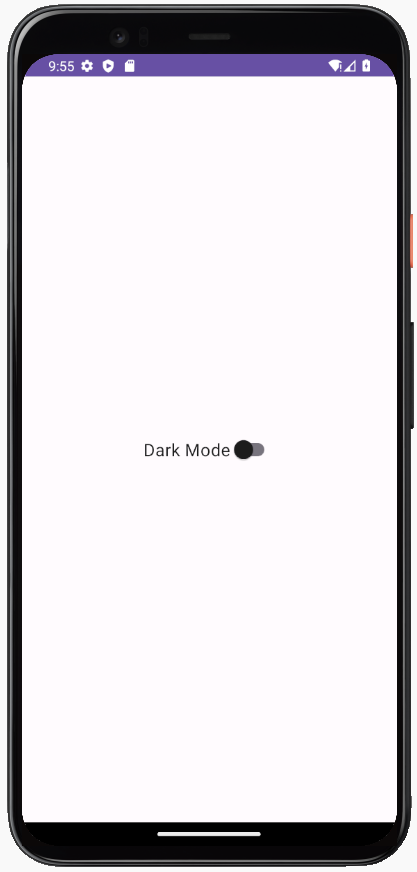
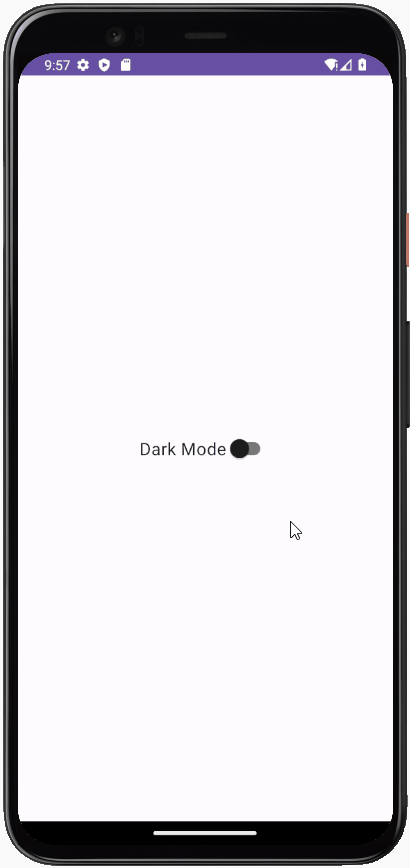
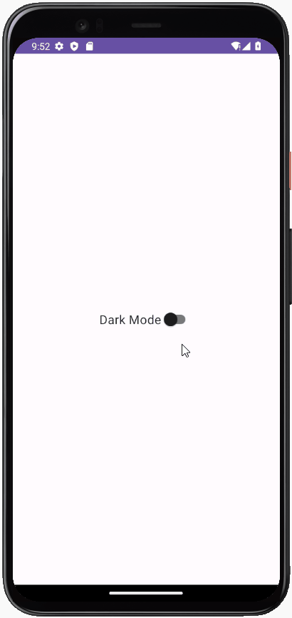

**[{{ Modul Materi (DataStore) }}](3-DataStore.md)**

# Praktik DataStore

## Alur Praktikum

1. Membuat project baru.
2. Mengatur tampilan pada berkas XML.
3. Menambahkan kode untuk mengatur tema aplikasi.
4. Menambahkan library DataStore ke dalam project.
5. Membuat kelas baru untuk mengatur DataStore.
6. Membuat kelas viewmodel untuk masing-masing fitur dan menghubungkan antara view dengan datastore.
7. Mengimplementasikan ViewModel ke dalam Activity.
8. Menjalankan aplikasi.

## 1. Membuat Project Baru

| Field                        | Value                |
| ---------------------------- | -------------------- |
| Nama Project                 | MyDataStore          |
| Templates                    | Phone and Tablet     |
| Tipe Activity                | Empty Views Activity |
| Language                     | Kotlin               |
| Minimum SDK                  | API level 29         |
| Build Configuration Language | Kotlin DSL           |

## 2. Mengatur Tampilan pada Berkas XML

`activity_main.xml`

```xml
<?xml version="1.0" encoding="utf-8"?>
<androidx.constraintlayout.widget.ConstraintLayout xmlns:android="http://schemas.android.com/apk/res/android"
   android:id="@+id/main"
   xmlns:app="http://schemas.android.com/apk/res-auto"
   xmlns:tools="http://schemas.android.com/tools"
   android:layout_width="match_parent"
   android:layout_height="match_parent"
   tools:context=".MainActivity">

   <com.google.android.material.switchmaterial.SwitchMaterial
       android:id="@+id/switch_theme"
       android:layout_width="wrap_content"
       android:layout_height="wrap_content"
       android:text="@string/dark_mode"
       android:textSize="18sp"
       app:layout_constraintBottom_toBottomOf="parent"
       app:layout_constraintEnd_toEndOf="parent"
       app:layout_constraintStart_toStartOf="parent"
       app:layout_constraintTop_toTopOf="parent" />

</androidx.constraintlayout.widget.ConstraintLayout>
```

---

`strings.xml`

```xml
<resources>
   <string name="app_name">My DataStore</string>
   <string name="dark_mode">Dark Mode</string>
</resources>
```



## 3. Menambahkan Kode untuk Mengatur Tema Aplikasi

`MainActivity.kt`

```kotlin
override fun onCreate(savedInstanceState: Bundle?) {
   super.onCreate(savedInstanceState)
   setContentView(R.layout.activity_main)

   val switchTheme = findViewById<SwitchMaterial>(R.id.switch_theme)

   switchTheme.setOnCheckedChangeListener { _: CompoundButton?, isChecked: Boolean ->
       if (isChecked) {
           AppCompatDelegate.setDefaultNightMode(AppCompatDelegate.MODE_NIGHT_YES)
           switchTheme.isChecked = true
       } else {
           AppCompatDelegate.setDefaultNightMode(AppCompatDelegate.MODE_NIGHT_NO)
           switchTheme.isChecked = false
       }
   }
}
```

---



Namun, ketika kita menutup aplikasi dan membuka aplikasi kembali, tema akan kembali ke awal lagi. Hal ini karena kita tidak menyimpan data pengaturan tema.

## 4. Menambahkan Library DataStore ke dalam Project

`build.gradle.kts (module:app)`

```gradle
dependencies {

   ...

   implementation("androidx.datastore:datastore-preferences:1.0.0")
   implementation("androidx.lifecycle:lifecycle-viewmodel-ktx:2.6.1")
   implementation("androidx.lifecycle:lifecycle-livedata-ktx:2.6.1")
   implementation("org.jetbrains.kotlinx:kotlinx-coroutines-core:1.5.2")
   implementation("org.jetbrains.kotlinx:kotlinx-coroutines-android:1.5.2")
}
```

---

**Khusus Iguana ke atas**

`build.gradle.kts (module:app)`

```gradle
dependencies {

    ...

    implementation(libs.androidx.datastore.preferences)
    implementation(libs.androidx.lifecycle.viewmodel.ktx)
    implementation(libs.androidx.lifecycle.livedata.ktx)
    implementation(libs.kotlinx.coroutines.core)
    implementation(libs.jetbrains.kotlinx.coroutines.android)
}
```

`libs.version.toml`

```toml
[versions]
...
datastorePreferences = "1.0.0"
kotlinxCoroutinesAndroid = "1.5.2"
kotlinxCoroutinesCore = "1.5.2"
lifecycleLivedataKtx = "2.6.1"
lifecycleViewmodelKtx = "2.6.1"

[libraries]
...
androidx-datastore-preferences = { module = "androidx.datastore:datastore-preferences", version.ref = "datastorePreferences" }
androidx-lifecycle-livedata-ktx = { module = "androidx.lifecycle:lifecycle-livedata-ktx", version.ref = "lifecycleLivedataKtx" }
androidx-lifecycle-viewmodel-ktx = { module = "androidx.lifecycle:lifecycle-viewmodel-ktx", version.ref = "lifecycleViewmodelKtx" }
jetbrains-kotlinx-coroutines-android = { module = "org.jetbrains.kotlinx:kotlinx-coroutines-android", version.ref = "kotlinxCoroutinesAndroid" }
kotlinx-coroutines-core = { module = "org.jetbrains.kotlinx:kotlinx-coroutines-core", version.ref = "kotlinxCoroutinesCore" }

[plugins]
...
```

## 5. Membuat Class Baru untuk Mengatur DataStore

`SettingsPreferences.kt`

```kotlin
import android.content.Context
import androidx.datastore.core.DataStore
import androidx.datastore.preferences.core.Preferences
import androidx.datastore.preferences.core.booleanPreferencesKey
import androidx.datastore.preferences.core.edit
import androidx.datastore.preferences.preferencesDataStore
import kotlinx.coroutines.flow.Flow
import kotlinx.coroutines.flow.map

val Context.dataStore: DataStore<Preferences> by preferencesDataStore(name = "settings")

class SettingPreferences private constructor(private val dataStore: DataStore<Preferences>) {

    private val THEME_KEY = booleanPreferencesKey("theme_setting")

    fun getThemeSetting(): Flow<Boolean> {
        return dataStore.data.map { preferences ->
            preferences[THEME_KEY] ?: false
        }
    }

    suspend fun saveThemeSetting(isDarkModeActive: Boolean) {
        dataStore.edit { preferences ->
            preferences[THEME_KEY] = isDarkModeActive
        }
    }

    companion object {
        @Volatile
        private var INSTANCE: SettingPreferences? = null

        fun getInstance(dataStore: DataStore<Preferences>): SettingPreferences {
            return INSTANCE ?: synchronized(this) {
                val instance = SettingPreferences(dataStore)
                INSTANCE = instance
                instance
            }
        }
    }
}
```

## 6. Membuat Class ViewModel

`MainViewModel.kt`

```kotlin
class MainViewModel(private val pref: SettingPreferences) : ViewModel() {
   fun getThemeSettings(): LiveData<Boolean> {
       return pref.getThemeSetting().asLiveData()
   }

   fun saveThemeSetting(isDarkModeActive: Boolean) {
       viewModelScope.launch {
           pref.saveThemeSetting(isDarkModeActive)
       }
   }
}
```

`ViewModelFactory.kt`

```kotlin
class ViewModelFactory(private val pref: SettingPreferences) : NewInstanceFactory() {

   @Suppress("UNCHECKED_CAST")
   override fun <T : ViewModel> create(modelClass: Class<T>): T {
       if (modelClass.isAssignableFrom(MainViewModel::class.java)) {
           return MainViewModel(pref) as T
       }
       throw IllegalArgumentException("Unknown ViewModel class: " + modelClass.name)
   }
}
```

## 7. Mengimplementasikan ViewModel ke dalam Activity

`MainActivity.kt`

```kotlin
class MainActivity : AppCompatActivity() {

   override fun onCreate(savedInstanceState: Bundle?) {
       super.onCreate(savedInstanceState)
       setContentView(R.layout.activity_main)

       val switchTheme = findViewById<SwitchMaterial>(R.id.switch_theme)

       val pref = SettingPreferences.getInstance(application.dataStore)
       val mainViewModel = ViewModelProvider(this, ViewModelFactory(pref)).get(
           MainViewModel::class.java
       )
       mainViewModel.getThemeSettings().observe(this) { isDarkModeActive: Boolean ->
           if (isDarkModeActive) {
               AppCompatDelegate.setDefaultNightMode(AppCompatDelegate.MODE_NIGHT_YES)
               switchTheme.isChecked = true
           } else {
               AppCompatDelegate.setDefaultNightMode(AppCompatDelegate.MODE_NIGHT_NO)
               switchTheme.isChecked = false
           }
       }

       switchTheme.setOnCheckedChangeListener { _: CompoundButton?, isChecked: Boolean ->
           mainViewModel.saveThemeSetting(isChecked)
       }
}
```

---



**[{{ Modul Materi (DataStore) }}](3-DataStore.md)**
