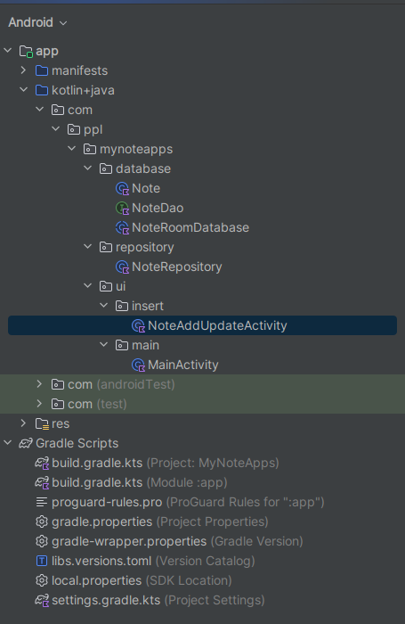
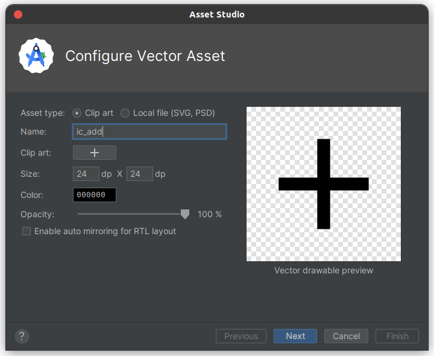
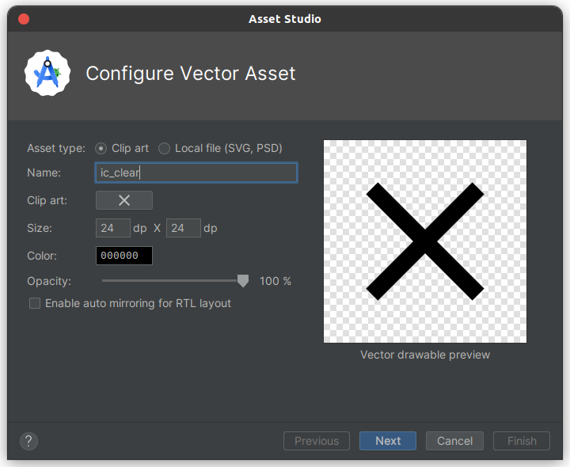
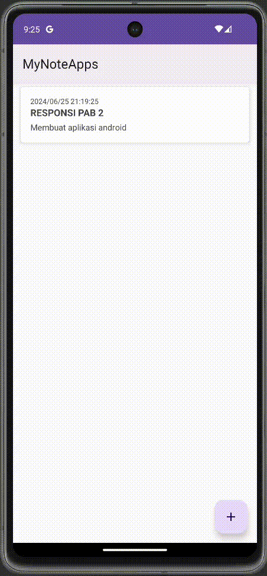

# Praktikum Room Database

Pada praktikum kali ini, kita akan mempelajari cara mengimplementasikan _database Room_ ke dalam aplikasi Android yang kita buat. Kita akan membuat aplikasi Notes sederhana.

## 1. Buat Project Baru

| Field                        | Value                              |
| ---------------------------- | -----------------------------------|
| Nama Project                 | MyNoteApps                         |
| Templates                    | Phone and Tablet, Api level 21     |
| Tipe Activity                | Empty Views Activity               |
| Language                     | Kotlin                             |
| Minimum SDK                  | API level 29                       |
| Build Configuration Language | Kotlin DSL                         |

## 2. Menambahkan Dependency Plugin

Untuk menggunakan Room, Anda perlu menambahkan dependency plugin tambahan. Hal ini karena nantinya, Room perlu menggunakan compiler tersendiri, Anda perlu menambahkan terlebih dulu plugin KSP di dalam build.gradle.kts (project). KSP (Kotlin Symbol Processing) merupakan alternatif untuk KAPT yang tentunya mempercepat proses annotation processor yang dipakai Room untuk abstraksi.

```gradle
plugins {
    alias(libs.plugins.androidApplication) apply false
    alias(libs.plugins.jetbrainsKotlinAndroid) apply false
    id("com.google.devtools.ksp") version "1.9.20-RC2-1.0.13" apply false //dengan asumsi versi Kotlin  1.9.20-RC2
```

**Pastikan bahwa versi KSP sama dengan versi Kotlin supaya tidak terjadi error**
untuk melihat versi yang tersedia, dapat dilihat pada URL berikut ini.

- [KSP Version Releases](https://github.com/google/ksp/releases)

#### Tambahkan Library Architecture Componenet, mengaktifkan ViewBinding, dan komponen lain.

Untuk mendapatkan library terbaru, silahkan kunjungi tautan-tautan berikut ini [Room](https://developer.android.com/jetpack/androidx/releases/room) dan [Lifecycle](https://developer.android.com/jetpack/androidx/releases/lifecycle).

Tambahkan pada file `build.gradle.kts(app)`

```gradle
plugins {
    id("com.android.application")
    id("kotlin-android")
    id("com.google.devtools.ksp")
    id("kotlin-parcelize")
}
android {
    ...
    buildFeatures {
        viewBinding = true
    }
}
 
dependencies {
    ...
    implementation("androidx.room:room-runtime:2.6.1")
    annotationProcessor("androidx.room:room-compiler:2.6.1")
    implementation ("androidx.lifecycle:lifecycle-viewmodel-ktx:2.8.2")  // Update version as needed
    implementation ("androidx.lifecycle:lifecycle-livedata-ktx:2.8.2")  // Update version as needed

    // To use Kotlin Symbol Processing (KSP)
    ksp("androidx.room:room-compiler:2.6.1")

}
```

**NOTES UNTUK YANG INGIN MENGGUNAKAN FILE LIBS**

`Kalau tidak mau ribet, kalian cukup copy-paste saja semua kode di atas`

Untuk Room dan KSP membutuhkan Java Version 18, untuk itu Anda perlu mengubah versi pada compileOptions dan kotlinOptions. Jika tidak diubah, Anda akan mengalami error Execution failed for task ‘:app:kaptGenerateStubsDebugKotlin’.
Penambahan library pada kode di atas menggunakan cara version catalog yang menjadi cara bawaan ketika membuat proyek baru pada Android Studio Iguana ke atas. Asisten menyarankan untuk membaca [artikel berikut](https://www.dicoding.com/blog/apa-yang-berubah-pada-template-project-android-studio-iguana/) agar dapat mengetahui bagaimana cara migrasi penambahan library dengan cara sebelumnya (hardcoded) ke version catalog.

**HAPUS NO ACTION BAR PADA THEME SEHINGGA MENJADI SEPERTI INI**

`themes.xml`

```xml
<resources xmlns:tools="http://schemas.android.com/tools">
    <!-- Base application theme. -->
    <style name="Base.Theme.MyNoteApps" parent="Theme.Material3.DayNight">
        <!-- Customize your dark theme here. -->
        <!-- <item name="colorPrimary">@color/my_dark_primary</item> -->
    </style>
</resources>
```

`themes.xml (night)`

```xml
<resources xmlns:tools="http://schemas.android.com/tools">
    <!-- Base application theme. -->
    <style name="Base.Theme.MyNoteApps" parent="Theme.Material3.DayNight">
        <!-- Customize your dark theme here. -->
        <!-- <item name="colorPrimary">@color/my_dark_primary</item> -->
    </style>
</resources>
```

## 3. Buat file kotlin `Note`.

Buat package `database` dan file Kotlin `Note`, kemudian tambahkan *annotation entity* sebagai berikut.

```kotlin
@Entity
class Note{

}
```

Kemudian, lengkapi file `Note` di atas menjadi seperti ini.
```kotlin
@Entity
data class Note(
    @PrimaryKey(autoGenerate = true)
    @ColumnInfo(name = "id")
    var id: Int = 0,
    @ColumnInfo(name = "title")
    var title: String? = null,
    @ColumnInfo(name = "description")
    var description: String? = null,
    @ColumnInfo(name = "date")
    var date: String? = null
)
```

Jangan lupa untuk mengimplementasikan `Parcelable` sehingga file tersebut akan menjadi seperti ini.

```kotlin
@Entity
@Parcelize
data class Note(
    @PrimaryKey(autoGenerate = true)
    @ColumnInfo(name = "id")
    var id: Int = 0,
 
    @ColumnInfo(name = "title")
    var title: String? = null,
 
    @ColumnInfo(name = "description")
    var description: String? = null,
 
    @ColumnInfo(name = "date")
    var date: String? = null
) : Parcelable
```

## 4. Buat interface class `NoteDao`

Buat interface class dalam package `database` dengan nama `NoteDao`

```kotlin
@Dao
interface NoteDao {
    @Insert(onConflict = OnConflictStrategy.IGNORE)
    fun insert(note: Note)
    @Update
    fun update(note: Note)
    @Delete
    fun delete(note: Note)
    @Query("SELECT * from note ORDER BY id ASC")
    fun getAllNotes(): LiveData<List<Note>>
}
```

## 5. Buat class `NoteRoomDatabase`. 

Selanjutnya, buatlah kelas baru di dalam package `database` dengan nama `NoteRoomDatabase`. Kelas ini akan berfungsi untuk menginisialisasi database dalam aplikasi. Setelah kelas ini dibuat, tambahkan implementasi `RoomDatabase`, beri annotation `@Database`, dan ubah menjadi kelas abstrak seperti contoh berikut:

```kotlin
@Database(entities = [Note::class], version = 1)
abstract class NoteRoomDatabase : RoomDatabase() {
 
}
```

Setelah itu tambahkan kode berikut untuk membuat variabel global berupa `Singleton` untuk `Dao` yang nanti akan dipanggil di kelas repository.

```kotlin
@Database(entities = [Note::class], version = 1)
abstract class NoteRoomDatabase : RoomDatabase() {
    abstract fun noteDao(): NoteDao
    companion object {
        @Volatile
        private var INSTANCE: NoteRoomDatabase? = null
        @JvmStatic
        fun getDatabase(context: Context): NoteRoomDatabase {
            if (INSTANCE == null) {
                synchronized(NoteRoomDatabase::class.java) {
                    INSTANCE = Room.databaseBuilder(context.applicationContext,
                            NoteRoomDatabase::class.java, "note_database")
                            .build()
                }
            }
            return INSTANCE as NoteRoomDatabase
        }
    }
}
```

## 6. Buat package baru `Repository` dan kelas `NoteRepository`

Kita sudah membuat beberapa kelas yang berfungsi sebagai komponen dari `Room` yaitu entitas, dao, dan database. Selanjutnya buat package baru dengan nama `repository`, dan buat kelas di dalamnya dengan nama `NoteRepository`. Kelas ini berfungsi sebagai penghubung antara ViewModel dengan database atau resource data. Setelah terbentuk, ubah dan tambahkan kodenya menjadi seperti ini:

```kotlin
class NoteRepository(application: Application) {
    private val mNotesDao: NoteDao
    private val executorService: ExecutorService = Executors.newSingleThreadExecutor()
    init {
        val db = NoteRoomDatabase.getDatabase(application)
        mNotesDao = db.noteDao()
    }
    fun getAllNotes(): LiveData<List<Note>> = mNotesDao.getAllNotes()
    fun insert(note: Note) {
        executorService.execute { mNotesDao.insert(note) }
    }
    fun delete(note: Note) {
        executorService.execute { mNotesDao.delete(note) }
    }
    fun update(note: Note) {
        executorService.execute { mNotesDao.update(note) }
    }
}
```

## 7. Buat package `ui`

Setelah menyiapkan repository dan database, buatlah sebuah package baru dengan nama `ui`. Di dalamnya buat lagi 2 package baru dengan nama `insert` dan `main`. Setelah itu, pindahkan `MainActivity` ke package `main`. Ini untuk memudahkan Anda memilah-milah fungsi dari masing masing kelas. Setelah itu Anda bisa membuat sebuah activity baru dengan nama `NoteAddUpdateActivity`. Sehingga struktur folder sekarang menjadi seperti ini:



## 8. Buat class `NoteAddUpdateViewModel`

Setelah membuat `Activity`, kita akan buat terlebih dahulu kelas `ViewModel` sebagai penghubung antara `Activity` dengan `Repository`. Buatlah kelas di dalam package `insert` dengan nama `NoteAddUpdateViewModel`. Kemudian ubah dan tambahkan kodenya menjadi seperti ini:

```kotlin
class NoteAddUpdateViewModel(application: Application) : ViewModel() {
    private val mNoteRepository: NoteRepository = NoteRepository(application)
    fun insert(note: Note) {
        mNoteRepository.insert(note)
    }
    fun update(note: Note) {
        mNoteRepository.update(note)
    }
    fun delete(note: Note) {
        mNoteRepository.delete(note)
    }
}
```

## 9. Buat class `MainViewModel`

Setelah itu, buat kelas ViewModel di package `main` dengan nama `MainViewModel`. Ubah dan tambahkan kode pada kelas tersebut menjadi seperti ini:

```kotlin
class MainViewModel(application: Application) : ViewModel() {
    private val mNoteRepository: NoteRepository = NoteRepository(application)
    fun getAllNotes(): LiveData<List<Note>> = mNoteRepository.getAllNotes()
}
```

## 10. Modifikasi `activity_main.xml`

Baik, Anda sudah membuat semua komponen yang dibutuhkan. Namun Anda perlu mengkonfigurasikan Activity yang ada agar sesuai dengan yang dibutuhkan. Kita mulai dari proses layouting, bukalah activity_main.xml kemudian ubah menjadi seperti ini:

`activity_main.xml`

```xml
<?xml version="1.0" encoding="utf-8"?>
<androidx.coordinatorlayout.widget.CoordinatorLayout xmlns:android="http://schemas.android.com/apk/res/android"
    xmlns:app="http://schemas.android.com/apk/res-auto"
    xmlns:tools="http://schemas.android.com/tools"
    android:layout_width="match_parent"
    android:layout_height="match_parent"
    android:fitsSystemWindows="true"
    tools:context=".ui.main.MainActivity">
 
    <androidx.recyclerview.widget.RecyclerView
        android:id="@+id/rv_notes"
        android:layout_width="match_parent"
        android:layout_height="match_parent"
        tools:listitem="@layout/item_note" />
    <com.google.android.material.floatingactionbutton.FloatingActionButton
        android:id="@+id/fab_add"
        android:layout_width="wrap_content"
        android:layout_height="wrap_content"
        android:layout_margin="16dp"
        android:foregroundGravity="bottom"
        app:fabSize="normal"
        app:layout_anchor="@id/rv_notes"
        app:layout_anchorGravity="bottom|end"
        app:srcCompat="@drawable/ic_add" />
</androidx.coordinatorlayout.widget.CoordinatorLayout>
```

Ketika Anda menambahkan FloatingActionButton, maka akan ada eror di bagian srcCompat. Tambahkan berkas gambar di bagian drawable. Klik kanan di drawable, kemudian pilih new dan pilih Vector Asset. Carilah gambar di bagian Clip Art dengan gambar add atau +, kemudian beri nama ic_add.



Tambahkan juga resource string-nya. Tambahkan semua string yang akan digunakan di project ini. Buka berkas strings.xml dan tambahkan kode berikut ini:

```xml
<resources>
    <string name="app_name">MyNoteApps</string>
    <string name="title">Judul</string>
    <string name="description">Deskripsi</string>
    <string name="submit">Submit</string>
    <string name="delete">Hapus</string>
    <string name="date">Date</string>
    <string name="message_undo">Batalkan menghapus item sebelumnya?</string>
    <string name="message_ok">OK</string>
    <string name="cancel">Batal</string>
    <string name="empty">Field can not be blank</string>
    <string name="update">Update</string>
    <string name="change">Ubah</string>
    <string name="add">Tambah</string>
    <string name="save">Simpan</string>
    <string name="yes">Ya</string>
    <string name="no">Tidak</string>
    <string name="message_cancel">Apakah anda ingin membatalkan perubahan pada form?</string>
    <string name="message_delete">Apakah anda yakin ingin menghapus item ini?</string>
    <string name="added">Satu item berhasil ditambahkan</string>
    <string name="changed">Satu item berhasil diubah</string>
    <string name="deleted">Satu item berhasil dihapus</string>
</resources>
```

## 11.Buat file `item_note.xml`

Setelah itu, buatlah satu berkas xml untuk menampilkan sebuah item. Klik kanan di bagian layout, pilih new, pilih Layout Resource File dan kemudian beri nama item_note.xml. Setelah terbentuk, ubahlah menjadi seperti ini:

```xml
<?xml version="1.0" encoding="utf-8"?>
<LinearLayout xmlns:android="http://schemas.android.com/apk/res/android"
    xmlns:app="http://schemas.android.com/apk/res-auto"
    android:layout_width="match_parent"
    android:layout_height="wrap_content"
    android:layout_marginLeft="8dp"
    android:layout_marginRight="8dp"
    android:orientation="vertical">
 
    <androidx.cardview.widget.CardView
        android:id="@+id/cv_item_note"
        android:layout_width="match_parent"
        android:layout_height="wrap_content"
        app:cardCornerRadius="4dp"
        app:cardElevation="4dp"
        app:cardMaxElevation="4dp"
        app:cardUseCompatPadding="true">
 
        <LinearLayout
            android:layout_width="match_parent"
            android:layout_height="wrap_content"
            android:orientation="vertical"
            android:padding="16dp">
 
            <TextView
                android:id="@+id/tv_item_date"
                android:layout_width="match_parent"
                android:layout_height="wrap_content"
                android:gravity="start"
                android:text="@string/date"
                android:textSize="12sp" />
 
            <TextView
                android:id="@+id/tv_item_title"
                android:layout_width="match_parent"
                android:layout_height="wrap_content"
                android:layout_marginBottom="4dp"
                android:gravity="start"
                android:text="@string/title"
                android:textSize="16sp"
                android:textStyle="bold" />
 
            <TextView
                android:id="@+id/tv_item_description"
                android:layout_width="match_parent"
                android:layout_height="wrap_content"
                android:gravity="start"
                android:text="@string/description"
                android:textSize="14sp" />
        </LinearLayout>
    </androidx.cardview.widget.CardView>
</LinearLayout>
```

## 12. Modifikasi `activity_note_add_update.xml`

Selanjutnya, buka activity_note_add_update.xml. Ubah dan tambahkan kode pada layout tersebut menjadi seperti ini:

```xml
<?xml version="1.0" encoding="utf-8"?>
<LinearLayout xmlns:android="http://schemas.android.com/apk/res/android"
    xmlns:tools="http://schemas.android.com/tools"
    android:id="@+id/activity_form_add_update"
    android:layout_width="match_parent"
    android:layout_height="match_parent"
    android:orientation="vertical"
    android:padding="16dp"
    tools:context=".ui.insert.NoteAddUpdateActivity">
 
    <com.google.android.material.textfield.TextInputLayout
        android:layout_width="match_parent"
        android:layout_height="wrap_content"
        android:layout_marginBottom="16dp">
 
        <EditText
            android:id="@+id/edt_title"
            android:layout_width="match_parent"
            android:layout_height="wrap_content"
            android:hint="@string/title"
            android:inputType="textCapSentences"
            android:maxLines="1" />
    </com.google.android.material.textfield.TextInputLayout>
 
    <com.google.android.material.textfield.TextInputLayout
        android:layout_width="match_parent"
        android:layout_height="wrap_content"
        android:layout_marginBottom="16dp">
 
        <EditText
            android:id="@+id/edt_description"
            android:layout_width="match_parent"
            android:layout_height="wrap_content"
            android:hint="@string/description"
            android:inputType="textCapSentences"
            android:maxLines="1" />
    </com.google.android.material.textfield.TextInputLayout>
 
    <Button
        android:id="@+id/btn_submit"
        style="@style/Base.Widget.AppCompat.Button.Colored"
        android:layout_width="match_parent"
        android:layout_height="wrap_content"
        android:text="@string/submit" />
</LinearLayout>
```

## 13. Buat package `Helper` dan file `DataHelper`

Oke, proses layouting sudah dilakukan. Sebelum melangkah lebih lanjut, buatlah package baru dengan nama helper. Package ini akan kita isi dengan beberapa kelas untuk membuat kode Anda menjadi lebih mudah. Pertama buatlah kelas di dalamnya dengan nama DateHelper. Kelas ini berfungsi untuk mendapatkan waktu seperti tanggal, bulan, tahun, dan jam. Setelah terbentuk, Anda bisa ubah dan tambahkan kode pada kelas tersebut menjadi seperti ini:

```kotlin
object DateHelper {
    fun getCurrentDate(): String {
        val dateFormat = SimpleDateFormat("yyyy/MM/dd HH:mm:ss", Locale.getDefault())
        val date = Date()
        return dateFormat.format(date)
    }
}
```

## 14. Buat class `ViewModelFactory`

Selanjutnya buat kelas baru dengan nama `ViewModelFactory` dalam package `helper`. Kelas ini berfungsi untuk menambahkan context ketika memanggil kelas ViewModel di dalam Activity. Setelah kelas tersebut terbentuk, ubah dan tambahkan kode pada kelas tersebut menjadi seperti ini:

```kotlin
class ViewModelFactory private constructor(private val mApplication: Application) : ViewModelProvider.NewInstanceFactory() {
    companion object {
        @Volatile
        private var INSTANCE: ViewModelFactory? = null
        @JvmStatic
        fun getInstance(application: Application): ViewModelFactory {
            if (INSTANCE == null) {
                synchronized(ViewModelFactory::class.java) {
                    INSTANCE = ViewModelFactory(application)
                }
            }
            return INSTANCE as ViewModelFactory
        }
    }
    
    @Suppress("UNCHECKED_CAST")
    override fun <T : ViewModel> create(modelClass: Class<T>): T {
        if (modelClass.isAssignableFrom(MainViewModel::class.java)) {
            return MainViewModel(mApplication) as T
        } else if (modelClass.isAssignableFrom(NoteAddUpdateViewModel::class.java)) {
            return NoteAddUpdateViewModel(mApplication) as T
        }
        throw IllegalArgumentException("Unknown ViewModel class: ${modelClass.name}")
    }
}
```

## 15. Tambahkan class `NoteDiffCallback`

Oke setelah itu, tambahkan kelas baru lagi di dalam package helper dan beri nama NoteDiffCallback untuk melakukan pengecekan apakah ada perubahan list note. Kelas ini nanti akan dipanggil di kelas adapter. Setelah itu, ubah dan tambahkan kode pada kelas tersebut menjadi seperti ini:

```kotlin
class NoteDiffCallback(private val oldNoteList: List<Note>, private val newNoteList: List<Note>) : DiffUtil.Callback() {
    override fun getOldListSize(): Int = oldNoteList.size
    override fun getNewListSize(): Int = newNoteList.size
    override fun areItemsTheSame(oldItemPosition: Int, newItemPosition: Int): Boolean {
        return oldNoteList[oldItemPosition].id == newNoteList[newItemPosition].id
    }
    override fun areContentsTheSame(oldItemPosition: Int, newItemPosition: Int): Boolean {
        val oldNote = oldNoteList[oldItemPosition]
        val newNote = newNoteList[newItemPosition]
        return oldNote.title == newNote.title && oldNote.description == newNote.description
    }
}
```

## 16. Buat android Resource Directory `menu`

Setelah menyiapkan kelas helper, Anda perlu membuat menu yang akan digunakan di NoteAddUpdateActivity. Untuk langkahnya, buatlah sebuah android resource directory baru dengan nama menu. Klik kanan res, kemudian pilih new dan pilih New Resource Directory. Kemudian ubah resource type-nya menjadi menu dan pilih OK. Setelah itu, buat sebuah menufile di dalam folder menu. Klik kanan di menu, kemudian pilih new dan pilih Menu Resource File. Berilah nama menu_form dan tambahkan kode berikut:

```xml
<?xml version="1.0" encoding="utf-8"?>
<menu xmlns:android="http://schemas.android.com/apk/res/android"
    xmlns:app="http://schemas.android.com/apk/res-auto">
    <item
        android:id="@+id/action_delete"
        android:icon="@drawable/ic_clear"
        android:title="@string/delete"
        app:showAsAction="always" />
</menu> 
```

Pada menu di atas, akan ada error di bagian icon. Anda bisa tambahkan file gambar di bagian drawable. Klik kanan di drawable, kemudian pilih new dan pilih VectorAsset. Carilah gambar di bagian Clip Art dengan gambar clear atau x, kemudian beri nama ic_clear.



## 17. Modifikasi `NoteAddUpdateActivity`

Setelah resource menu sudah siap, bukalah NoteAddUpdateActivity. Tambahkan kode berikut untuk menginisialisasi view yang ada di layout-nya.

```kotlin
class NoteAddUpdateActivity : AppCompatActivity() {
    companion object {
        const val EXTRA_NOTE = "extra_note"
        const val ALERT_DIALOG_CLOSE = 10
        const val ALERT_DIALOG_DELETE = 20
    }
    private var isEdit = false
    private var note: Note? = null
   
    ...
}
```

Selanjutnya hubungkan NoteAddUpdateViewModel dengan NoteAddUpdateActivity.

```kotlin
class NoteAddUpdateActivity : AppCompatActivity() {
 
    ...
 
    private lateinit var noteAddUpdateViewModel: NoteAddUpdateViewModel
    private var _activityNoteAddUpdateBinding: ActivityNoteAddUpdateBinding? = null
    private val binding get() = _activityNoteAddUpdateBinding
 
    override fun onCreate(savedInstanceState: Bundle?) {
        super.onCreate(savedInstanceState)
 
        _activityNoteAddUpdateBinding = ActivityNoteAddUpdateBinding.inflate(layoutInflater)
        setContentView(binding?.root)
        noteAddUpdateViewModel = obtainViewModel(this@NoteAddUpdateActivity)
    }
 
    override fun onDestroy() {
        super.onDestroy()
        _activityNoteAddUpdateBinding = null
    }
    private fun obtainViewModel(activity: AppCompatActivity): NoteAddUpdateViewModel {
        val factory = ViewModelFactory.getInstance(activity.application)
        return ViewModelProvider(activity, factory).get(NoteAddUpdateViewModel::class.java)
    }
}
```
Setelah itu, karena kelas ini berfungsi untuk menambahkan, memperbarui, dan menghapus item, maka perlu masukkan kode berikut:

```kotlin
class NoteAddUpdateActivity : AppCompatActivity() {
 
    ...
 
    override fun onCreate(savedInstanceState: Bundle?) {
        super.onCreate(savedInstanceState)
 
        ...
 
        note = intent.getParcelableExtra(EXTRA_NOTE)
        if (note != null) {
            isEdit = true
        } else {
            note = Note()
        }
        val actionBarTitle: String
        val btnTitle: String
        if (isEdit) {
            actionBarTitle = getString(R.string.change)
            btnTitle = getString(R.string.update)
            if (note != null) {
                note?.let { note ->
                    binding?.edtTitle?.setText(note.title)
                    binding?.edtDescription?.setText(note.description)
                }
            }
        } else {
            actionBarTitle = getString(R.string.add)
            btnTitle = getString(R.string.save)
        }
        supportActionBar?.title = actionBarTitle
        supportActionBar?.setDisplayHomeAsUpEnabled(true)
        binding?.btnSubmit?.text = btnTitle
    }
 
    ...
}
```

Setelah itu, tambahkan aksi untuk button-nya seperti ini:

```kotlin
class NoteAddUpdateActivity : AppCompatActivity() {
    ...
    override fun onCreate(savedInstanceState: Bundle?) {
        super.onCreate(savedInstanceState)
 
        _activityNoteAddUpdateBinding = ActivityNoteAddUpdateBinding.inflate(layoutInflater)
        setContentView(binding?.root)
        ...
        binding?.btnSubmit?.setOnClickListener {
            val title = binding?.edtTitle?.text.toString().trim()
            val description = binding?.edtDescription?.text.toString().trim()
            when {
                title.isEmpty() -> {
                    binding?.edtTitle?.error = getString(R.string.empty)
                }
                description.isEmpty() -> {
                    binding?.edtDescription?.error = getString(R.string.empty)
                }
                else -> {
                    note.let { note ->
                        note?.title = title
                        note?.description = description
                    }
                    if (isEdit) {
                        noteAddUpdateViewModel.update(note as Note)
                        showToast(getString(R.string.changed))
                    } else {
                        note.let { note ->
                            note?.date = DateHelper.getCurrentDate()
                        }
                        noteAddUpdateViewModel.insert(note as Note)
                        showToast(getString(R.string.added))
                    }
                    finish()
                }
            }
        }
    }
 
    private fun showToast(message: String) {
        Toast.makeText(this, message, Toast.LENGTH_SHORT).show()
    }
    ...
}
```

Setelah itu, tambahkan kode berikut untuk menghapus item dari database:

```kotlin
class NoteAddUpdateActivity : AppCompatActivity() {
 
    override fun onCreate(savedInstanceState: Bundle?) {
        super.onCreate(savedInstanceState)
 
        ...
 
        onBackPressedDispatcher.addCallback(this, object: OnBackPressedCallback(true) {
            override fun handleOnBackPressed() {
                showAlertDialog(ALERT_DIALOG_CLOSE)
            }
        })
    }
 
    ...
 
    override fun onCreateOptionsMenu(menu: Menu): Boolean {
        if (isEdit) {
            menuInflater.inflate(R.menu.menu_form, menu)
        }
        return super.onCreateOptionsMenu(menu)
    }
    override fun onOptionsItemSelected(item: MenuItem): Boolean {
        when (item.itemId) {
            R.id.action_delete -> showAlertDialog(ALERT_DIALOG_DELETE)
            android.R.id.home -> showAlertDialog(ALERT_DIALOG_CLOSE)
        }
        return super.onOptionsItemSelected(item)
    }
 
    private fun showAlertDialog(type: Int) {
        val isDialogClose = type == ALERT_DIALOG_CLOSE
        val dialogTitle: String
        val dialogMessage: String
        if (isDialogClose) {
            dialogTitle = getString(R.string.cancel)
            dialogMessage = getString(R.string.message_cancel)
        } else {
            dialogMessage = getString(R.string.message_delete)
            dialogTitle = getString(R.string.delete)
        }
        val alertDialogBuilder = AlertDialog.Builder(this)
        with(alertDialogBuilder) {
            setTitle(dialogTitle)
            setMessage(dialogMessage)
            setCancelable(false)
            setPositiveButton(getString(R.string.yes)) { _, _ ->
                if (!isDialogClose) {
                    noteAddUpdateViewModel.delete(note as Note)
                    showToast(getString(R.string.deleted))
                }
                finish()
            }
            setNegativeButton(getString(R.string.no)) { dialog, _ -> dialog.cancel() }
        }
        val alertDialog = alertDialogBuilder.create()
        alertDialog.show()
    }
 
    ...
}
```

## 18. Buat class `NoteAdapter`

Sebelum Anda mengubah kode yang ada di MainActivity, buatlah kelas baru untuk adapter dari list item di package main. Berilah nama NoteAdapter, dan tambahkan kode berikut

```kotlin
class NoteAdapter : RecyclerView.Adapter<NoteViewHolder>() {
    private val listNotes = ArrayList<Note>()
    fun setListNotes(listNotes: List<Note>) {
        val diffCallback = NoteDiffCallback(this.listNotes, listNotes)
        val diffResult = DiffUtil.calculateDiff(diffCallback)
        this.listNotes.clear()
        this.listNotes.addAll(listNotes)
        diffResult.dispatchUpdatesTo(this)
    }
    override fun onCreateViewHolder(parent: ViewGroup, viewType: Int): NoteViewHolder {
        val binding = ItemNoteBinding.inflate(LayoutInflater.from(parent.context), parent, false)
        return NoteViewHolder(binding)
    }
    override fun onBindViewHolder(holder: NoteViewHolder, position: Int) {
        holder.bind(listNotes[position])
    }
    override fun getItemCount(): Int {
        return listNotes.size
    }
    inner class NoteViewHolder(private val binding: ItemNoteBinding) : RecyclerView.ViewHolder(binding.root) {
        fun bind(note: Note) {
            with(binding) {
                tvItemTitle.text = note.title
                tvItemDate.text = note.date
                tvItemDescription.text = note.description
                cvItemNote.setOnClickListener {
                    val intent = Intent(it.context, NoteAddUpdateActivity::class.java)
                    intent.putExtra(NoteAddUpdateActivity.EXTRA_NOTE, note)
                    it.context.startActivity(intent)
                }
            }
        }
    }
}
```

Kode di atas memanggil kelas NoteDiffCallback untuk memeriksa perubahan yang ada pada listNotes. Jadi jika ada perubahan pada listNotes, maka akan memperbarui secara otomatis. NoteDiffCallback digunakan sebagai pengganti notifyDataSetChanged, yang fungsinya sama-sama untuk melakukan pembaharuan item pada RecyclerView.

## 19. Modifikasi `MainActivity`

Terakhir, buka kelas MainActivity dan tambahkan kode-kode berikut:

```kotlin
class MainActivity : AppCompatActivity() {
 
    private var _activityMainBinding: ActivityMainBinding? = null
    private val binding get() = _activityMainBinding
    private lateinit var adapter: NoteAdapter
 
    override fun onCreate(savedInstanceState: Bundle?) {
        super.onCreate(savedInstanceState)
 
        _activityMainBinding = ActivityMainBinding.inflate(layoutInflater)
        setContentView(binding?.root)
        adapter = NoteAdapter()
        binding?.rvNotes?.layoutManager = LinearLayoutManager(this)
        binding?.rvNotes?.setHasFixedSize(true)
        binding?.rvNotes?.adapter = adapter
    }
 
    override fun onDestroy() {
        super.onDestroy()
        _activityMainBinding = null
    }
}
```

Setelah menginisialisasi RecyclerView dan NoteAdapter, tambahkan kode di bawah ini untuk menghubungkan MainViewModel dengan MainActivity.

```kotlin
class MainActivity : AppCompatActivity() {
 
    private var _activityMainBinding: ActivityMainBinding? = null
    private val binding get() = _activityMainBinding
 
    private lateinit var adapter: NoteAdapter
 
    override fun onCreate(savedInstanceState: Bundle?) {
        super.onCreate(savedInstanceState)
 
        _activityMainBinding = ActivityMainBinding.inflate(layoutInflater)
        setContentView(binding?.root)
 
        val mainViewModel = obtainViewModel(this@MainActivity)
        mainViewModel.getAllNotes().observe(this) { noteList ->
            if (noteList != null) {
                adapter.setListNotes(noteList)
            }
        }
 
        adapter = NoteAdapter()
 
        binding?.rvNotes?.layoutManager = LinearLayoutManager(this)
        binding?.rvNotes?.setHasFixedSize(true)
        binding?.rvNotes?.adapter = adapter
    }
 
    private fun obtainViewModel(activity: AppCompatActivity): MainViewModel {
        val factory = ViewModelFactory.getInstance(activity.application)
        return ViewModelProvider(activity, factory).get(MainViewModel::class.java)
    }
}
```

Setelah itu, tambahkan kode untuk aksi pada fab untuk berpindah ke halaman NoteAddUpdateActivity.

```kotlin
class MainActivity : AppCompatActivity() {
 
    private var _activityMainBinding: ActivityMainBinding? = null
    private val binding get() = _activityMainBinding
 
    private lateinit var adapter: NoteAdapter
 
    override fun onCreate(savedInstanceState: Bundle?) {
        super.onCreate(savedInstanceState)
 
        ...
 
        binding?.fabAdd?.setOnClickListener {
            val intent = Intent(this@MainActivity, NoteAddUpdateActivity::class.java)
            startActivity(intent)
        }
    }
    ...
}
```

## 20. Result Aplikasi

Jika semua tahapan berhasil, maka aplikasi akan seperti berikut ini.

