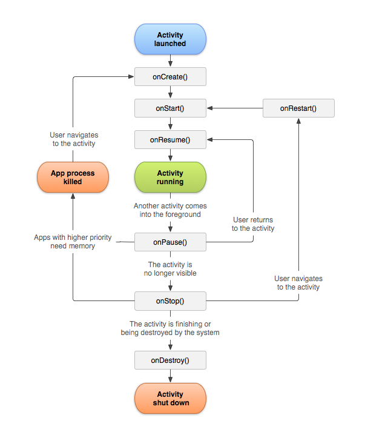

# ACTIVITY

Activity Class adalah komponen penting dari aplikasi Android, dan cara activity diluncurkan dan disatukan adalah bagian mendasar dari model aplikasi platform. Tidak seperti paradigma pemrograman di mana aplikasi diluncurkan dengan metode main(), sistem Android memulai kode dalam instance Activity dengan memanggil metode callback spesifik yang sesuai dengan tahapan tertentu dalam life cycle-nya. Mobile App Experience berbeda dengan dekstop app karena interaksi pengguna dengan aplikasi tidak selalu dimulai di tempat yang sama. Sebaliknya,user journey sering kali dimulai secara tidak pasti. Misalnya, jika Anda membuka aplikasi email dari layar beranda, Anda mungkin akan melihat daftar email. Sebaliknya, jika Anda menggunakan aplikasi media sosial yang kemudian meluncurkan aplikasi email Anda, Anda mungkin langsung membuka layar aplikasi email untuk menulis email. 

Ketika membuat project baru di Android Studio, maka akan ada dua berkas yang sudah tercipta, yaitu MainActivity dan activity_main.xml. MainActivity adalah file untuk mengatur logika dari jalannya aplikasi, sedangkan activity_main.xml adalah file untuk mendesain tampilan dari aplikasinya. Sebuah aplikasi dapat memiliki banyak activity yang saling terhubung dan memiliki fungsi yang berbeda-beda. Selain itu, setiap Activity yang dibuat harus terdaftar di AndroidManifest.xml.

## Activity Lifecycle

### OnCreate()
Developer harus mengimplementasikan _callback_ ini, dimana akan dijalankan ketika sistem pertama kali membuat Activity. Pada proses membuat Activity, activity akan memasuki pada **Created State**. Dalam method **onCreate()**, diisi dengan start-up logic yang hanya akan terjadi sekali untuk selama activity dijalankan.

### OnStart()
Ketika activity memasuki state Started, sistem akan memanggil onStart(). Panggilan ini membuat activity terlihat oleh pengguna saat aplikasi mempersiapkan activity untuk masuk ke **foreground** dan menjadi interaktif. Sebagai contoh, metode ini adalah tempat kode yang mengelola UI diinisialisasi.

### OnResume()
Ketika activity memasuki state OnResume, activity akan muncul di **foreground**, dan sistem akan memanggil callback onResume(). Ini adalah keadaan di mana aplikasi berinteraksi dengan pengguna. Aplikasi tetap berada dalam status ini sampai sesuatu terjadi yang mengalihkan fokus dari aplikasi, seperti perangkat menerima panggilan telepon, pengguna menavigasi ke activity lain, atau layar perangkat mati.

### OnPause()
Sistem memanggil metode ini sebagai indikasi pertama bahwa pengguna meninggalkan activity, meskipun tidak selalu berarti activity tersebut dihancurkan. Ini menandakan bahwa activity tidak lagi berada di **foreground**, tetapi masih terlihat jika pengguna berada dalam multi-window mode. Ada beberapa alasan mengapa activity dapat memasuki kondisi ini:
- Peristiwa yang mengganggu eksekusi aplikasi, seperti yang dijelaskan di bagian tentang pemanggilan kembali onResume(), yang menghentikan activity yang sedang berjalan. Ini adalah kasus yang paling umum terjadi.
- Dalam multi-window mode, hanya satu aplikasi yang memiliki fokus pada suatu waktu, dan sistem akan menjeda semua aplikasi lainnya.
- Pembukaan semi-transparent activity yang baru, seperti dialog, akan menjeda activity yang ditutupinya. Selama activity terlihat sebagian tetapi tidak dalam fokus, activity tersebut tetap dijeda.

### Onstop()
Ketika activity Anda tidak lagi terlihat oleh pengguna, activity tersebut masuk ke Stopped state, dan sistem akan memanggil kembali onStop(). Hal ini dapat terjadi ketika activity yang baru diluncurkan menutupi seluruh layar. Sistem juga memanggil onStop() ketika activity selesai berjalan dan akan dihentikan.

### OnDestroy()
onDestroy() dipanggil sebelum activity dihancurkan. Sistem memanggil pemanggilan balik ini karena salah satu dari dua alasan:
- Activity selesai, karena pengguna menutup activity sepenuhnya atau karena onFinish() dipanggil pada activity.
- Sistem menghancurkan activity untuk sementara karena perubahan konfigurasi, seperti rotasi perangkat atau masuk ke multi-window mode.
Ketika activity berpindah ke destroyed state, komponen yang menyadari lifecycle yang terkait dengan lifecycle activity menerima peristiwa ON_DESTROY. Di sinilah komponen lifecycle dapat membersihkan apa pun yang diperlukan sebelum activity dihancurkan.

## Saving State Activity

onSaveInstanceState() adalah sebuah method yang digunakan dalam siklus hidup (lifecycle) dari activity (Activity) pada platform Android. Method ini digunakan **untuk menyimpan data atau keadaan dari activity ketika activity tersebut sedang dalam proses onDestroy() atau ketika sistem Android memutuskan untuk menghentikan activity tersebut untuk sementara waktu (misalnya saat rotasi layar)**.

Ketika sebuah activity OnDestroy atau onPause oleh sistem Android, data-data penting yang ingin disimpan bisa disimpan dalam objek Bundle. Objek Bundle ini akan di-passing ke method onSaveInstanceState() sebagai parameter. Kita bisa menyimpan data ke dalam objek Bundle ini menggunakan berbagai metode, seperti putString(), putInt(), putParcelable(), dan sebagainya, tergantung pada jenis data yang ingin Anda simpan. **Perlu diingat bahwa method ini tidak digunakan untuk menyimpan data yang besar pada bundle** karena akan menyebabkan proses serialisasi dan deserialisasi akan memakan banyak memori.

Kemudian, saat activity tersebut dibuat kembali (misalnya setelah rotasi layar selesai), data yang telah disimpan dalam Bundle tersebut dapat diambil kembali dari method onCreate(), onRestoreInstanceState(), atau onCreateView() tergantung pada jenis komponen UI yang digunakan.

##### Berikut ini adalah referensi untuk memperdalam pemahaman mengenai activity.
- [Activity](https://developer.android.com/reference/android/app/Activity)
- [Introduction to Activity](https://developer.android.com/guide/components/activities/intro-activities)