# ACTIVITY PRACTICE

## Membuat Project Android Studio

Pastikan bahwa kalian sudah menginstall Android Studio pada device kalian masing-masing yaa!

1. Kalian bisa **Running** Android Studio terlebih dahulu, maka akan menampilkan tampilan kurang lebih seperti ini. Kemudian, kalian bisa pilih **New Project**.

    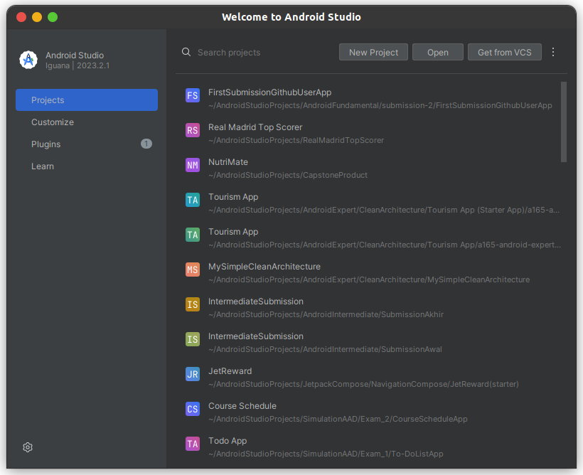

2. Kemudian, ditampilkan seperti di bawah ini. Dikarenkakan kita hanya membuat **basic project** saja maka kalian bisa memilih yang **Empty View Activity**. Kemudian, bisa klik **Next**.

    

3. Maka, akan ditampilkan window seperti berikut ini. Untuk **nama**, **Language**, **Minimum SDK**, dan **Build configuration language** bisa mengikuti seperti pada gambar, sedangkan untuk package bisa disesuaikan dengan format berikut ini: 

    **com.nim.2namapertama.beamvolume**.

4. Kemudian, untuk save location bisa disesuaikan sesuai dengan path pada device masing-masing. Lalu bisa pilih **Finish**.

    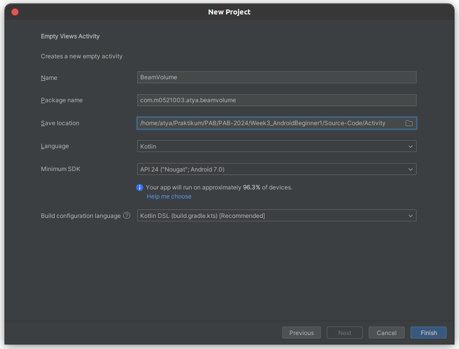

5. Jika sudah, **tunggu build.gradles hingga selesai** dan tampilannya akan menjadi seperti ini.

    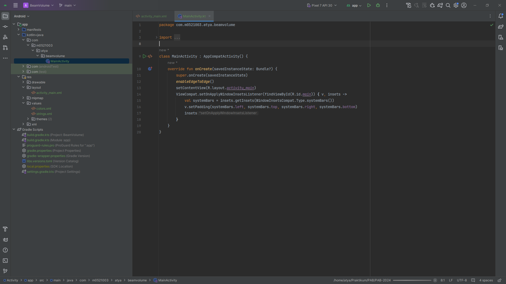

6. Jika kalian sudah menkonfigurasi emulator, maka bisa langsung di-running dan akan menjadi seperti ini.

    


## Menyusun Tampilan dengan XML (Layouting)

1. Kalian bisa membuka file **activity_main.xml** pada directory **res/layout/activity_main.xml**. Maka tampilan layout akan ditampilkan seperti ini.

    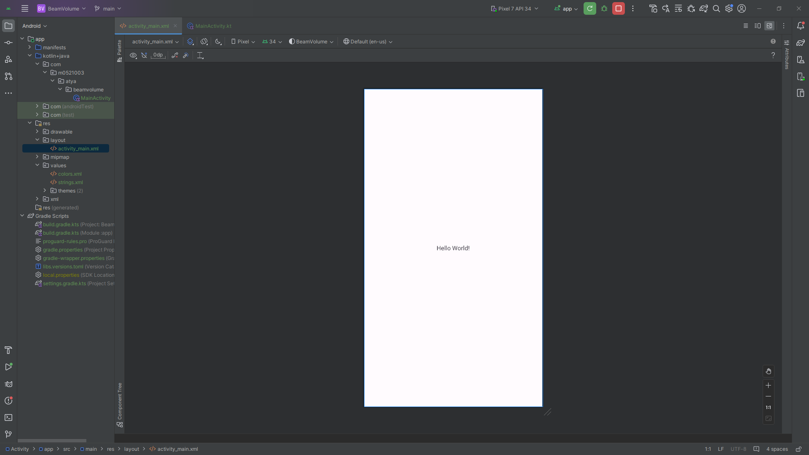

2. Kemudian, kalian bisa memilih yang tengah supaya bisa dilakukan split sehingga kita bisa melihat tampilan layout dan XML secara bersamaan.

    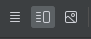

    Jika berhasil, maka tampilannya akan menjadi seperti ini.

    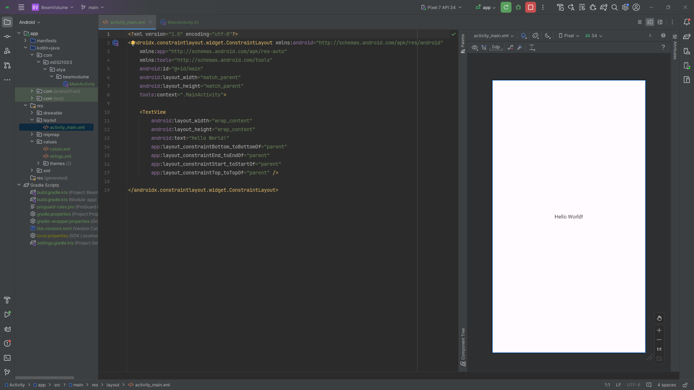

3. Berikut ini adalah code pertama kali ketika membuka file **activity_main.xml**.

    ```xml
    <?xml version="1.0" encoding="utf-8"?>
    <androidx.constraintlayout.widget.ConstraintLayout xmlns:android="http://schemas.android.com/apk/res/android"
        xmlns:app="http://schemas.android.com/apk/res-auto"
        xmlns:tools="http://schemas.android.com/tools"
        android:id="@+id/main"
        android:layout_width="match_parent"
        android:layout_height="match_parent"
        tools:context=".MainActivity">

        <TextView
            android:layout_width="wrap_content"
            android:layout_height="wrap_content"
            android:text="Hello World!"
            app:layout_constraintBottom_toBottomOf="parent"
            app:layout_constraintEnd_toEndOf="parent"
            app:layout_constraintStart_toStartOf="parent"
            app:layout_constraintTop_toTopOf="parent"/>
        
    </androidx.constraintlayout.widget.ConstraintLayout>
    ```
4. Kemudian, ubah layout yang sebelumnya ConstrainLayout menjadi LinearLayout. Hal ini karena LinearLayout adalah Layout yang paling sederhana dan paling mudah supaya mempermudah dalam praktikum kali ini. Untuk materi Layouting akan dibahas pada pertemuan yang akan datang. Sesuaikan sehingga hasilnya seperti code berikut ini.
    ```xml
    <?xml version="1.0" encoding="utf-8"?>
    <LinearLayout xmlns:android="http://schemas.android.com/apk/res/android"
        xmlns:app="http://schemas.android.com/apk/res-auto"
        xmlns:tools="http://schemas.android.com/tools"
        android:id="@+id/main"
        android:layout_width="match_parent"
        android:layout_height="match_parent"
        android:padding="16.dp"
        android:orientation="vertical"
        tools:context=".MainActivity">

        <TextView
            android:layout_width="match_parent"
            android:layout_height="wrap_content"
            android:text="Beam Volume" />

    </LinearLayout>
    ```
5. Selanjutnya, tambahkan TextView dan EditText pada code XML sebelumnya. TextView adalah code untuk menampilkan static text pada screen, sedangkan EditText untuk menerima input dari user, kurang lebih seperti form.
    ```xml
    <?xml version="1.0" encoding="utf-8"?>
    <LinearLayout xmlns:android="http://schemas.android.com/apk/res/android"
        xmlns:app="http://schemas.android.com/apk/res-auto"
        xmlns:tools="http://schemas.android.com/tools"
        android:id="@+id/main"
        android:layout_width="match_parent"
        android:layout_height="match_parent"
        android:layout_margin="16.dp"
        android:orientation="vertical"
        tools:context=".MainActivity">

        <TextView
            android:layout_width="match_parent"
            android:layout_height="wrap_content"
            android:text="Beam Volume"
            android:textStyle="bold"
            android:textSize="20.sp"
            android:layout_marginTop="8.dp"
            android:layout_marginBottom="8.dp"/>

        <TextView
            android:layout_width="match_parent"
            android:layout_height="wrap_content"
            android:text="Length"/>

        <EditText
            android:id="@+id/edt_length"
            android:layout_width="match_parent"
            android:layout_height="wrap_content"
            android:inputType="numberDecimal"
            android:lines="1"/>

        <TextView
            android:layout_width="match_parent"
            android:layout_height="wrap_content"
            android:text="Height"/>

        <EditText
            android:id="@+id/edt_height"
            android:layout_width="match_parent"
            android:layout_height="wrap_content"
            android:inputType="numberDecimal"
            android:lines="1"/>

        <TextView
            android:layout_width="match_parent"
            android:layout_height="wrap_content"
            android:text="Width"/>

        <EditText
            android:id="@+id/edt_width"
            android:layout_width="match_parent"
            android:layout_height="wrap_content"
            android:inputType="numberDecimal"
            android:lines="1"/>

        <Button
            android:id="@+id/btn_calculate"
            android:layout_width="match_parent"
            android:layout_height="wrap_content"
            android:text="Calculate"/>

        <TextView
            android:id="@+id/tv_results"
            android:layout_width="match_parent"
            android:layout_height="wrap_content"
            android:gravity="center"
            android:text="Result"
            android:textSize="24sp"
            android:layout_marginTop="16.dp"
            android:textStyle="bold"/>

    </LinearLayout>
    ```
6. Sayangnya, muncul **warning** seperti berikut ini.

    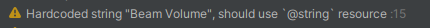

    Hal ini dikarenakan pada **android:text="Beam Volume"** kita menuliskan **string secara hard code** dimana tidak direkomendasikan karena seharusnya kita menuliskan teks pada directory **res/values/string.xml**.

    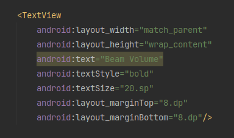

7. Untuk cara mengatasinya bisa mengklik **icon lamp** atau menekan **ALT+Enter** pada code yang dihighlight dengan warna kuning tersebut. Lalu, pilih untuk **Extract string resources**.

    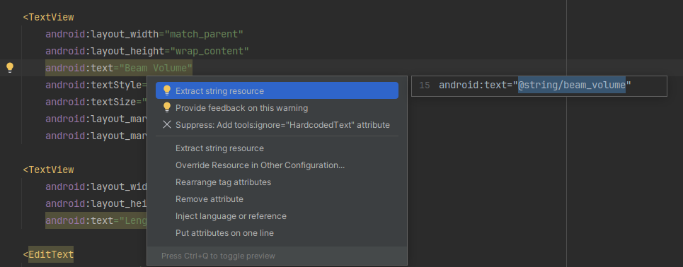

8. Kemudian, akan muncul window seperti berikut ini. Untuk **Resource name** merupakan nama variabel yang digunakan, sedangkan **Resource value** adalah nilai dari variabel yang digunakan (teks asli). Setelah itu, bisa pilih **OK**.

    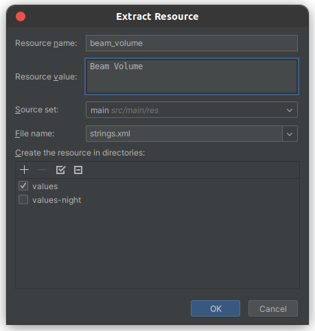

9. Sehingga code akan mengalami perubahan menjadi seperti ini pada value **android:text**.

    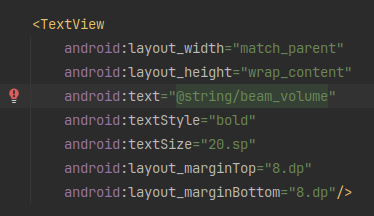

10. Pada file **string.xml** juga akan ditambahkan kode baru seperti di bawah ini.

    

11. **Perhatikan string dengan nama beam_volume, itu adalah kode yang ditambahkan dari perubahan hardcode sebelumnya**

    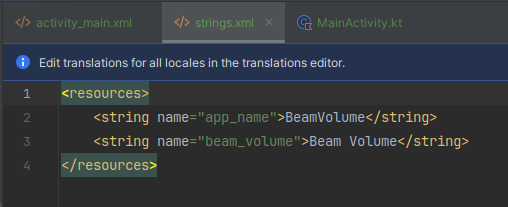

12. Lakukan pada **hardcode** yang lainnya sehingga tampilan dari **string.xml** akan menjadi seperti ini.

    ```xml
    <resources>
        <string name="app_name">BeamVolume</string>
        <string name="beam_volume">Beam Volume</string>
        <string name="length">Length</string>
        <string name="height">Height</string>
        <string name="width">Width</string>
        <string name="calculate">Calculate</string>
        <string name="result">Result</string>
    </resources>
    ```

13. **Kode berikut ini adalah hasil akhir dari Layouting yang kita lakukan dimana kita juga berhasil menuliskan string pada string.xml**

    ```xml
    <?xml version="1.0" encoding="utf-8"?>
    <LinearLayout xmlns:android="http://schemas.android.com/apk/res/android"
        xmlns:app="http://schemas.android.com/apk/res-auto"
        xmlns:tools="http://schemas.android.com/tools"
        android:id="@+id/main"
        android:layout_width="match_parent"
        android:layout_height="match_parent"
        android:layout_margin="16.dp"
        android:orientation="vertical"
        tools:context=".MainActivity">

        <TextView
            android:layout_width="match_parent"
            android:layout_height="wrap_content"
            android:text="@string/beam_volume"
            android:textStyle="bold"
            android:textSize="20.sp"
            android:layout_marginTop="8.dp"
            android:layout_marginBottom="8.dp"/>
        <TextView
            android:layout_width="match_parent"
            android:layout_height="wrap_content"
            android:text="@string/length"/>

        <EditText
            android:id="@+id/edt_length"
            android:layout_width="match_parent"
            android:layout_height="wrap_content"
            android:inputType="numberDecimal"
            android:lines="1"/>

        <TextView
            android:layout_width="match_parent"
            android:layout_height="wrap_content"
            android:text="@string/height"/>

        <EditText
            android:id="@+id/edt_height"
            android:layout_width="match_parent"
            android:layout_height="wrap_content"
            android:inputType="numberDecimal"
            android:lines="1"/>

        <TextView
            android:layout_width="match_parent"
            android:layout_height="wrap_content"
            android:text="@string/width"/>

        <EditText
            android:id="@+id/edt_width"
            android:layout_width="match_parent"
            android:layout_height="wrap_content"
            android:inputType="numberDecimal"
            android:lines="1"/>

        <Button
            android:id="@+id/btn_calculate"
            android:layout_width="match_parent"
            android:layout_height="wrap_content"
            android:text="@string/calculate"/>

        <TextView
            android:id="@+id/tv_results"
            android:layout_width="match_parent"
            android:layout_height="wrap_content"
            android:gravity="center"
            android:text="@string/result"
            android:textSize="24sp"
            android:layout_marginTop="16.dp"
            android:textStyle="bold"/>

    </LinearLayout>
    ```

14. **Berikut ini adalah tampilan Layout akhirnya**.

    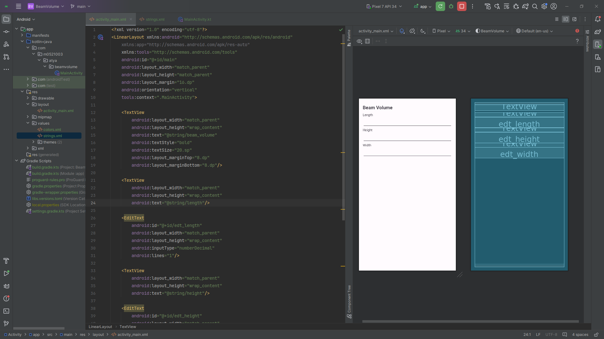

15. Ketika dijalankan akan menjadi seperti ini, tetapi belum ada respon karena kita belum menuliskan code untuk logikanya.

    

## Menuliskan Logic Code

1. Pertama,buka file **MainActivity.kt**, kemudian tambahkan beberapa variabel yang akan digunakan untuk menyimpan nilai dari View.

    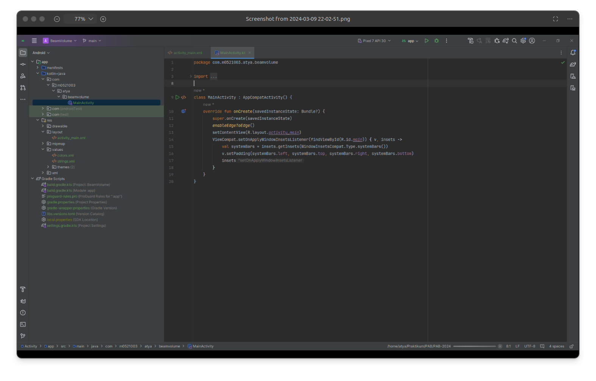

    Berikut ini code yang ditambahkan.

    ```kotlin
    class MainActivity : AppCompatActivity() {

        private lateinit var edtWidth : EditText
        private lateinit var edtHeight : EditText
        private lateinit var edtLength : EditText
        private lateinit var btnCalculate : Button
        private lateinit var tvResult : TextView

        override fun onCreate(savedInstanceState: Bundle?) {
            super.onCreate(savedInstanceState)
            enableEdgeToEdge()
            setContentView(R.layout.activity_main)
            ViewCompat.setOnApplyWindowInsetsListener(findViewById(R.id.main)) { v, insets ->
                val systemBars = insets.getInsets(WindowInsetsCompat.Type.systemBars())
                v.setPadding(systemBars.left, systemBars.top, systemBars.right, systemBars.bottom)
                insets
            }
        }
    }
    ```

2. Lalu, inisialiasikan variabel yang telah kita buat dengan method **findViewById**. Jadi, kita akan menginisialisasikan dengan cara mencari View dengan **id** yang sama seperti yang kita cari.
    ```kotlin
        override fun onCreate(savedInstanceState: Bundle?) {
            super.onCreate(savedInstanceState)
            enableEdgeToEdge()
            setContentView(R.layout.activity_main)
            ViewCompat.setOnApplyWindowInsetsListener(findViewById(R.id.main)) { v, insets ->
                val systemBars = insets.getInsets(WindowInsetsCompat.Type.systemBars())
                v.setPadding(systemBars.left, systemBars.top, systemBars.right, systemBars.bottom)
                insets
            }

            // kode yang ditambahkan 
            edtHeight = findViewById(R.id.edt_height)
            edtWidth = findViewById(R.id.edt_width)
            edtLength = findViewById(R.id.edt_length)
            btnCalculate = findViewById(R.id.btn_calculate)
            tvResult = findViewById(R.id.tv_results)
            btnCalculate.setOnClickListener(this)
        }
    ```
3. Code **this** akan muncul baris merah pada **btnCalculate.setOnClickListener(this)**. Kalian bisa menekan lampu merah yang muncul atau bisa juga dengan **ALT + ENTER**. Kemudian, pilih **"Let MainActivity ..."** seperti berikut ini.

    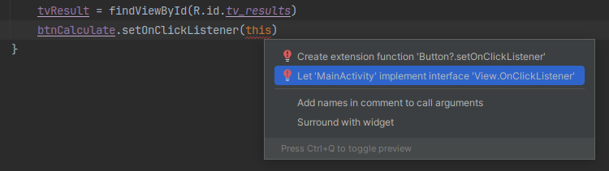

    Pilih **OK**

    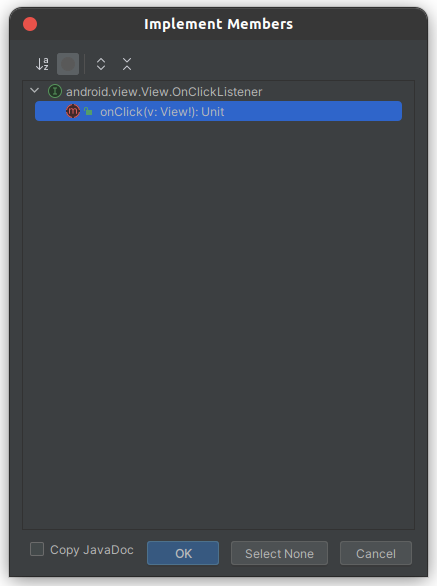

    Sehingga hasilnya akan seperti berikut ini, dimana akan memunculkan method **onClick(v: View?)** dan juga **View.OnClickListener** pada class MainActivity.
    ```kotlin
    class MainActivity : AppCompatActivity(), View.OnClickListener {

        ...

        override fun onCreate(savedInstanceState: Bundle?) {
            ...
        }

        override fun onClick(v: View?) {
            TODO("Not yet implemented")
        }
    }
    ```
4. Selanjutnya, tambahkan code berikut ini untuk menyimpan input dari variabel yang telah diinisialiasasi sebelumnya dan melakukan operasi perhitungan **Beam Volume** serta menampilkannya pada **TextView**,
    ```kotlin
        override fun onClick(view: View?) {
            if(view?.id == R.id.btn_calculate){
                val inputLength = edtLength.text.toString().trim()
                val inputWidth = edtWidth.text.toString().trim()
                val inputHeight = edtHeight.text.toString().trim()
                val beamVolume = inputLength.toDouble() * inputWidth.toDouble() * inputHeight.toDouble()
                tvResult.text = beamVolume.toString()
            }
        }
    ```

    Ketika dirunning dan diisi semua input user (form) maka hasilnya akan berhasil ditampilkan pada **TextView** seperti berikut ini.

    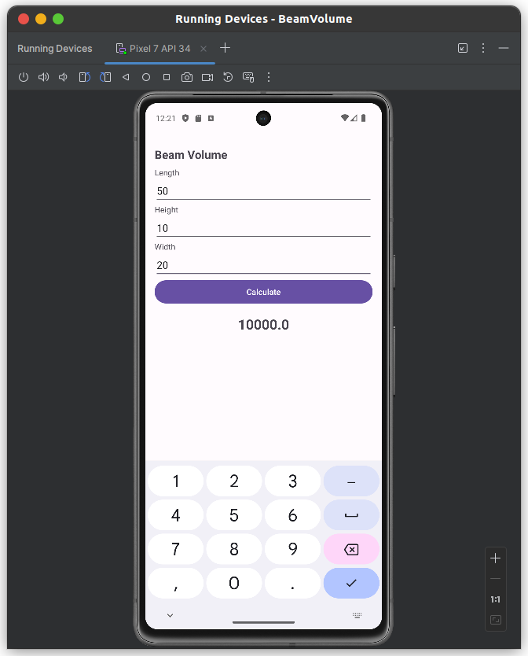

5. Sayangnya, ketika kita ada salah satu dari form yang tidak diisi, maka aplikasi akan *force close* dan akan muncul **Exception seperti berikut ini**.

    

    **EXCEPTION sebagai berikut.**

    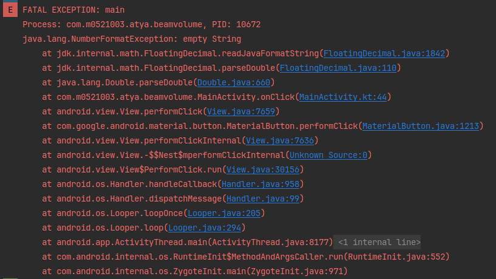
    

6. Maka cara mengatasinya dengan menggunakan *control flow* untuk mengecek dari masing-masing **EditText** seperti kode berikut ini.
    ```kotlin
        override fun onClick(view: View?) {
            if(view?.id == R.id.btn_calculate){
                val inputLength = edtLength.text.toString().trim()
                val inputWidth = edtWidth.text.toString().trim()
                val inputHeight = edtHeight.text.toString().trim()
                var isEmptyFields = false
                if (inputLength.isEmpty()) {
                    isEmptyFields = true
                    edtLength.error = "Field ini tidak boleh kosong"
                }
                if (inputWidth.isEmpty()) {
                    isEmptyFields = true
                    edtWidth.error = "Field ini tidak boleh kosong"
                }
                if (inputHeight.isEmpty()) {
                    isEmptyFields = true
                    edtHeight.error = "Field ini tidak boleh kosong"
                }
                if (!isEmptyFields) {
                    val volume = inputLength.toDouble() * inputWidth.toDouble() * inputHeight.toDouble()
                    tvResult.text = volume.toString()
                }
            }
        }
    ```
7. Maka ketika aplikasi dijalankan, hasilnya akan seperti berikut ini **jika salah satu form tidak diisi**.

    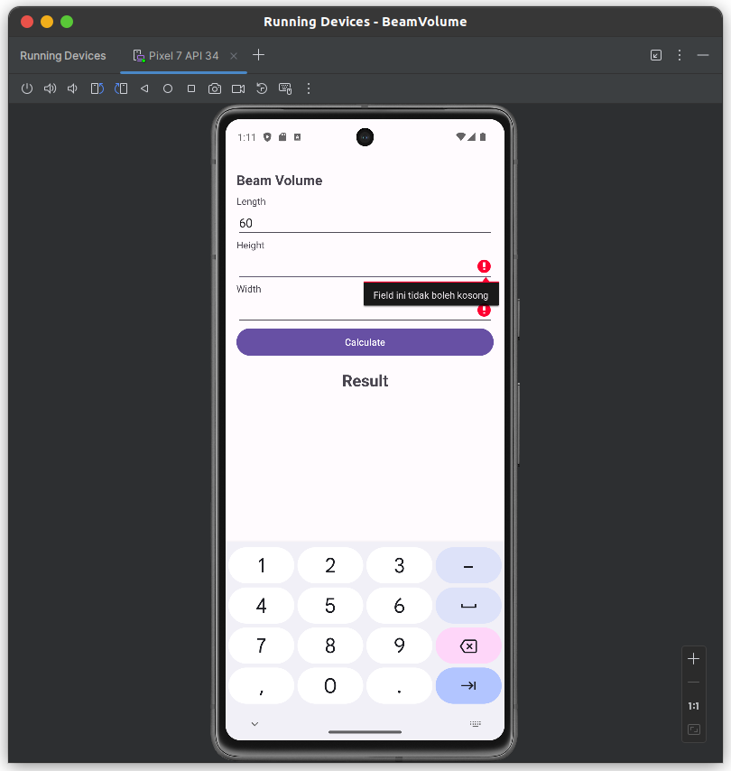

    
8. Akan tetapi, ketika dilakukan perhitungan dan hasilnya berhasil ditampilkan, kemudian dilakukan *change orientation* maka hasilnya yang ditampilkan sebelumnya menjadi hilang seperti berikut ini.

    **Orientation secara Vertikal**

    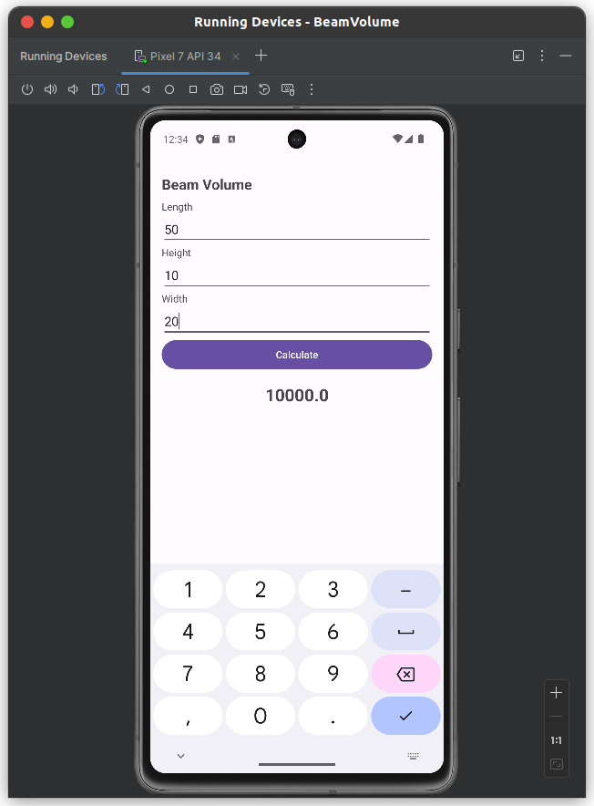

    **Setelah Orientation diubah menjadi Landscape, nilai dari Result hilang**

    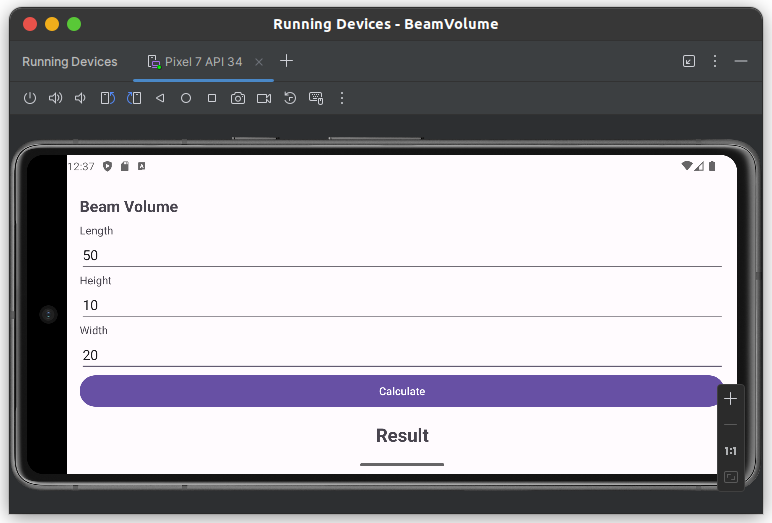


9. Cara mengatasinya dengan menggunakan onSaveInstanceState seperti berikut ini.
    ```kotlin
    class MainActivity : AppCompatActivity(), View.OnClickListener {

        companion object{
            private const val STATE_RESULT = "state_result"
        }

    ...

        override fun onCreate(savedInstanceState: Bundle?) {
            ...
        }

        override fun onSaveInstanceState(outState: Bundle) {
            super.onSaveInstanceState(outState)
            outState.putString(STATE_RESULT, tvResult.text.toString())
        }

        override fun onClick(view: View?) {
            ...
        }
    }
    ```
    Tambahkan juga kode berikut ini pada method **onCreate()**
    ```kotlin
    override fun onCreate(savedInstanceState: Bundle?) {
    super.onCreate(savedInstanceState)
    setContentView(R.layout.activity_main)
    ...
    if (savedInstanceState != null) {
        val result = savedInstanceState.getString(STATE_RESULT)
        tvResult.text = result
    }
    }
    ```

10. Berikut ini jika kita coba mengubah orientasi dari devicenya.

    **Orientation secara Vertikal**

    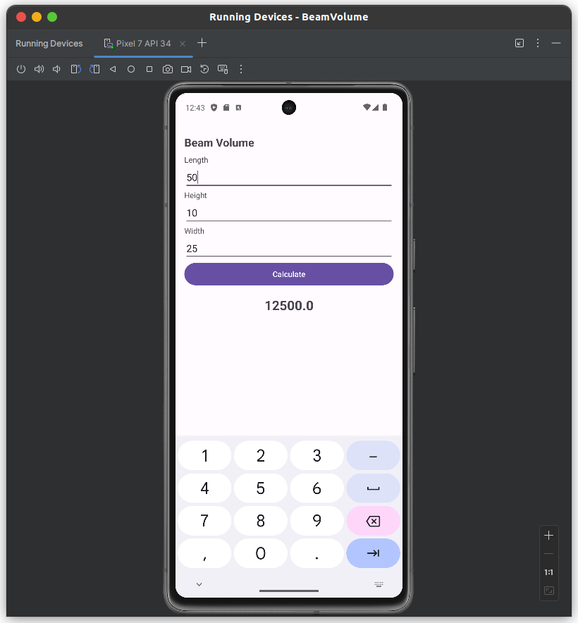

    **Setelah Orientation diubah menjadi Landscape, nilai dari Result tetap ada karena disimpan dengan onSaveInstanceState**

    