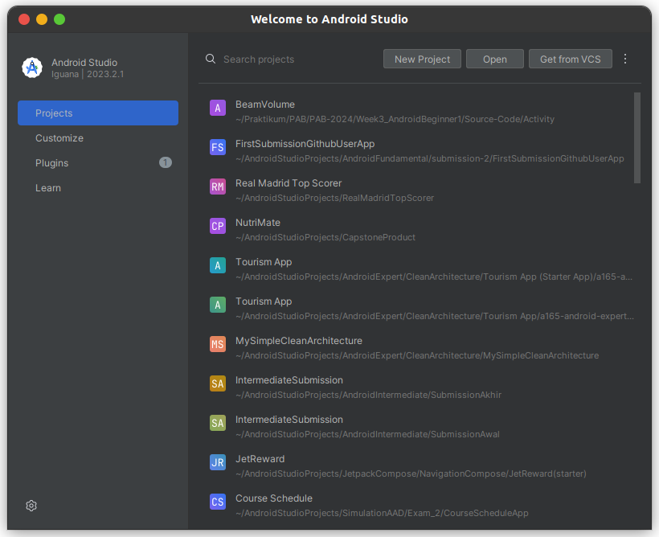
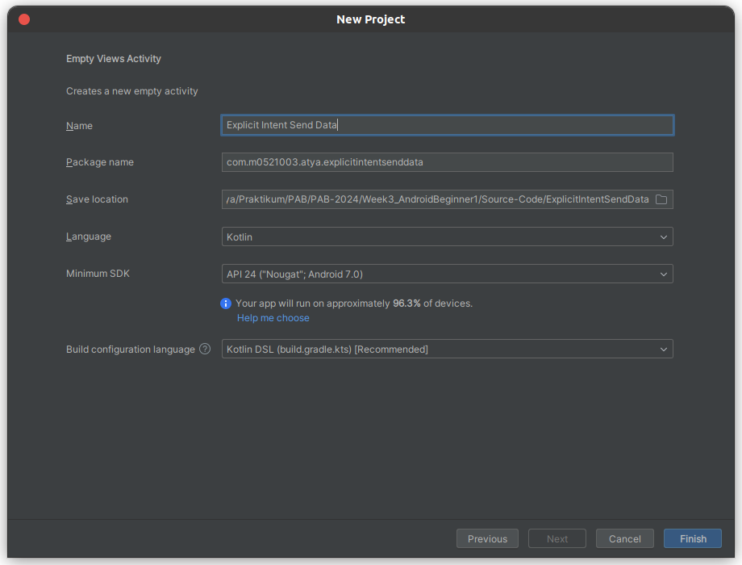
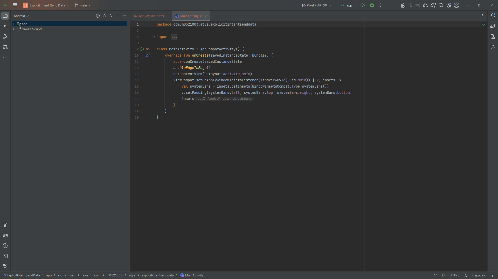
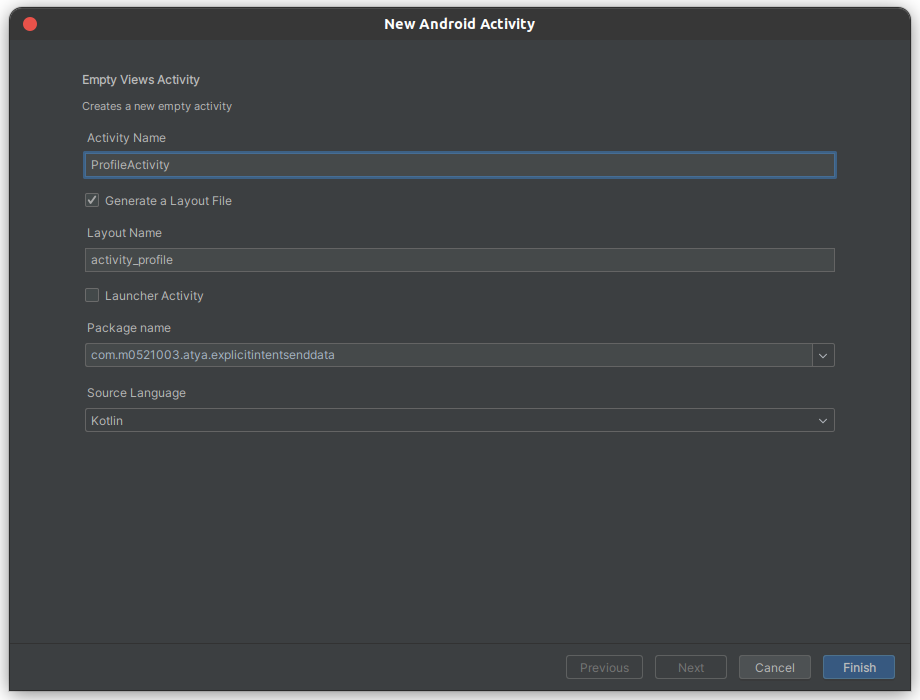
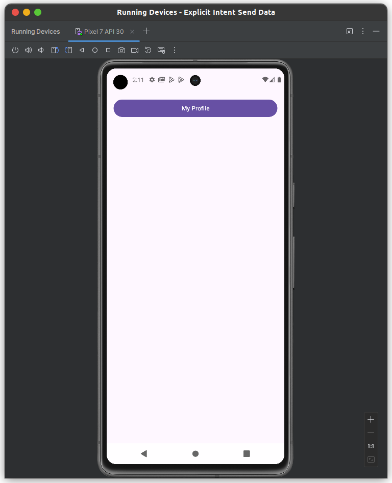
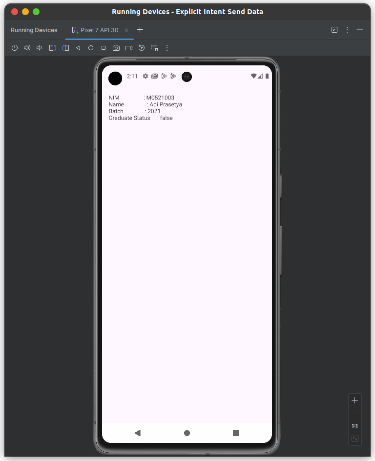

# EXPLICIT INTENT FOR SENDING DATA

1. Kalian bisa Running Android Studio terlebih dahulu, maka akan menampilkan tampilan kurang lebih seperti ini. Kemudian, kalian bisa pilih **New Project**.

    

2. Kemudian, ditampilkan seperti di bawah ini. Dikarenkakan kita hanya membuat **basic project** saja maka kalian bisa memilih yang **Empty View Activity**. Kemudian, bisa klik **Next**.

    

3. Maka, akan ditampilkan window seperti berikut ini. Untuk **nama**, **Language**, **Minimum SDK**, dan **Build configuration language** bisa mengikuti seperti pada gambar, sedangkan untuk package bisa disesuaikan dengan format berikut ini: 

    **com.nim.2namapertama.explicitintentsenddata**.

4. Kemudian, untuk save location bisa disesuaikan sesuai dengan path pada device masing-masing. Lalu bisa pilih **Finish**.

    

5. Selanjutnya, akan muncul tampilan awal dan tunggu hingga proses **build.gradles** selesai dilakukan.

    

6. Kemudian, ubahlah code xml pada **activity_main.xml** menjadi LinearLayout dan tambahkan **button** supaya terdapat **button** yang akan digunakan untuk berpindah **activity** (bisa dimodifikasi sendiri).

    Sebelum diubah: 
    ```xml
    <?xml version="1.0" encoding="utf-8"?>
    <androidx.constraintlayout.widget.ConstraintLayout xmlns:android="http://schemas.android.com/apk/res/android"
        xmlns:app="http://schemas.android.com/apk/res-auto"
        xmlns:tools="http://schemas.android.com/tools"
        android:id="@+id/main"
        android:layout_width="match_parent"
        android:layout_height="match_parent"
        tools:context=".MainActivity">

        <TextView
            android:layout_width="wrap_content"
            android:layout_height="wrap_content"
            android:text="Hello World!"
            app:layout_constraintBottom_toBottomOf="parent"
            app:layout_constraintEnd_toEndOf="parent"
            app:layout_constraintStart_toStartOf="parent"
            app:layout_constraintTop_toTopOf="parent" />

    </androidx.constraintlayout.widget.ConstraintLayout>
    ```
    Sesudah diubah:
    ```xml
    <?xml version="1.0" encoding="utf-8"?>
    <LinearLayout xmlns:android="http://schemas.android.com/apk/res/android"
        xmlns:app="http://schemas.android.com/apk/res-auto"
        xmlns:tools="http://schemas.android.com/tools"
        android:id="@+id/main"
        android:layout_width="match_parent"
        android:layout_height="match_parent"
        android:layout_margin="16.dp"
        tools:context=".MainActivity">

        <Button
            android:id="@+id/btn_profile"
            android:layout_width="match_parent"
            android:layout_height="wrap_content"
            android:text="My Profile" />

    </LinearLayout>
    ```
7. Lalu, buat variabel dan inisialisasikan untuk menampung **view** dari Button sendiri, jangan lupa untuk menambahkan **setOnClickListener** supaya terdapat aksi yang dilakukan ketika **button** ditekan.
    ```kotlin
    class MainActivity : AppCompatActivity(), View.OnClickListener {
        override fun onCreate(savedInstanceState: Bundle?) {
            super.onCreate(savedInstanceState)
            enableEdgeToEdge()
            setContentView(R.layout.activity_main)
            ViewCompat.setOnApplyWindowInsetsListener(findViewById(R.id.main)) { v, insets ->
                val systemBars = insets.getInsets(WindowInsetsCompat.Type.systemBars())
                v.setPadding(systemBars.left, systemBars.top, systemBars.right, systemBars.bottom)
                insets
            }

            val btnProfile : Button = findViewById(R.id.btn_profile)
            btnProfile.setOnClickListener(this) // jika error, alt+enter dan pilih yang "Let .."
        }

        // Akan muncul method ini
        override fun onClick(v: View?) {
            TODO("Not yet implemented")
        }
    }
    ```
8. Kemudian, ubah isi method **onClick** supaya dapat menampung aksi ketika **button diklik**.
    ```kotlin
        override fun onClick(view: View?) {
            when(view?.id){
                R.id.btn_profile -> {

                }
            }
        }
    ```
9. Buat Activity baru dengan cara menekan directory di atas MainActivity, lalu pilih **New** -> **Activity** -> **Empty View Activity**. Kemudian, berikut ini konfigurasi untuk activity yang baru.
    

    Berikut ini adalah code untuk **ProfileActivity** yang baru saja dibuat.
    ```kotlin
    package com.m0521003.atya.explicitintentsenddata

    import android.os.Bundle
    import androidx.activity.enableEdgeToEdge
    import androidx.appcompat.app.AppCompatActivity
    import androidx.core.view.ViewCompat
    import androidx.core.view.WindowInsetsCompat

    class ProfileActivity : AppCompatActivity() {
        override fun onCreate(savedInstanceState: Bundle?) {
            super.onCreate(savedInstanceState)
            enableEdgeToEdge()
            setContentView(R.layout.activity_profile)
            ViewCompat.setOnApplyWindowInsetsListener(findViewById(R.id.main)) { v, insets ->
                val systemBars = insets.getInsets(WindowInsetsCompat.Type.systemBars())
                v.setPadding(systemBars.left, systemBars.top, systemBars.right, systemBars.bottom)
                insets
            }
        }
    }
    ```
10. Kemudian, ubah file **activity_profile.xml** agar menjadi LinearLayout dan tambah **TextView** untuk menampilkan data yang akan diterima pada **ProfileActivity**. 
    ```xml
    <?xml version="1.0" encoding="utf-8"?>
    <LinearLayout xmlns:android="http://schemas.android.com/apk/res/android"
        xmlns:app="http://schemas.android.com/apk/res-auto"
        xmlns:tools="http://schemas.android.com/tools"
        android:id="@+id/main"
        android:layout_width="match_parent"
        android:layout_height="match_parent"
        android:layout_margin="16.dp"
        tools:context=".ProfileActivity">

        <TextView
            android:id="@+id/tv_profile_data"
            android:layout_width="match_parent"
            android:layout_height="wrap_content"
            android:text="Data Profile" />

    </LinearLayout>
    ```
11. Selanjutnya, buat variabel dan inisialisasikan untuk menampung view dari **TextView** yang baru saja dibuat seperti berikut ini.
    ```kotlin
    class ProfileActivity : AppCompatActivity() {
        override fun onCreate(savedInstanceState: Bundle?) {
            super.onCreate(savedInstanceState)
            
            ...
            
            val tvProfileData : TextView = findViewById(R.id.tv_profile_data)
        }
    }
    ```

12. Pada **ProfileActivity**, tambahkan **companion object** yang di dalamnya akan berisi beberapa **contanta** yang akan digunakan untuk mengirim dan menerima data melalui intent. 
    ```kotlin
    class ProfileActivity : AppCompatActivity() {

        companion object{
            const val EXTRA_NIM = "extra_nim"
            const val EXTRA_NAME = "extra_name"
            const val EXTRA_BATCH = "extra_batch"
            const val EXTRA_GRADUATED = "extra_graduated"
        }
        override fun onCreate(savedInstanceState: Bundle?) {
            
            ...

            val tvProfileData : TextView = findViewById(R.id.tv_profile_data)

            val nim = intent.getStringExtra(EXTRA_NIM)
            val name = intent.getStringExtra(EXTRA_NAME)
            val batch = intent.getIntExtra(EXTRA_BATCH, 0)
            val isGraduated = intent.getBooleanExtra(EXTRA_GRADUATED, false)

            val text = """
                NIM           : $nim
                Name          : $name
                Batch         : $batch
                Is Graduated  : $isGraduated
            """.trimIndent()

            tvProfileData.text = text
        }
    }
    ```
    Untuk menerima data melalui intent, bisa menggunakan seperti berikut ini.
    ```kotlin
     val namaVariabel = intent.getTipeDataExtra(nama_costanta)
    ```
13. Selanjutnya, kita beralih ke **MainActivity**, di sini kita akan menginisialisasikan untuk **value** dari data yang akan kita kirim seperti berikut ini.
    ```kotlin
    class MainActivity : AppCompatActivity(), View.OnClickListener {

        override fun onCreate(savedInstanceState: Bundle?) {
            ...
        }

        override fun onClick(view: View?) {
            when(view?.id){
                R.id.btn_profile -> {
                    val profileIntent = Intent(this@MainActivity, ProfileActivity::class.java)
                    profileIntent.putExtra(ProfileActivity.EXTRA_NIM, "M0521003")
                    profileIntent.putExtra(ProfileActivity.EXTRA_NAME, "Adi Prasetya")
                    profileIntent.putExtra(ProfileActivity.EXTRA_BATCH, 2021)
                    profileIntent.putExtra(ProfileActivity.EXTRA_GRADUATED, false)
                    startActivity(profileIntent)
                }
            }
        }
    }
    ```Siaran
    ```kotlin
    intent.putExtra(ActivityTujuan.Nama_Constanta, value)
    ```
14. Sekarang kalian bisa menjalankan aplikasi dan akan menghasilkan tampilan seperti berikut ini.

    **User Interface dari MainActivity**
    

    **Ketika Button diklik maka akan menuju ke Profile Activity**

    **User Interface dari ProfileActivity**
    

15. Selesai! Sekarang kalian sudah berhasil mengirim data dengan Intent!