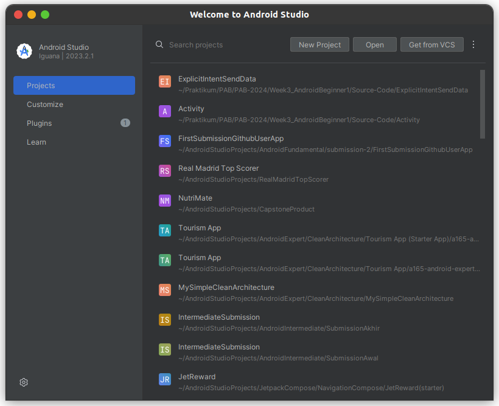
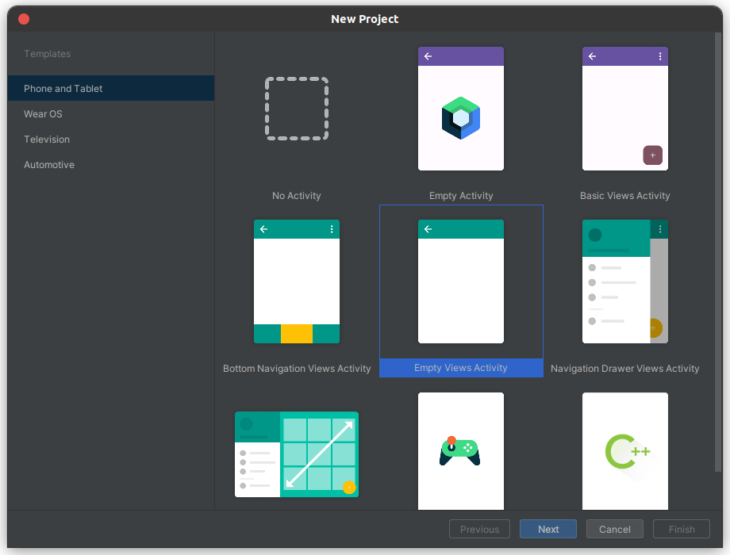
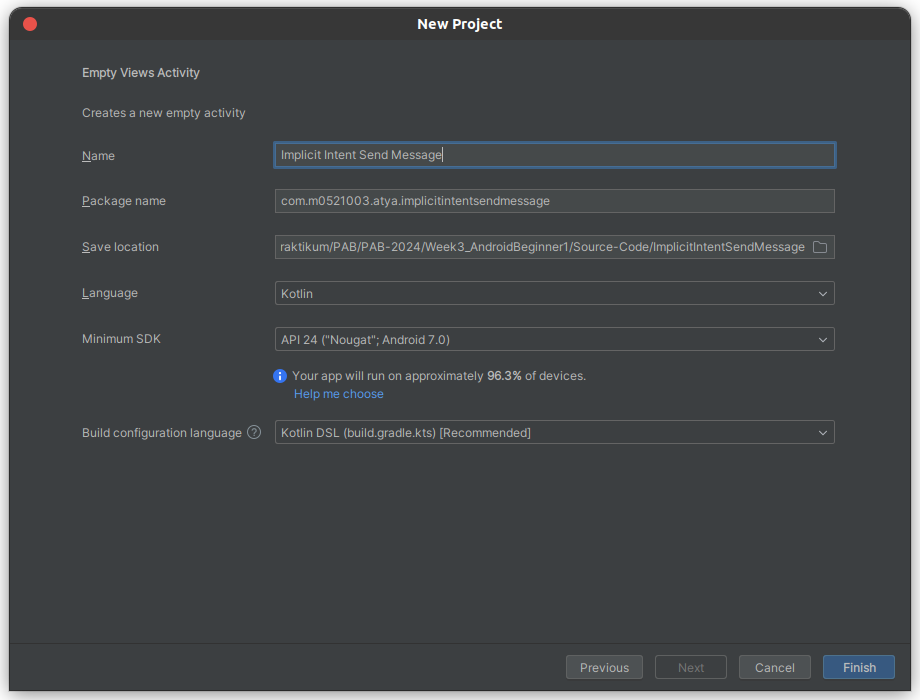
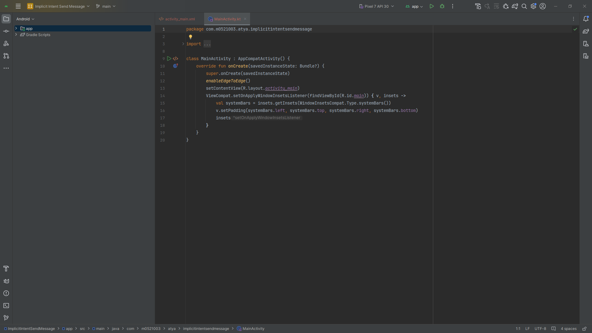
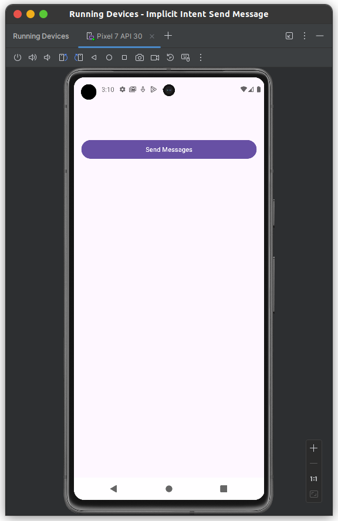
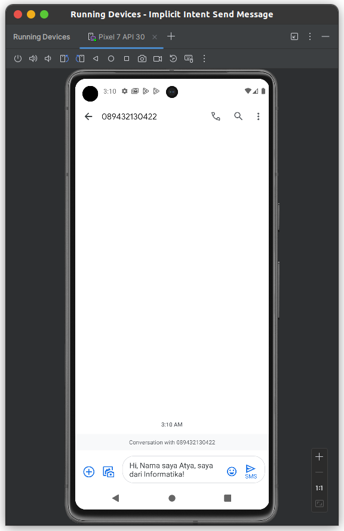

# IMPLICIT INTENT FOR SENDING A MESSAGE

1. Kalian bisa Running Android Studio terlebih dahulu, maka akan menampilkan tampilan kurang lebih seperti ini. Kemudian, kalian bisa pilih **New Project**.

    

2. Kemudian, ditampilkan seperti di bawah ini. Dikarenkakan kita hanya membuat **basic project** saja maka kalian bisa memilih yang **Empty View Activity**. Kemudian, bisa klik **Next**.

    

3. Maka, akan ditampilkan window seperti berikut ini. Untuk **nama**, **Language**, **Minimum SDK**, dan **Build configuration language** bisa mengikuti seperti pada gambar, sedangkan untuk package bisa disesuaikan dengan format berikut ini: 

    **com.nim.2namapertama.implicitintentsendmessage**.

4. Kemudian, untuk save location bisa disesuaikan sesuai dengan path pada device masing-masing. Lalu bisa pilih **Finish**.

    

5. Selanjutnya, akan muncul tampilan awal dan tunggu hingga proses **build.gradles** selesai dilakukan.

    

6. Kemudian, ubahlah code xml pada **activity_main.xml** menjadi LinearLayout dan tambahkan **button** supaya terdapat **button** yang akan digunakan untuk menjalankan **implicit intent**.

    Sebelum diubah: 
    ```xml
    <?xml version="1.0" encoding="utf-8"?>
    <androidx.constraintlayout.widget.ConstraintLayout xmlns:android="http://schemas.android.com/apk/res/android"
        xmlns:app="http://schemas.android.com/apk/res-auto"
        xmlns:tools="http://schemas.android.com/tools"
        android:id="@+id/main"
        android:layout_width="match_parent"
        android:layout_height="match_parent"
        tools:context=".MainActivity">

        <TextView
            android:layout_width="wrap_content"
            android:layout_height="wrap_content"
            android:text="Hello World!"
            app:layout_constraintBottom_toBottomOf="parent"
            app:layout_constraintEnd_toEndOf="parent"
            app:layout_constraintStart_toStartOf="parent"
            app:layout_constraintTop_toTopOf="parent" />

    </androidx.constraintlayout.widget.ConstraintLayout>
    ```
    Sesudah diubah:
    ```xml
    <?xml version="1.0" encoding="utf-8"?>
    <LinearLayout xmlns:android="http://schemas.android.com/apk/res/android"
        xmlns:app="http://schemas.android.com/apk/res-auto"
        xmlns:tools="http://schemas.android.com/tools"
        android:id="@+id/main"
        android:layout_width="match_parent"
        android:layout_height="match_parent"
        android:layout_margin="16.dp"
        tools:context=".MainActivity">

        <Button
            android:id="@+id/btn_send_messages"
            android:layout_width="match_parent"
            android:layout_height="wrap_content"
            android:layout_marginTop="64.dp"
            android:text="Send Messages" />

    </LinearLayout>
    ```

7. Lalu, buat variabel dan inisialisasikan untuk menampung **view** dari Button sendiri, jangan lupa untuk menambahkan **setOnClickListener** supaya terdapat aksi yang dilakukan ketika **button** ditekan.
    ```kotlin
    class MainActivity : AppCompatActivity(), View.OnClickListener {

        override fun onCreate(savedInstanceState: Bundle?) {
            super.onCreate(savedInstanceState)
            enableEdgeToEdge()
            setContentView(R.layout.activity_main)
            ViewCompat.setOnApplyWindowInsetsListener(findViewById(R.id.main)) { v, insets ->
                val systemBars = insets.getInsets(WindowInsetsCompat.Type.systemBars())
                v.setPadding(systemBars.left, systemBars.top, systemBars.right, systemBars.bottom)
                insets
            }

            val btnMessageButton : Button = findViewById(R.id.btn_send_message)
            btnMessageButton.setOnClickListener(this)
        }

        override fun onClick(v: View?) {
            TODO("Not yet implemented")
        }
    }
    ```

8. Kemudian, ubah isi method **onClick** supaya dapat menampung aksi ketika **button diklik**.

    ```kotlin
    override fun onClick(view: View?) {
        when(view?.id){
            R.id.btn_send_message -> {
                val intent = Intent(Intent.ACTION_SENDTO)
                intent.data = Uri.parse("smsto:089432130422")
                intent.putExtra("sms_body", "Hi, Nama saya Atya, saya dari Informatika!")
                startActivity(intent)
            }
        }
    }
    ```
    Terdapat Intent dibuat dengan tindakan ACTION_SENDTO. Ini adalah sebuah Implicit Intent yang digunakan untuk mengirim pesan SMS. Kemudian, data intent diatur menggunakan parse dari URI dengan nomor telepon tujuan yang ditentukan dalam format "smsto:089432130422". Selain itu, pesan SMS juga ditambahkan ke intent menggunakan putExtra dengan **key** "sms_body" dan isi pesan sebagai **value**

9. Sekarang kalian bisa menjalankan aplikasi dan akan menghasilkan tampilan seperti berikut ini.

    **User Interface dari MainActivity**

    

    **Ketika Button diklik maka akan menuju ke Aplikasi Default yang menangani action dari ACTION_SENDTO**

    **User Interface dari Aplikasi Default (Aplikasi SMS)**

    


#### Berikut ini adalah Action pada Implicit Intent yang dapat digunakan
| Action Intent                  | Penjelasan                                                                                                       |
|--------------------------------|------------------------------------------------------------------------------------------------------------------|
| `ACTION_VIEW`                  | Menampilkan data yang diberikan. Biasanya digunakan untuk menampilkan file, URL, atau lokasi di peta.            |
| `ACTION_SEND`                  | Mengirim data ke aplikasi lain. Data bisa berupa teks, gambar, atau file lainnya.                                |
| `ACTION_EDIT`                  | Menampilkan data untuk diedit.                                                                                   |
| `ACTION_DIAL`                  | Memulai aktivitas dialer dengan nomor telepon tertentu diisi (biasanya tidak memulai panggilan langsung).       |
| `ACTION_CALL`                  | Memulai panggilan telepon ke nomor yang ditentukan.                                                              |
| `ACTION_SENDTO`                | Mirip dengan ACTION_SEND, tetapi Anda bisa menentukan alamat tujuan.                                             |
| `ACTION_WEB_SEARCH`            | Membuka pencarian web.                                                                                           |
| `ACTION_PICK`                  | Memilih dan kembali dengan data.                                                                                  |
| `ACTION_GET_CONTENT`           | Memilih konten dan mengembalikan URI konten.                                                                     |
| `ACTION_IMAGE_CAPTURE`         | Membuka kamera untuk mengambil gambar.                                                                           |
| `ACTION_BATTERY_CHANGED`       | Broadcast yang dikirim saat status baterai berubah.                                                                 |
| `ACTION_POWER_CONNECTED`       | Broadcast yang dikirim ketika perangkat terhubung ke sumber daya.                                                   |
| `ACTION_POWER_DISCONNECTED`    | Broadcast yang dikirim ketika perangkat terputus dari sumber daya.                                                  |
| `ACTION_HEADSET_PLUG`          | Broadcast yang dikirim ketika headset terhubung atau terputus.                                                      |
