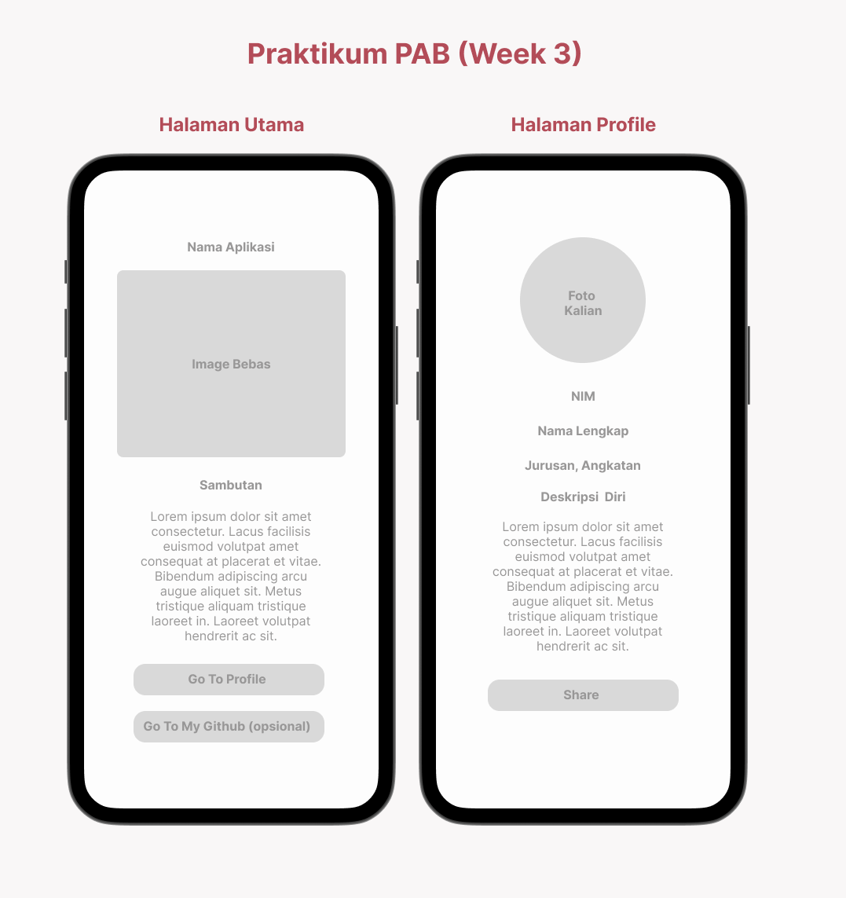

# Tugas  Praktikum PAB (Week 3)
### Buatlah **sebuah aplikasi android** dengan bahasa Kotlin dimana aplikasi tersebut wajib mengimplementasikan fitur-fitur berikut ini.

    1. 2 Activity, sudah termasuk Main Activity
    2. Explicit Intent
    3. Implicit Intent

    Mendapatkan nilai tambahan jika mengimplementasikan >1 Implicit Intent.

### Berikut kerangka user interface yang bisa digunakan untuk referensi

1. Ketika **button Go To Profile** pada Halaman Utama ditekan, maka akan mengirimkan data dengan **intent** ke halaman Profile. Jadi, data yang dikirim ke halaman profile adalah **NIM, nama lengkap, jurusan, angkatan, dan deskripsi diri**. Ini penerapan untuk Explicit Intent.
2. Ketika **button Share** ditekan, maka akan meneruskan informasi **NIM, nama lengkap, jurusan, angkatan, dan deskripsi diri** ke aplikasi default berdasarkan **action** dari Implicit Intent yang digunakan.
3. Ketika **button Go To My Github** ditekan, maka akan membuka aplikasi web browser default dan akan langsung mengarahkan ke akun Github yang telah ditentukan. Fitur ini bersifat **opsional** dan akan **mendapatkan nilai tambahan** jika diimplementasikan.


    

### Demo Final Aplikasi


### Tips and Tricks
1. Simpan gambar pada directory **res/drawable** dan jangan lupa untuk menghindari **penulisan string** secara **hardcode** pada file xml.
2. Untuk membuat rounded pada foto dapat menggunakan library Glide yang dapat diakses pada [Github berikut ini](https://github.com/bumptech/glide).

    Tambahkan Library Glide pada build.gradles.kts(modules) seperti berikut ini.
    ```kotlin
    dependencies {

        implementation(libs.androidx.core.ktx)
        implementation(libs.androidx.appcompat)
        implementation(libs.material)
        ...

        // Library yang ditambahkan dengan cara lama
        implementation("de.hdodenhof:circleimageview:3.1.0")
    }
    ```
    Berikut contoh penggunaan sederhana pada file xml-nya.
    ```xml
        <de.hdodenhof.circleimageview.CircleImageView
            android:id="@+id/profile_image"
            android:layout_width="match_parent"
            android:layout_height="150dp"
            android:layout_marginTop="48dp"
            android:layout_marginBottom="32dp"
            android:src="@drawable/hitori"
            app:civ_border_color="#FF000000"
            app:civ_border_width="2dp" />
    ```

### Ketentuan Source Code Aplikasi
1. Menggunakan Android Studio
2. Menggunakan bahasa pemrograman Kotlin
3. Asisten akan menggunakan emulator dengan SDK level 30, maka pastikan saat build aplikasi, **gunakanlah Minimum SDK <= 30**

### Detail Laporan Praktikum
#### Laporan berisi screenshot source code dan tampilan user interface beserta penjelasannya disertai dengan kesimpulan. 
    
Tugas dikumpulkan dalam bentuk **.ZIP** dengan format nama **PPAB-03_NIM_Nama.zip yang berisi source code dari aplikasi** dan **.PDF dengan format nama PPAB-03_NIM_Nama.pdf yang berisi laporan praktikum**. Perlu diingat bahwa **file .zip tidak berisikan file pdf, murni berisi source code saja** dan gunakan **cara .zip sesuai yang diajarkan oleh asisten**.

    PPAB-XX_NIM_Nama.zip
    PPAB-XX_NIM_Nama.pdf
    
    xx = week praktikum

### Penilaian didasarkan pada: 
    1. Aplikasi Bebas dari error ketika dijalankan secara normal (10%)
    2. Relevansi source code dengan instruksi di atas (50%) 
    3. Kompleksitas Program yang dibuat (30%)
    4. Kreativitas masing-masing individu (10%). 
