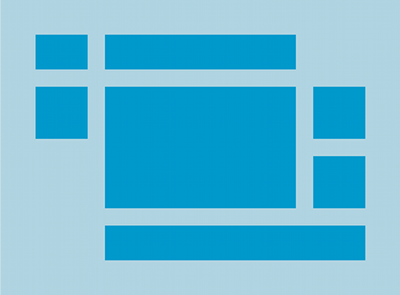

# VIEW AND VIEWGROUP

Di Android, Layout digunakan untuk mendeskripsikan UI (User Interface) suatu aplikasi atau aktivitas, dan menyimpan elemen UI yang akan terlihat oleh pengguna. UI aplikasi Android terdiri dari serangkaian elemen **View** dan **ViewGroup**. Dalam beberapa kasus, aplikasi Android akan memiliki setidaknya satu atau beberapa operasi, yang masing-masing dari itu merupakan satu layar aplikasi. Beberapa komponen UI akan hadir dalam operasi tersebut dan komponen UI tersebut akan menjadi instance dari subkelas View dan Viewgroup. 

## Component View and ViewGroup


**View** merupakan komponen dasar yang tampil di layar dan dapat digunakan untuk berinteraksi dengan pengguna. Contoh komponen turunan dari View adalah sebagai berikut.

- **TextView**
Komponen yang berguna untuk menampilkan teks ke layar.

- **Button**
Komponen yang membuat pengguna dapat berinteraksi dengan cara ditekan untuk melakukan sesuatu.

- **ImageView**
Komponen untuk menampilkan gambar.

- **RecyclerView**
Komponen untuk menampilkan informasi dalam bentuk daftar atau list.

- **GridView**
Komponen untuk menampilkan informasi dalam bentuk grid.

- **RadioButton**
Komponen yang memungkinkan pengguna dapat memilih satu pilihan dari berbagai pilihan yang disediakan.

- **Checkbox**
Komponen yang memungkinkan pengguna dapat memilih lebih dari satu dari pilihan yang tersedia.

##

Sedangkan **ViewGroup** merupakan jenis tampilan khusus yang diperluas dari View sebagai kelas dasarnya dan berguna untuk mengatur posisinya sehingga membentuk satu kesatuan tampilan aplikasi yang utuh. Contoh komponen ViewGroup adalah sebagai berikut.

## LinearLayout
LinearLayout akan menempatkan komponen-komponen di dalamnya secara horizontal atau vertikal. Untuk menggunakannya dengan atribut seperti berikut **android:orientation=" "**

```kotlin 
<?xml version="1.0" encoding="utf-8"?>
<LinearLayout xmlns:android="http://schemas.android.com/apk/res/android"
    android:layout_width="match_parent"
    android:layout_height="match_parent"
    android:paddingLeft="16dp"
    android:paddingRight="16dp"
    android:orientation="vertical" >
    <EditText
        android:layout_width="match_parent"
        android:layout_height="wrap_content"
        android:hint="@string/to" />
    <EditText
        android:layout_width="match_parent"
        android:layout_height="wrap_content"
        android:hint="@string/subject" />
    <EditText
        android:layout_width="match_parent"
        android:layout_height="0dp"
        android:layout_weight="1"
        android:gravity="top"
        android:hint="@string/message" />
    <Button
        android:layout_width="100dp"
        android:layout_height="wrap_content"
        android:layout_gravity="end"
        android:text="@string/send" />
</LinearLayout>
```

Untuk selengkapnya Anda dapat melihat dan mempelajarinya pada tautan berikut.

- [LinearLayout](https://developer.android.com/develop/ui/views/layout/linear)

## RelativeLayout
RelativeLayout menampilkan tampilan komponen dalam posisi relatif. Ini berarti posisi masing-masing dapat ditentukan secara fleksibel terhadap komponen lain, dan juga dapat mengacu secara relatif ke batas layar. Seperti komponen A berada disebelah kanan komponen B atau komponen C berada di rata bawa tengah terhadap *parent*nya. 


Untuk selengkapnya Anda dapat melihat dan mempelajarinya pada tautan berikut.

- [RelativeLayout](https://developer.android.com/develop/ui/views/layout/relative)

## ConstraintLayout
Layout ini merupakan layout default yang direkomendasikan di dalam XML. Untuk menyusun tampilan yang kompleks cukup dengan satu lapis hirerarki saja, Anda dapat menggunakan ConstraintLayout, karena ConstraintLayout memberikan performa dan proses *rendering* yang lebih baik daripada penggunakan *nested layout* (layout di dalam layout). Berikut berbagai fitur tambahan untuk memudahkan Anda dalam mendesain aplikasi, sebagai berikut.

- *Relative Positioning:*
  memosisikan komponen secara relatif terhadap komponen yang lain.

- *Center Positioning & Bias:*
  menentukan alignment dengan menggunakan persentase, default-nya 50% atau tengah.

- *Baseline alignement:*
  membuat text pada suatu komponen sejajar dengan teks pada komponen lain.

- *Guideline:*
  untuk membuat garis pembantu yang tidak terlihat oleh user.

- *Barrier:*
  sama seperti Guideline, tetapi posisinya dapat mengkuti komponen lainnya.
  
- *Chain:*
  mengatur sekumpulan komponen secara linear.

Untuk selengkapnya Anda dapat melihat dan mempelajarinya pada tautan berikut.

- [ConstraintLayout](https://developer.android.com/develop/ui/views/layout/constraint-layout)

## FrameLayout
FrameLayout memiliki kemampuan sebagai kontainer atau pondasi untuk fragment-fragment di dalam sebuah activity. Layout ini akan membuat komponen yang ada di dalamnya menjadi menumpuk atau saling menutupi satu sama lain. Untuk menggunakannya dengan atribut seperti berikut.
```kotlin 
android:layout_gravity
```


Gambar di atas adalah ilustrasi dari penggunaan FrameLayout terhadap *child* view yang dimilikinya. Dan untuk selengkapnya Anda dapat melihat dan mempelajarinya pada tautan berikut.

- [FrameLayout](https://developer.android.com/reference/android/widget/FrameLayout.html)

## TableLayout
TableLayout adalah bagian dari **ViewGroup** yang menampilkan **View** komponen elemen dalam abris dan kolom. Akan tetapi layout ini tidak akan menampilkan garis pembatas untuk baris, kolom atau *cell*-nya



Gambar di atas adalah ilustrasi penggunaan dari TableLayout. Dan untuk selengkapnya Anda dapat melihat dan mempelajarinya pada tautan berikut.

- [TableLayout](https://developer.android.com/guide/topics/ui/layout/grid.html)

## ScrollView
Layout yang memungkinkan komponen tampilan di dalamnya dapat digulir atau digeser(*scroll*) secara vertikal maupun horizontal. Komponen dari ScrollView hanya diperbolehkan memiliki satu *parent* utama yang ada seperti; LinearLayout, RelativeLayout, FrameLayout, atau TableLayout.


Dan untuk selengkapnya Anda dapat melihat dan mempelajarinya pada tautan berikut.

- [ScrollView](https://developer.android.com/reference/android/widget/ScrollView.html)


