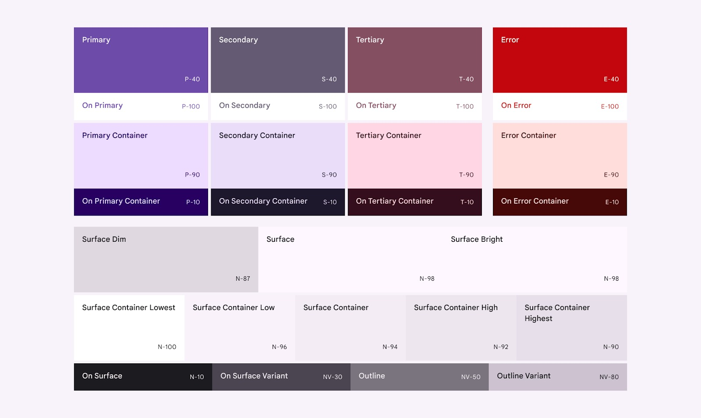

# STYLE AND THEME

Di Android *Style* dan *Theme* digunakan untuk mengubah tampilan berdasarkan kebutuhan pengguna. Dengan menerapkan *Style* dan *Theme* juga dapat mengurangi duplikasi kode dan menjadikan aplikasi kita lebih ringan dan responsif.

-  Secara umum, *Style* adalah kombinasi beberapa atribut atau komponen yang dibutuhkan untuk mendefinisikan sebuah komponen view dan layar jendela (bisa activity maupun fragment) ditampilkan. Seperti **font color, font style, padding, margin, height, width, dan background_color**.
Dengan adanya *Style* lebih memudahkan Developer dalam menuliskan kode, karena tidak harus ditulis berulang-ulang di banyak komponen atau atribut, cukup dengan mengubah di satu tempat saja. Dan untuk mengubahnya, *Style* berada pada file **themes.xml**.

-  Sebagai contoh, kalian mempunyai TextView yang berisi berbagai atribut berikut.
```xml
<TextView
                android:layout_width="wrap_content"
                android:layout_height="wrap_content"
                android:textColor="@android:color/white"
                android:layout_gravity="bottom"
                android:layout_marginStart="16dp"
                android:layout_marginBottom="16dp"
                android:background="#4D000000"
                android:drawablePadding="4dp"
                android:gravity="center_vertical"
                android:padding="8dp"
                android:text="@string/pisang_ijo"
                android:drawableStart="@drawable/ic_collections_white_18dp"
/>
```
TextView di atas berguna untuk menampilkan konten dari detail informasi yang terdapat di keseluruhan aplikasi. Sangat tidak efektif jika kita melakukan copy paste dari satu layout xml ke layout xml lainnya. Kita dapat menyederhanakan hal tersebut menjadi:

```xml
<TextView
                style="@style/TextContent.BodyMedium.White.MarginAll"
                android:layout_gravity="bottom"
                android:background="#4D000000"
                android:drawablePadding="4dp"
                android:gravity="center_vertical"
                android:padding="8dp"
                android:text="@string/pisang_ijo"
                app:drawableStartCompat="@drawable/ic_collections_white_18dp"
/>
```
Untuk atribut margin dapat dipindahkan menjadi sebuah style sendiri untuk textview tersebut dan dapat digunakan kembali untuk semua jenis obyek textview sejenis.

## Aturan Penggunaan Styles

1. Semua style yang dibuat harus berada dalam **tag resources**.

2. Semua style yang ingin didefinisikan harus berada dalam **tag style**.
```xml
<style name="TitleStyle">
```
Nama dari **style** adalah nama **style** yang kalian buat. **Style** yang diwarisi dapat diubah dan ditambahkan atributnya dalam **style** baru yang  dibuat. Android sudah menyediakan beragam **style** yang bisa digunakan untuk berbagai tampilan.

3. Semua atribut yang didefinisikan dalam sebuah style harus berada dalam **tag item.**
```xml
<item name="android:layout_width">match_parent</item>
```

Nama dari item attribut adalah nama atribut yang ingin didefinisikan, sedangkan **match_parent** adalah nilai dari atribut tersebut.

##

-  *Theme* adalah kumpulan atribut yang diterapkan ke seluruh aplikasi, aktivitas atau hirarki tampilan. Saat kalian menerapkan *Theme*, maka setiap tampilan aplikasi atau aktivitas akan menerapkan atribut tema yang didukungnya. *Style* dan *theme* dideklarasikan di dalam file **themes.xml** dan **AndroidManifest.xml**. *Theme* juga dapat menerapkan *Style* pada elemen non-view, seperti *status bar* atau *window background*.


*Dua tema yang diaplikasikan pada aktivitas yang sama*.

Berikut adalah pendeklarasian dari *theme* pada file themes.xml 

```xml
<resources xmlns:tools="http://schemas.android.com/tools">
   <!-- Base application theme. -->
   <style name="Base.Theme.MyApplication" parent="Theme.Material3.DayNight.NoActionBar">
       <!-- Customize your light theme here. -->
       <!-- <item name="colorPrimary">@color/my_light_primary</item> -->
   </style>
 
   <style name="Theme.MyApplication" parent="Base.Theme.MyApplication" />
 
   ...
</resources>
```

Kode di atas dapat dimanipulasi atau diubah *theme* nya sesuai kebutuhan. Apabila kalian ingin mengubah warna, tipografi, atau shape secara keseluruhan, cukup mengubah pada file tersebut. Contohnya menghidupkan komentar dalam warna **colorPrimary**.


*Contoh penerapan colorPrimary sebelum dan sesudah*.

Terdapat perbedaan pada atribut **parent** dalam theme, ini dikarenakan theme mewarisi *style*(termasuk atribut di dalamnya) yang telah ada, umumnya bawaan dari sdk ataupun platform.
```xml
parent="Theme.Material3.DayNight.NoActionBar"
```

Dalam kasus di atas, project Android Studio menggunakan Material Design 3 sehingga aplikasi akan mewarisi design yang ada dalam Material 3. Salah satu contohnya adalah NoActionBar, artinya theme dari aplikasi tidak akan memunculkan ActionBar. Untuk memunculkan ActionBar dalam theme aplikasi, Anda cukup menghapus **.NoActionBar** pada bagian parent tersebut.

```xml
<resources xmlns:tools="http://schemas.android.com/tools">
  <!-- Base application theme. -->
  <style name="Base.Theme.MyApplication" parent="Theme.Material3.DayNight">
      <!-- Customize your light theme here. -->
      <item name="colorPrimary">#009688</item>
  </style>
 
  <style name="Theme.MyApplication" parent="Base.Theme.MyApplication" />
  
  ...
</resources>
```

  
*Sebelum dan sesudah menggunakan .NoactionBar*

##

Selain **primaryColor** terdapat beberapa konfigurasi warna-warna yang didukung oleh theme Material 3.

  

Berikut sedikit penjelasan dari masing-masing warna:
  
-  **Primary:** Warna utama yang menunjukkan brand dari suatu aplikasi. Biasa digunakan di banyak tempat, seperti Floating Action Button, tombol utama, state aktif pada Switch dan Radio Button.
-  **Secondary:** Digunakan untuk komponen yang kurang menonjol seperti chip filter.
-  **Tersier:** Digunakan untuk memberikan aksen warna yang kontras untuk menyeimbangkan warna primary dan secondary. Atau bisa juga digunakan untuk memberikan perhatian yang lebih tinggi pada suatu komponen.


## Material Design
Material Design adalah panduan desain dan sistem desain yang dikembangkan oleh Google untuk menyediakan panduan dan alat bagi para desainer dan pengembang untuk menciptakan pengalaman pengguna yang konsisten, intuitif, dan indah di berbagai platform dan perangkat.

Semenjak menjadi Android Studio Flamingo, tema default Android adalah Material 3.  Material 3 adalah versi terbaru dari Material Design yang berisi panduan dalam merancang dan membangun tampilan aplikasi.

Berikut di bawah ini adalah beberapa refrensi untuk theme, atribut dari Material 3 ataupun sumber refrensi lain.

-  [Material 3 Design Kit](https://www.figma.com/community/file/1035203688168086460/material-3-design-kit)
-  [Github Buttons Material 3](https://github.com/material-components/material-components-android/blob/master/docs/components/Button.md#text-label-attributes)
-  [Common buttons - Material Design 3](https://m3.material.io/components/buttons/overview)
-  [Color Hunt](https://colorhunt.co/)
-  [Coolors](https://coolors.co/)
