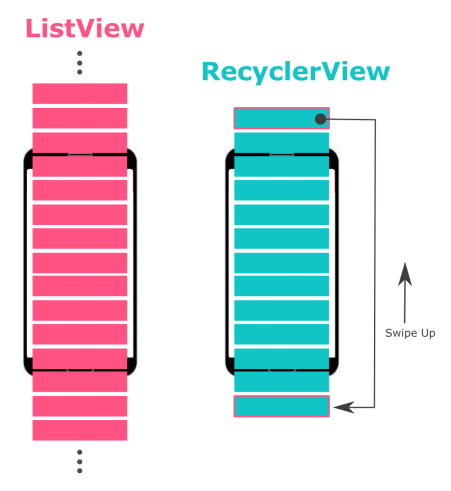

# Android For Beginner 3

Pada pertemuan kali ini, kita akan belajar mengenai [RecyclerView](https://developer.android.com/reference/androidx/recyclerview/widget/RecyclerView).

## Recycler View

Pada aplikasi, interaksi dengan pengguna dalam menampilkan data yang jumlahnya banyak umumnya dilakukan melalui sebuah **list** yang dapat digeser ke atas dan ke bawah. Untuk menerapkan hal tersebut dalam aplikasi kita, dibutuhkan **RecyclerView**.

RecyclerView memiliki pendahulunya yaitu ListView. Perbedaan signifikan diantara keduanya ialah, ListView akan membuat semua objek pada item secara langsung, sedangkan RecyclerView tidak. RecyclerView hanya **membuat objek sesuai dengan ukuran layar** dan beberapa di atas dan bawahnya saja. Seperti namanya, _recycle_, RecyclerView kemudian akan **menggunakan kembali** item yang sudah tidak terlihat. 

Hal ini membuat aplikasi yang menggunakan RecyclerView menjadi efisien dan lebih menghemat memori.

### Penerapan RecyclerView

Untuk menampilkan RecyclerView, terdapat beberapa hal yang perlu diketahui:
1. RecyclerView : komponen ViewGroup yang perlu ditambahkan ke layout XML.
2. LayoutManager : mengatur tata letak item pada RecyclerView. Terdapat beberapa opsi yang dapat kita pilih, yaitu :  
 
    - LinearLayoutManager : menampilkan satu kolom secara linear.
    - GridLayoutManager : menampilkan lebih dari satu kolom atau grid.
    - StaggeredLayoutManager : tampilan menyesuaikan tinggi setiap item.
3. Data source : sumber data yang akan ditampilkan pada RecyclerView, umumnya berupa **List/ArrayList**.
4. Layout item : tampilan layout XML untuk setiap baris item.
5. RecyclerView.Adapter : sebuah _class_ yang berfungsi untuk **menghubungkan** sumber data dengan RecyclerView. Terdapat beberapa fungsi didalamnya :
    - onCreateViewHolder() : digunakan untuk membuat ViewHolder baru yang terhubung dengan layout item.
    - onBindViewHolder() : digunakan untuk meng-_attach_ atau menetapkan sumber data sesuai dengan posisinya.
    - getItemCount() : digunakan untuk menetapkan ukuran dari jumlah data yang ingin ditampilkan.
6. RecyclerView.ViewHolder : digunakan untuk menentukan bagaimana data ditampilkan ke dalam layout item.

### Langkah-langkah menampilkan data menggunakan RecyclerView 

1. Menambahkan RecyclerView ke dalam layout XML.
2. Membuat layout XML untuk layout item.
3. Membuat _class_ baru dan menambahkan pewarisan `RecyclerView.Adapter`.
4. Membuat _inner class_ dan menambahkan pewarisan `RecyclerView.ViewHolder`.
5. Pada _method_ `onCreate()` dalam Activity, inisiasikan RecyclerView dengan adapter dan layoutManager.

