# RECYCLERVIEW PRACTICE

## Membuat Project Android Studio

Pastikan bahwa kalian sudah menginstall Android Studio pada device kalian masing-masing yaa!

1. Kalian bisa **Running** Android Studio terlebih dahulu. Kemudian, buatlah **New Project**.

    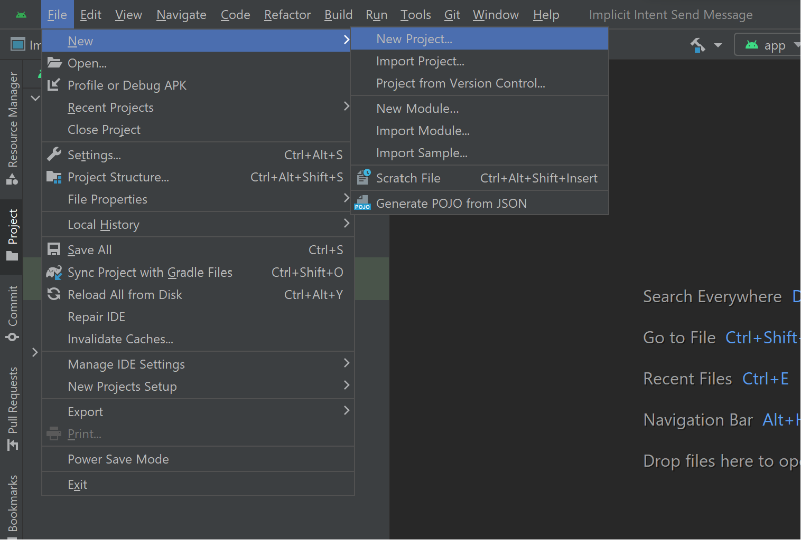

2. Kemudian, ditampilkan seperti di bawah ini. Dikarenkakan kita hanya membuat **basic project** saja maka kalian bisa memilih yang **Empty View Activity**. Kemudian, bisa klik **Next**.

    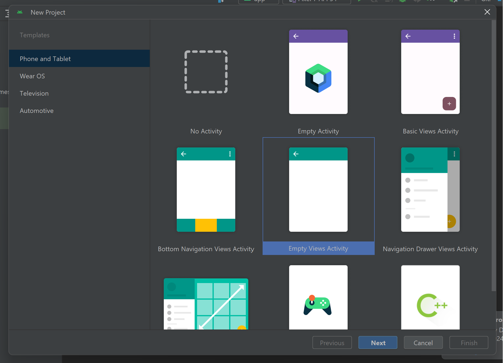

3. Maka, akan ditampilkan window seperti berikut ini. Untuk **nama**, **Language**, **Minimum SDK**, dan **Build configuration language** bisa mengikuti seperti pada gambar, sedangkan untuk package bisa disesuaikan dengan format berikut ini: 

    **com.nim.2namapertama.meowapp**.

4. Kemudian, untuk save location bisa disesuaikan sesuai dengan path pada device masing-masing. Lalu bisa pilih **Finish**.

    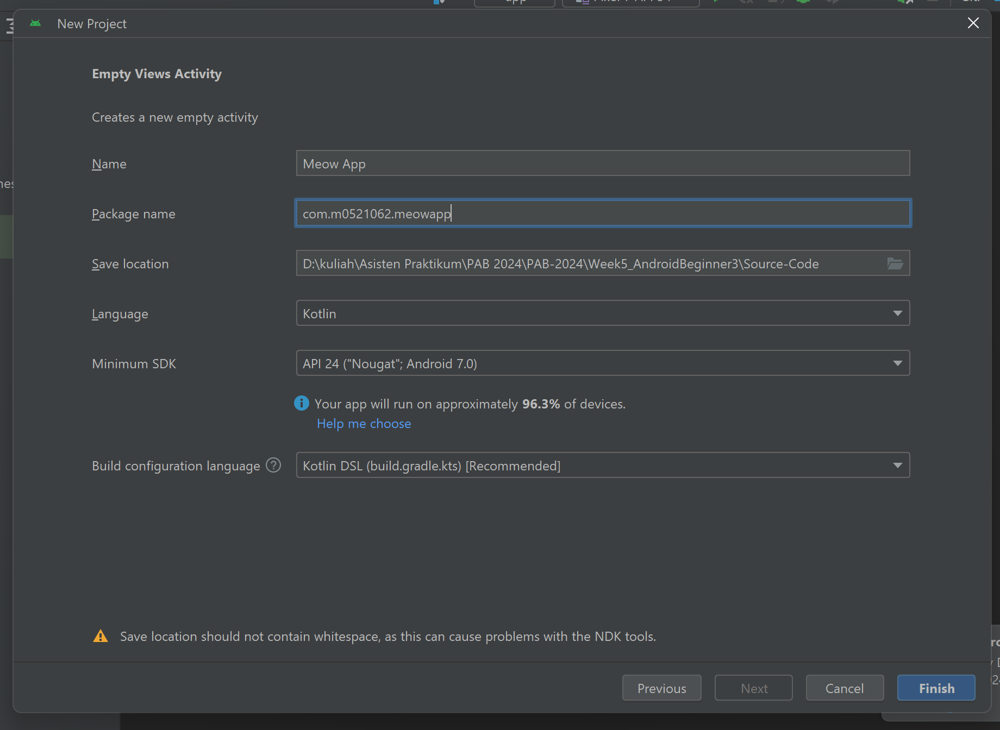

5. Jika sudah, **tunggu build.gradles hingga selesai** dan tampilannya akan menjadi seperti ini.

    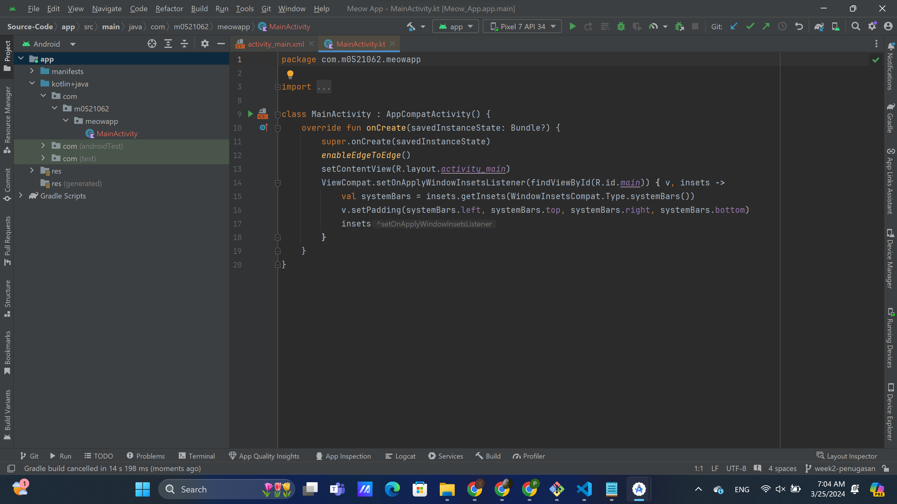

6. Jika kalian sudah menkonfigurasi emulator, maka bisa langsung di-running dan akan menjadi seperti ini.

    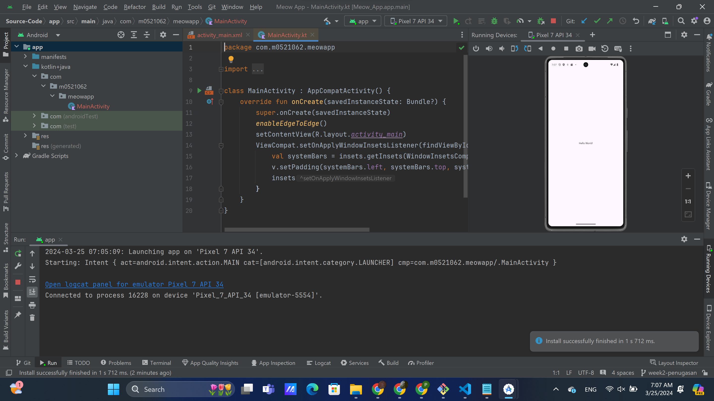


## Menyusun Tampilan dengan XML (Layouting)

1. Kalian bisa membuka file **activity_main.xml** pada directory **res/layout/activity_main.xml**. Maka tampilan layout akan ditampilkan seperti ini.

    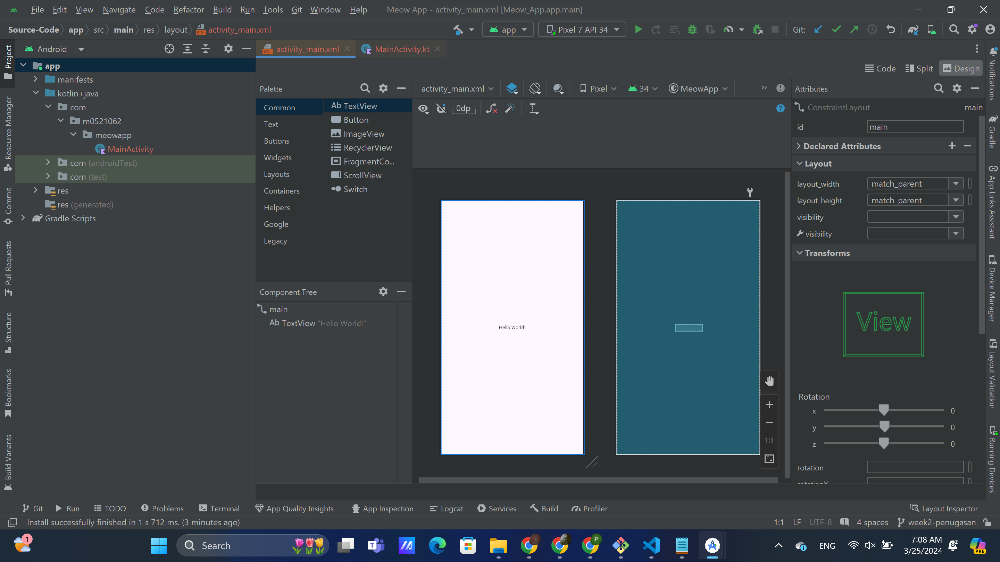

2. Kemudian, kalian bisa memilih yang tengah supaya bisa dilakukan split sehingga kita bisa melihat tampilan layout dan XML secara bersamaan.

    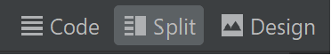

    Jika berhasil, maka tampilannya akan menjadi seperti ini.

    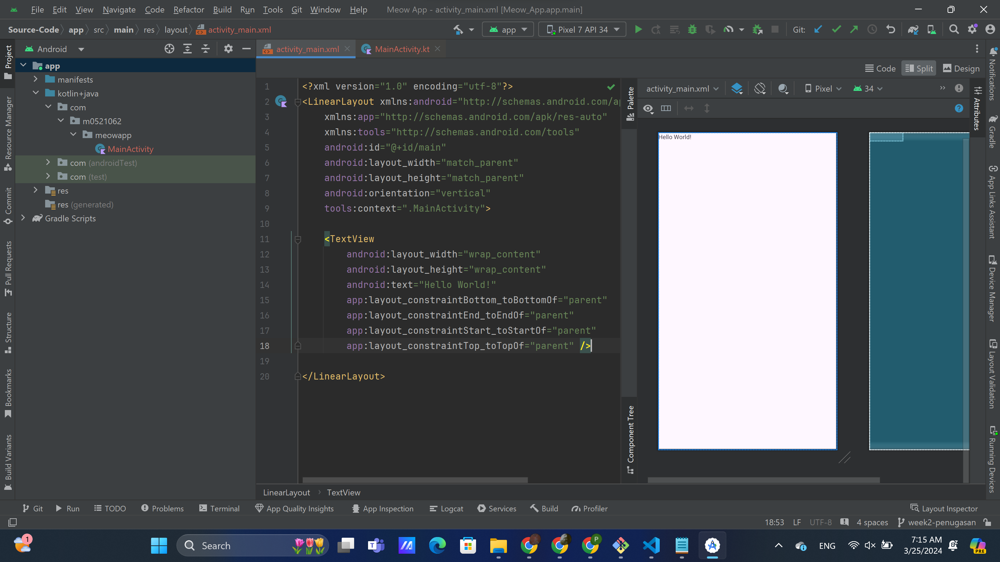

3. Selanjutnya, ubah layout yang sebelumnya ConstrainLayout menjadi LinearLayout. Hal ini karena LinearLayout adalah Layout yang paling sederhana dan paling mudah supaya mempermudah dalam praktikum kali ini. Untuk materi Layouting akan dibahas pada pertemuan yang akan datang. Sesuaikan sehingga hasilnya seperti code berikut ini.
    ```xml
    <?xml version="1.0" encoding="utf-8"?>
    <LinearLayout xmlns:android="http://schemas.android.com/apk/res/android"
        xmlns:app="http://schemas.android.com/apk/res-auto"
        xmlns:tools="http://schemas.android.com/tools"
        android:id="@+id/main"
        android:layout_width="match_parent"
        android:layout_height="match_parent"
        android:padding="16.dp"
        android:orientation="vertical"
        tools:context=".MainActivity">

        <TextView
            android:layout_width="match_parent"
            android:layout_height="wrap_content"
            android:text="Beam Volume" />

    </LinearLayout>
    ```

## Persiapan

### Menambahkan Plugin (Bagi Pengguna Android Studio Iguana & Android Studio dengan file `libs.version.toml`)

1. Pada file `libs.version.toml`, tambahkan kode berikut pada bagian **[version]** : 
    ```kotlin
    kotlinParcelize = "1.9.0"
    ```
    Kode keseluruhan **[version]** akan menjadi seperti berikut : 
    ```kotlin
    [versions]
    agp = "8.3.0"
    kotlin = "1.9.0"
    coreKtx = "1.10.1"
    junit = "4.13.2"
    junitVersion = "1.1.5"
    espressoCore = "3.5.1"
    appcompat = "1.6.1"
    material = "1.11.0"
    activity = "1.8.0"
    constraintlayout = "2.1.4"
    kotlinParcelize = "1.9.0"
    ```
2. Masih pada file yang sama, tambahkan kode berikut pada bagian **[plugins]**
    ```kotlin
    kotlin-parcelize = { id = "org.jetbrains.kotlin.plugin.parcelize", version.ref = "kotlinParcelize"}
    ```

    Kode keseluruhan **[plugins]** akan menjadi seperti berikut : 
    ```kotlin
    [plugins]
    androidApplication = { id = "com.android.application", version.ref = "agp" }
    jetbrainsKotlinAndroid = { id = "org.jetbrains.kotlin.android", version.ref = "kotlin" }
    kotlin-parcelize = { id = "org.jetbrains.kotlin.plugin.parcelize", version.ref = "kotlinParcelize"}
    ```

    Tampilan file akan menjadi seperti berikut : 
    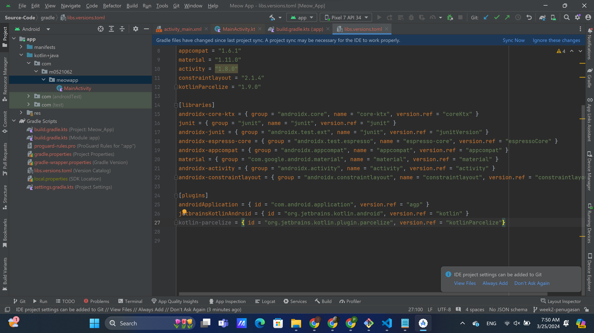

    Kemudian, klik tombol `Sync Now` pada bagian kanan atas  dan tunggu hingga selesai

    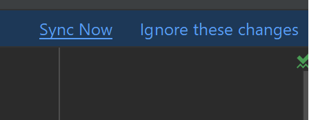 

2. Tambahkan plugin berikut pada file `build.gradle` pada level project (Project: Meow_App).

    ```gradle
    alias(libs.plugins.kotlin.parcelize) apply false
    ```

    Sehingga keseluruhan kode akan menjadi seperti berikut : 
    ```gradle
    plugins {
        alias(libs.plugins.androidApplication) apply false
        alias(libs.plugins.jetbrainsKotlinAndroid) apply false
        alias(libs.plugins.kotlin.parcelize) apply false
    }
    ```

    Tampilan file akan menjadi seperti gambar berikut : 
    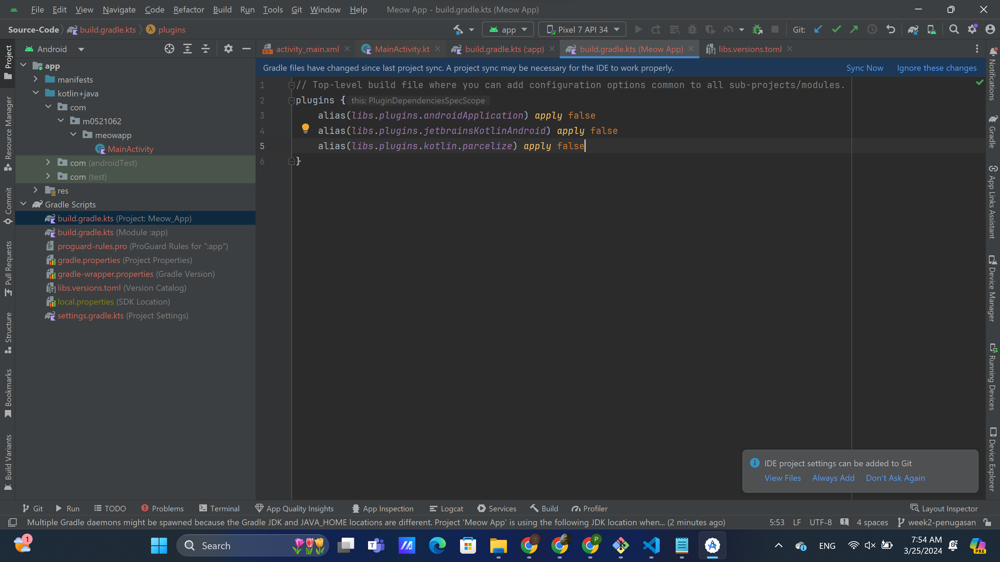

3. Tambahkan plugin berikut pada file `build.gradle` pada level module (Module: app).

    ```gradle
    alias(libs.plugins.kotlin.parcelize)
    ```

    Sehingga keseluruhan kode akan menjadi seperti berikut : 
    ```gradle
    plugins {
        alias(libs.plugins.androidApplication)
        alias(libs.plugins.jetbrainsKotlinAndroid)
        alias(libs.plugins.kotlin.parcelize)
    }
    ```

    Tampilan file akan menjadi seperti gambar berikut : 
    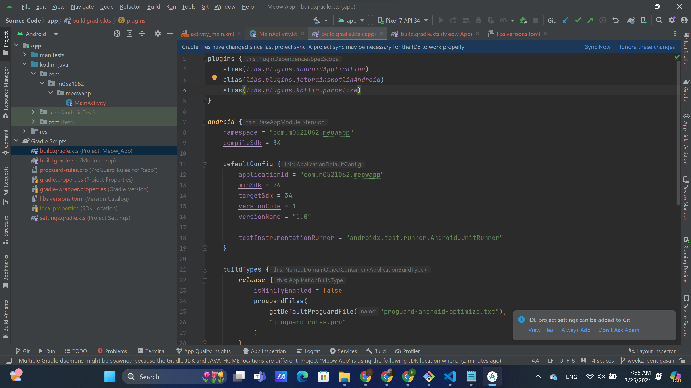

4. Klik `Sync Now`

    Klik tombol `Sync Now` seperti pada gambar di bawah, lalu tunggu hingga selesai.

     

### Menambahkan Plugin (Bagi Pengguna Android Studio yg tidak ada file `libs.version.toml`)

1. Buka file `build.gradle` pada level module (Module: app) dan tambahkan plugin berikut.

   ```
   id("kotlin-parcelize")
   ```

   Sehingga isi _plugin_ akan menjadi seperti ini
   
   ```
   plugins {
       id("com.android.application")
       id("org.jetbrains.kotlin.android")
       id("kotlin-parcelize")
   }
   ```

3. Klik `Sync Now`

    Klik tombol `Sync Now` seperti pada gambar di bawah, lalu tunggu hingga selesai.

     

### Mendownload _asset_
Download _asset_ yang dibutuhkan pada praktikum kali ini melalui link [berikut](https://drive.google.com/file/d/1EPxdCJ6yt-xm_PgdPaaWzkmfDmhDmGfB/view?usp=sharing).

Kemudian, _extract file_ yang telah didownload.

Copy isi folder ke dalam folder **drawable**.

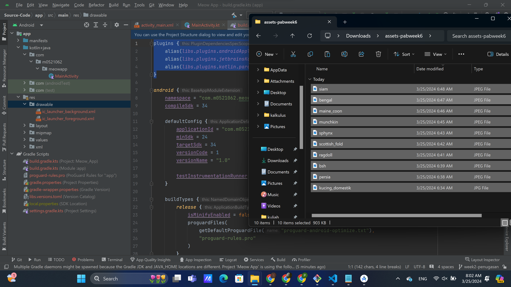


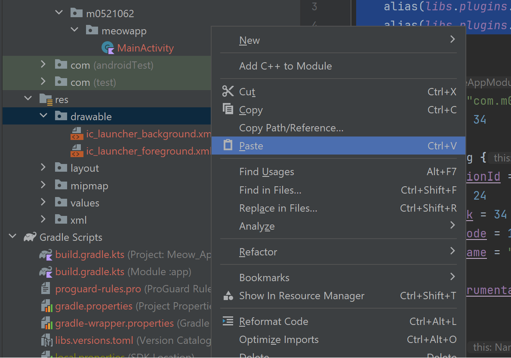


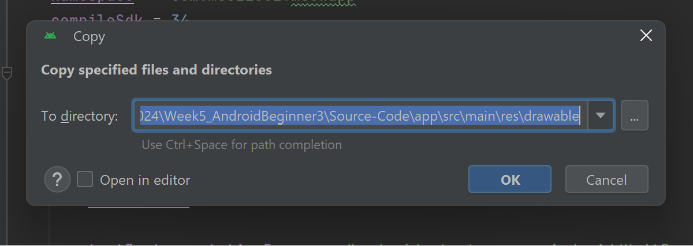

Jika berhasil, maka isi folder **drawable** akan menjadi seperti berikut : 

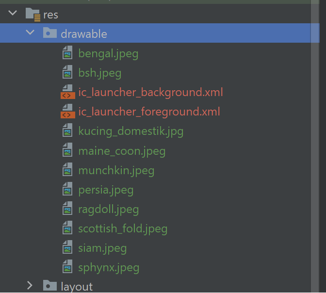

## Menambahkan RecyclerView

Pertama, hapus TextView terlebih dahulu. Kemudian, tambahkan RecyclerView dengan mengetik "RecyclerView" pada xml sehingga muncul gambar berikut

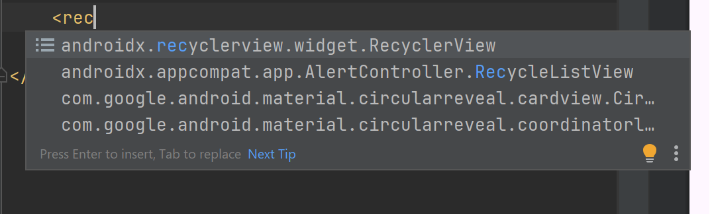

Pilih yang paling atas.

Untuk **layout_width** & **layout_height**, isikan `match_parent`. Selanjutnya, beri **id** dengan `rv_cats`

Kode pada `activity_main.xml` akan menjadi seperti berikut ini.

```xml
<?xml version="1.0" encoding="utf-8"?>
<LinearLayout xmlns:android="http://schemas.android.com/apk/res/android"
    xmlns:app="http://schemas.android.com/apk/res-auto"
    xmlns:tools="http://schemas.android.com/tools"
    android:id="@+id/main"
    android:layout_width="match_parent"
    android:layout_height="match_parent"
    android:orientation="vertical"
    tools:context=".MainActivity">

    <androidx.recyclerview.widget.RecyclerView
        android:id="@+id/rv_cats"
        android:layout_width="match_parent"
        android:layout_height="match_parent"/>

</LinearLayout>
```

Tampilan akan menjadi seperti berikut ini

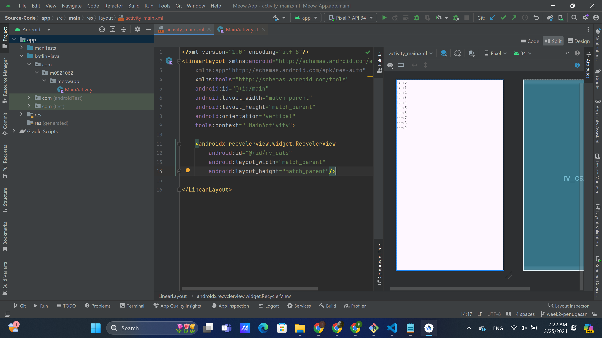

## Membuat Layout Item
1. Klik kanan pada direktori layout → New → layout resource file dan beri nama `item_row_cat`. Pastikan **Root element** menggunakan **ConstraintLayout** terlebih dahulu.

    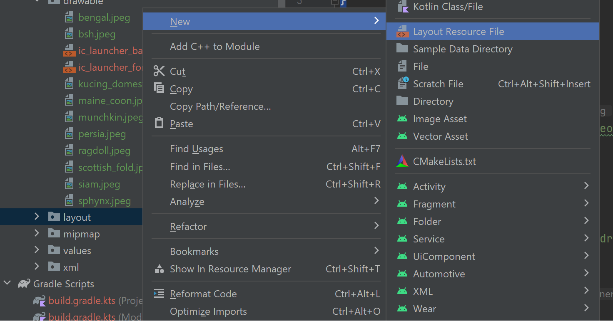

    Setelah diklik, maka akan muncul tab berikut : 

    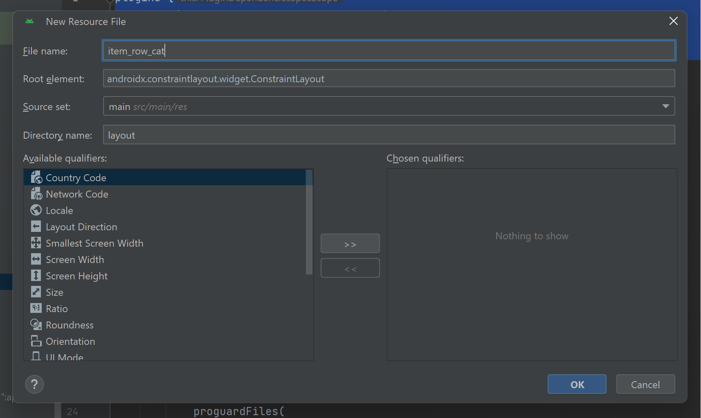

    Ketika file berhasil terbuat, maka tampilan file akan menjadi seperti berikut. Jangan lupa untuk mengubah tampilan menjadi **split screen**.

    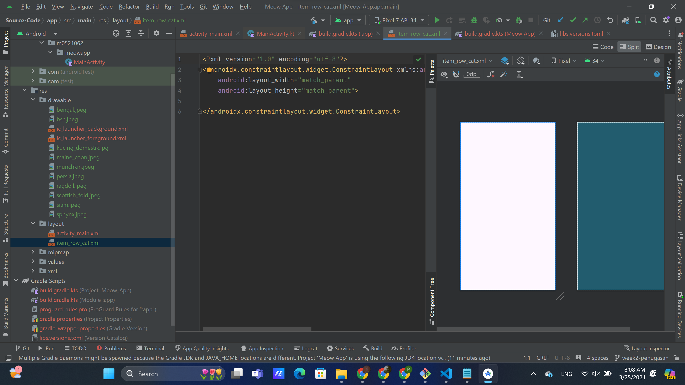

2. Ubah Kode pada XML
Ubah kode pada layout XML `item_row_cat` menjadi seperti berikut : 

    ```xml
    <?xml version="1.0" encoding="utf-8"?>
    <androidx.cardview.widget.CardView xmlns:android="http://schemas.android.com/apk/res/android"
        xmlns:card_view="http://schemas.android.com/apk/res-auto"
        xmlns:tools="http://schemas.android.com/tools"
        android:id="@+id/card_view"
        android:layout_width="match_parent"
        android:layout_height="wrap_content"
        android:layout_gravity="center"
        android:layout_marginStart="8dp"
        android:layout_marginTop="4dp"
        android:layout_marginEnd="8dp"
        android:layout_marginBottom="4dp"
        card_view:cardCornerRadius="4dp">

        <androidx.constraintlayout.widget.ConstraintLayout
            android:layout_width="match_parent"
            android:layout_height="wrap_content"
            android:padding="8dp">

            <ImageView
                android:id="@+id/img_item_photo"
                android:layout_width="70dp"
                android:layout_height="100dp"
                android:scaleType="centerCrop"
                card_view:layout_constraintBottom_toBottomOf="parent"
                card_view:layout_constraintStart_toStartOf="parent"
                card_view:layout_constraintTop_toTopOf="parent"
                tools:src="@tools:sample/avatars" />

            <TextView
                android:id="@+id/tv_item_name"
                android:layout_width="0dp"
                android:layout_height="wrap_content"
                android:layout_marginStart="8dp"
                android:layout_marginEnd="8dp"
                android:layout_toEndOf="@id/img_item_photo"
                android:textSize="16sp"
                android:textStyle="bold"
                card_view:layout_constraintEnd_toEndOf="parent"
                card_view:layout_constraintStart_toEndOf="@+id/img_item_photo"
                card_view:layout_constraintTop_toTopOf="@+id/img_item_photo"
                tools:text="@string/cat_name" />

            <TextView
                android:id="@+id/tv_item_description"
                android:layout_width="0dp"
                android:layout_height="0dp"
                android:layout_marginTop="8dp"
                android:ellipsize="end"
                android:maxLines="5"
                card_view:layout_constraintBottom_toBottomOf="@+id/img_item_photo"
                card_view:layout_constraintEnd_toEndOf="@+id/tv_item_name"
                card_view:layout_constraintStart_toStartOf="@+id/tv_item_name"
                card_view:layout_constraintTop_toBottomOf="@+id/tv_item_name"
                card_view:layout_constraintVertical_bias="0.0"
                tools:text="@string/description" />
        </androidx.constraintlayout.widget.ConstraintLayout>
    </androidx.cardview.widget.CardView>

    ```

    Tampilan file akan mejadi seperti berikut : 

    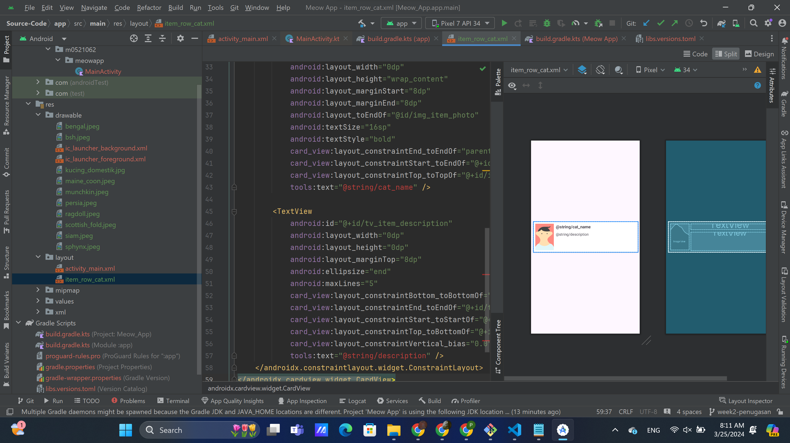

3. Terdapat kode yang masih _error_ pada bagian `@string/cat_name` dan `@string/description`. Hal ini dikarenakan kita belum membuat nilai string tersebut.

    Untuk mengatasinya,masuk ke dalam **res → values → strings.xml**. Tambahkan kode seperti berikut.

    ```xml
    <resources>
    <string name="app_name">Meow App</string>
    <string name="cat_name">Nama Kucing</string>
    <string name="description">Deskripsi</string>

    <string-array name="data_name">
        <item>Kucing Domestik</item>
        <item>Persia</item>
        <item>British Shorthair</item>
        <item>Ragdoll</item>
        <item>Scottish Fold</item>
        <item>Sphynx</item>
        <item>Munchkin</item>
        <item>Maine Coon</item>
        <item>Kucing Bengal</item>
        <item>Kucing Siam</item>
    </string-array>

    <string-array name="data_desc">
    <item><![CDATA[Kucing kampung merupakan jenis kucing peliharaan di Indonesia yang sangat mudah ditemui. Biasanya kucing ini hidup liar atau bebas di sekitar pemukiman manusia.

    Jenis kucing ini dapat memiliki berbagai warna bulu dan ciri-ciri fisik yang beragam.

    Mereka biasanya dibiarkan bebas berkeliaran di sekitar lingkungan dan mengandalkan makanan dari tempat sampah, berburu, atau sisa-sisa makanan manusia.]]></item>
    <item><![CDATA[Kucing Persia cukup populer untuk dijadikan hewan peliharaan. Wajahnya datar dan bulunya yang panjang menjadikan kucing ini banyak disukai orang.

    Meski termasuk kucing ras berbulu panjang, kucing Persia tidak membutuhkan banyak perawatan khusus. Namun, karena bulunya yang panjang, Anda harus rutin menyisir rambut untuk menghindari rambut kusut dan kutu di badan mereka.

    Dengan penampilannya yang anggun, kucing Persia ternyata sangat suka dipeluk dan tidur di pangkuan pemiliknya.]]></item>
    <item><![CDATA[British Shorthair memiliki karakteristik berupa warna bulu abu-abu, bulunya tebal dan pendek seperti karpet, mata bulat besar, dan ukuran berwarna sedang.

    Berbeda dengan jenis kucing pada umumnya, British Shorthair dikatakan hewan yang tenang dan pendiam. Mereka biasanya mudah terikat dengan pemiliknya, penyayang, dan mudah beradaptasi. Sayangnya, mereka tidak terlalu suka digendong.

    British Shorthair bisa rukun dengan segala jenis binatang, seperti kucing, kelinci, dan burung. Hal ini cocok bagi Anda yang suka memelihara lebih dari satu jenis binatang untuk dipelihara.]]></item>
    <item><![CDATA[Kucing ini memiliki bulu panjang, berwarna cerah, dan kedua matanya berwarna biru. Dengan penampilan yang elegan ini mereka sangatlah clingy dan lebih suka bermain dengan manusia dibandingkan dengan sesama kucing.

    Ragdoll juga termasuk dalam jenis yang baik hati, patuh, kooperatif, dan bisa bermain dengan anak-anak.]]></item>
    <item><![CDATA[Scottish Fold merupakan jenis kucing ras yang berasal dari Skotlandia. Scottish Fold memiliki ciri-ciri unik yaitu telinga yang terlipat ke depan akibat mutasi genetik. Mukanya bulat dengan bulu lembut dan tebal serta mata yang besar. Sekilas, kucing ini terlihat seperti boneka beruang.

    Dengan ekspresi yang manis, jenis kucing ini mudah beradaptasi dan mudah menunjukkan kasih sayang kepada pemiliknya. Kucing ini juga cukup tenang dan tidak mudah panik saat berada di lingkungan baru atau ada orang asing di dalam rumah.

    Scottish Fold tidak butuh perawatan yang banyak. Cukup berikan makanan bernutrisi dan kasih sayang yang berlimpah agar ia tumbuh sehat dan bahagia.]]></item>
    <item><![CDATA[Kucing Sphynx merupakan jenis kucing yang paling unik di antara semua kucing karena tidak memiliki bulu. Kucing ini mengalami mutasi genetik yang sudah terjadi sejak lama.Kucing ini diberi nama Sphynx karena mirip dengan Sphynx, salah satu patung di Mesir.

    Selain tidak memiliki bulu, ciri fisik lainnya yaitu matanya berbentuk lemon, telinganya besar, dan memiliki banyak lipatan tubuh. Karakternya sangat tenang, cuek, dan sangat pendiam.

    Karena tidak berbulu, kucing ini memiliki perawatan khusus yaitu Anda harus sering menyeka kulitnya secara teratur.]]></item>
    <item><![CDATA[Kucing Munchkin merupakan model kucing yang memiliki ciri-ciri fisik unik, yaitu kaki pendek atau kaki yang lebih pendek dari rata-rata kucing lainnya. Meski begitu, jenis kucing ini sangat cepat dan tangkas dalam bergerak. Ia sangat aktif berlarian ke seluruh rumah sekaligus dapat menyelinap ke sudut sempit karena badannya yang imut.

    Munchkin merupakan kucing yang penuh kasih sayang. Mereka tidak enggan menunjukkan rasa sayang pada pemiliknya, seperti minta dielus atau tidur dalam pangkuan pemiliknya.

    Jenis kucing ini juga umumnya mudah beradaptasi dan bergaul dengan orang asing. Meski kadang menunjukkan rasa takut, lama-kelamaan ia akan mudah bermain dengan manusia yang baru ditemuinya.]]></item>
    <item><![CDATA[Maine Coon disebut sebagai ‘kucing raksasa’. Hal ini karena ukurannya yang lebih besar, tinggi, dan kuat daripada rata-rata kucing pada umumnya. Bulu kucing ini sangat lebat dengan dagu dan telinga yang runcing.

    Meski berukuran besar, maine coon merupakan kucing yang berkarakter lincah, manis, dan sangat ramah. Kucing ini pun sangat mudah bergaul dengan manusia maupun dengan hewan lainnya.]]></item>
    <item><![CDATA[Jenis kucing Bengal banyak diminati karena motif di bulunya yang mirip macan tutul. Pola belang ini adalah salah satu ciri khas utama ras ini. Warna bulu Bengal bisa beragam, termasuk belang cokelat atau putih salju dengan pola belang hitam.

    Selain itu, karakternya begitu aktif, rasa ingin tahunya tinggi, dan sangat suka bermain.

    Kucing Bengal sangat mudah beradaptasi dan setia kepada pemiliknya. Ia juga tak enggan menunjukkan rasa sayang kepada pemiliknya, seperti minta dielus, tidur di pangkuan, atau minta diajak bermain.]]></item>
    <item><![CDATA[Jenis kucing lain yang populer dijadikan hewan peliharaan yaitu kucing siam. Kucing ini sering disebut sebagai ‘pangeran kucing’ karena cara berjalannya, bentuk wajahnya, serta warna dan ketebalan bulunya.

    Selain itu, kucing Siam terkenal karena cerewet. Ia sering mengeong sebagai bentuk komunikasi pada manusia. Kucing Siam juga punya banyak energi sehingga Anda sebaiknya menyediakan banyak mainan untuk menghabiskan energinya. Karena cukup aktif, kucing Siam terkadang lebih banyak menghabiskan makanan kucing untuk mengisi kembali energi mereka.]]></item>
    </string-array>

    <integer-array name="data_img">
        <item>@drawable/kucing_domestik</item>
        <item>@drawable/persia</item>
        <item>@drawable/bsh</item>
        <item>@drawable/ragdoll</item>
        <item>@drawable/scottish_fold</item>
        <item>@drawable/sphynx</item>
        <item>@drawable/munchkin</item>
        <item>@drawable/maine_coon</item>
        <item>@drawable/bengal</item>
        <item>@drawable/siam</item>
    </integer-array>

    </resources>
    ```

4. Layout `item_row_cat` akan menjadi seperti gambar berikut : 

      

## Membuat Data Class

1. Buat sebuah _data class_ bernama Cat dengan cara klik kanan pada **nama package → New → Java/Kotlin class**. _Class_ ini nantinya digunakan untuk menampung data yang akan ditampilkan.

    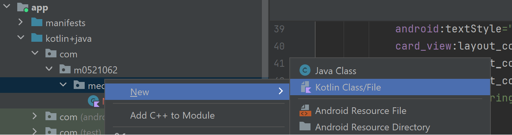  

    Akan muncul tab seperti berikut, beri nama _data class_ dengan **Cat**.

    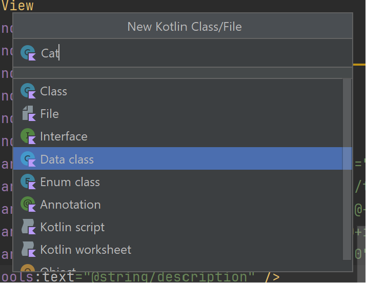 

    Tampilan awal _file_ akan terlihat speerti gambar di bawah ini : 

    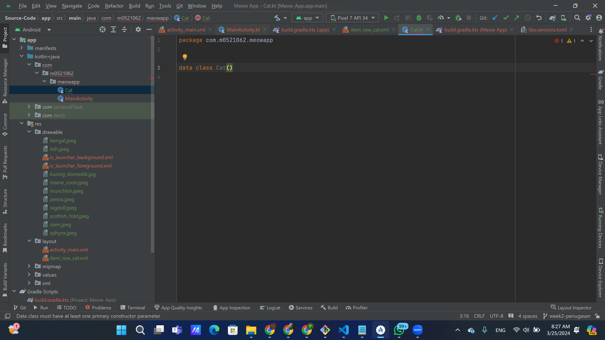  

2. Tambahkan properti data yang akan ditampilkan, yaitu nama, deskripsi, dan gambar.

    ```kotlin
    data class Cat(
        val name: String,
        val desc: String,
        val img: Int
    )
    ```

    Tampilan file akan menjadi seperti pada gambar berikut : 
    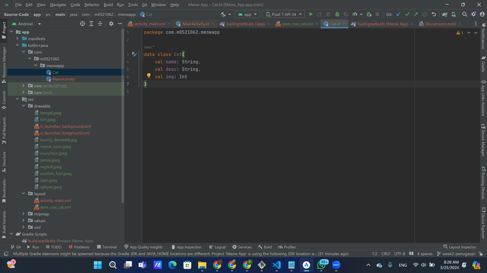  

3. Tambahkan implementasi **parcelable** ke kelas `Cat`

    ```kotlin
    @Parcelize
    data class Cat(
        val name: String,
        val desc: String,
        val img: Int
    ) : Parcelable
    ```

    Ketika mengimport `Parcelize`, pastikan untuk import yang **kotlinx.parcelize**. Tambahkan juga `Parcelable` pada akhir kode _data class_.

    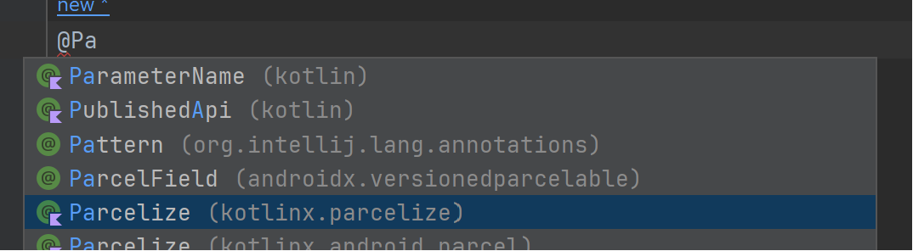  

    Tampilan file akan menjadi seperti pada gambar berikut : 
    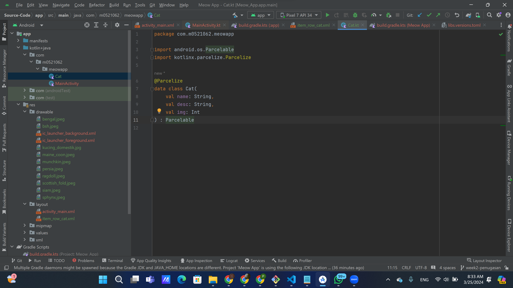  

## Membuat Adapter RecyclerView

1. Buatlah kelas adapter secara manual dengan klik kanan pada **package utama → New → Kotlin/Java Class** dan beri nama ListCatAdapter.

    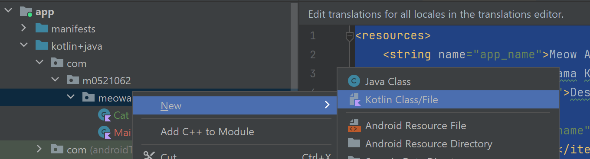

    Akan muncul tab berikut, berikan nama _class_ dengan **ListCatAdapter**

    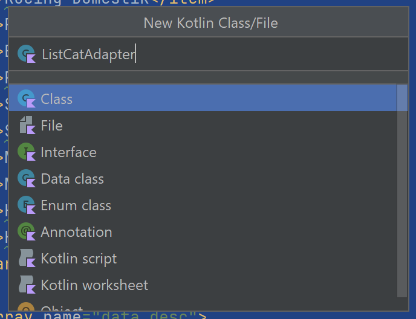  

    Ketika file berhasil dibuat, akan menampilkan tampilan seperti gambar di bawah ini : 

    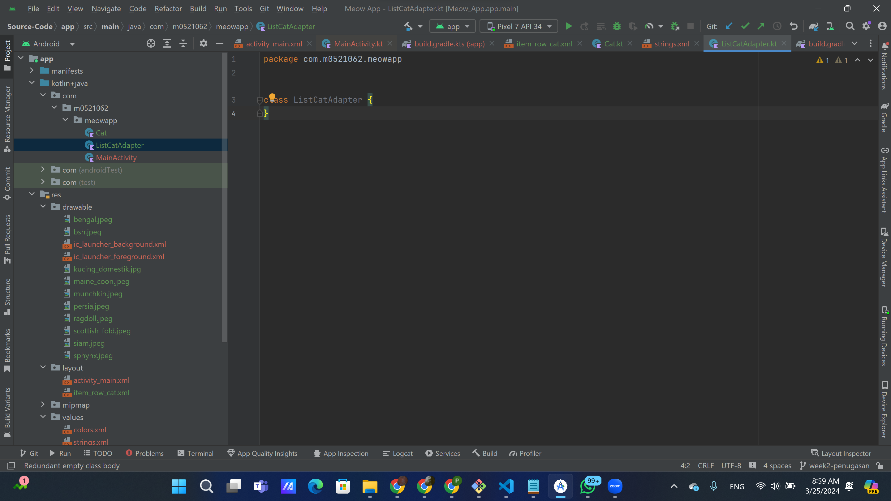

2. Setelah kelas Adapter berhasil dibuat, lengkapi kodenya menjadi seperti berikut 

    ```kotlin
    class ListCatAdapter : RecyclerView.Adapter<ListCatAdapter.ListViewHolder>() {

    }
    ```

3. Kemudian muncul garis merah pada kode, begitu pun pada ListViewHolder. Kita akan membetulkannya satu per satu. Pertama adalah kita tekan Alt+Enter/klik tombol merah pada ListViewHolder dan pilih "Create class ListViewHolder", kemudian pilih `ListCatAdapter` karena kita akan membuat sebuah _inner class_:

    

    Kemudian pilih **ListCatAdapter** untuk membuat kelas ListViewHolder di dalam ListCatAdapter.

    

    Kode pada `ListCatAdapter` akan menajdi seperti berikut

    ```kotlin
    class ListCatAdapter : RecyclerView.Adapter<ListCatAdapter.ListViewHolder>() {
        class ListViewHolder {

        }
    }
    ```

4. Arahkan kursor ke teks class `ListCatAdapter` dan lakukan lagi alt+enter / klik tombol merah, lalu pilih implement members.

    Sebelumnya, pastikan kode "RecyclerView" sudah diimport dan tidak merah/_error_.

    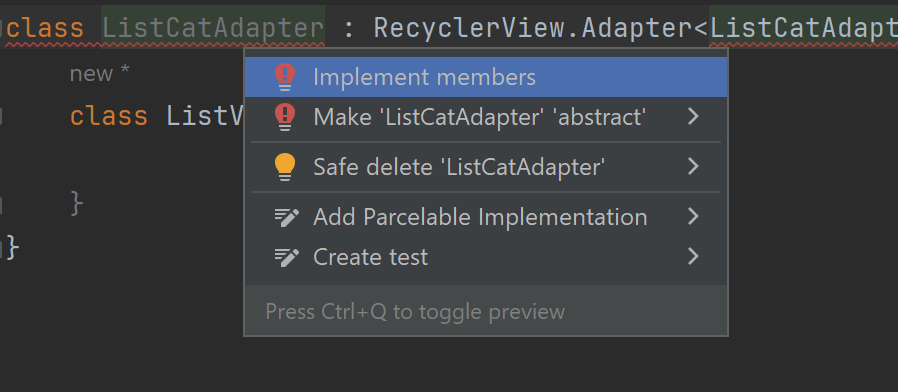

    Kemudian, pilih ketiga _methods_ dari RecyclerView.Adapter dan klik OK

    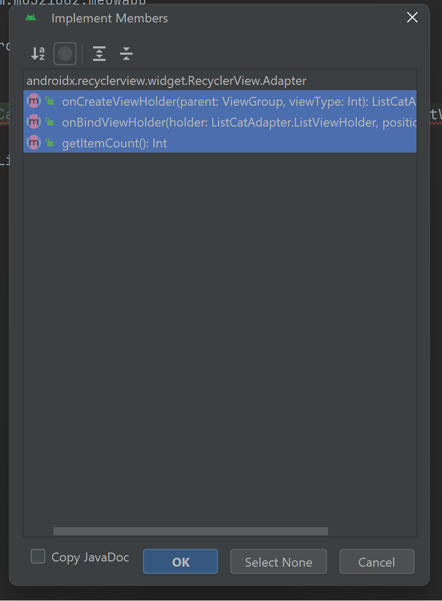

    Kode akan menjadi seperti ini
    ```kotlin
    class ListCatAdapter : RecyclerView.Adapter<ListCatAdapter.ListViewHolder>() {
        class ListViewHolder {

        }

        override fun onCreateViewHolder(parent: ViewGroup, viewType: Int): ListViewHolder {
            TODO("Not yet implemented")
        }

        override fun getItemCount(): Int {
            TODO("Not yet implemented")
        }

        override fun onBindViewHolder(holder: ListViewHolder, position: Int) {
            TODO("Not yet implemented")
        }
    }
    ```

5. Masih terdapat garis merah karena **ListViewHolder** seharusnya mewariskan `RecyclerView.ViewHolder`. Oleh karena itu, ubah kodenya menjadi seperti ini.

    ```kotlin
        class ListViewHolder : RecyclerView.ViewHolder {

        }
    ```

    Pada `RecycleView.ViewHolder`, kita lakukan lagi **Alt + Enter** / klik tombol merah dan pilih Add constructor paremeter from ViewHolder(View)

    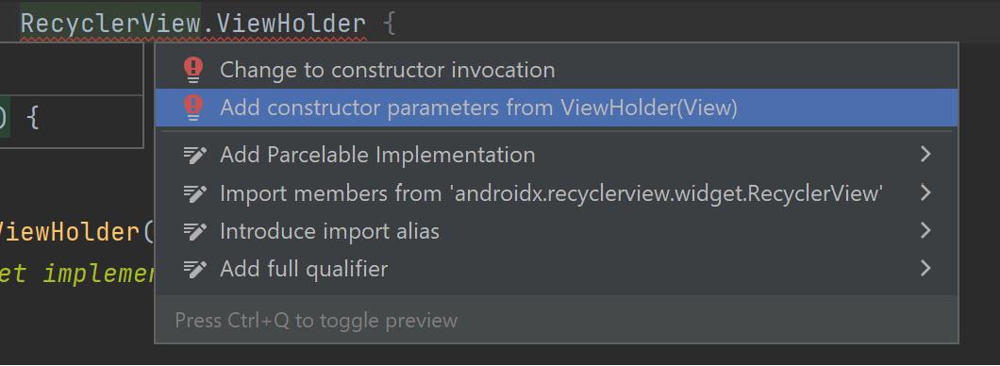

    Sehingga, kode pada `ListCatAdapter` menjadi seperti berikut : 
    ```kotlin
    class ListCatAdapter : RecyclerView.Adapter<ListCatAdapter.ListViewHolder>() {
        class ListViewHolder(itemView: View) : RecyclerView.ViewHolder(itemView) {

        }

        override fun onCreateViewHolder(parent: ViewGroup, viewType: Int): ListViewHolder {
            TODO("Not yet implemented")
        }

        override fun getItemCount(): Int {
            TODO("Not yet implemented")
        }

        override fun onBindViewHolder(holder: ListViewHolder, position: Int) {
            TODO("Not yet implemented")
        }
    }
    ```

6. Selanjutnya, buatlah sebuah _constructor_ untuk _list_ seperti berikut

    ```kotlin
    class ListCatAdapter(private val listCat: ArrayList<Cat>) : RecyclerView.Adapter<ListCatAdapter.ListViewHolder>()
    ```

7. Kemudian, kita dapat melengkapi kode kode hasil dari turunan **RecyclerView.Adapter** sehingga kode lengkap dari kelas `ListCatAdapter` adalah sebagai berikut:

    ```kotlin
    class ListCatAdapter(private val listCat: ArrayList<Cat>) : RecyclerView.Adapter<ListCatAdapter.ListViewHolder>() {
        class ListViewHolder(itemView: View) : RecyclerView.ViewHolder(itemView) {
            val imgPhoto: ImageView = itemView.findViewById(R.id.img_item_photo)
            val tvName: TextView = itemView.findViewById(R.id.tv_item_name)
            val tvDescription: TextView = itemView.findViewById(R.id.tv_item_description)
        }

        override fun onCreateViewHolder(parent: ViewGroup, viewType: Int): ListViewHolder {
            val view: View = LayoutInflater.from(parent.context).inflate(R.layout.item_row_cat, parent, false)
            return ListViewHolder(view)
        }

        override fun getItemCount(): Int = listCat.size

        override fun onBindViewHolder(holder: ListViewHolder, position: Int) {
            val (name, desc, img) = listCat[position]
            holder.imgPhoto.setImageResource(img)
            holder.tvName.text = name
            holder.tvDescription.text = desc
        }
    }
    ```

    Note : Variabel **parent** didapat dari parameter yang ada pada fungsi `onCreateViewHolder`. Apabila hasil generate pada Android Studio Anda berbeda (misal viewGroup, bukan parent). Silakan sesuaikan saja dengan parameternya atau nama variabelnya.

## Mengatur Layout Manager & Adapter
1. Buka kelas `MainActivity` dan atur fixed size **RecyclerView** yang sudah dibuat di `activity_main`.

    ```kotlin
    class MainActivity : AppCompatActivity() {

        private lateinit var rvCats: RecyclerView

        override fun onCreate(savedInstanceState: Bundle?) {
            super.onCreate(savedInstanceState)
            enableEdgeToEdge()
            setContentView(R.layout.activity_main)
            ViewCompat.setOnApplyWindowInsetsListener(findViewById(R.id.main)) { v, insets ->
                val systemBars = insets.getInsets(WindowInsetsCompat.Type.systemBars())
                v.setPadding(systemBars.left, systemBars.top, systemBars.right, systemBars.bottom)
                insets
            }

            rvCats = findViewById(R.id.rv_cats)
            rvCats.setHasFixedSize(true)
        }
    }
    ```

2. Kemudian, kita akan memanggil data yang telah kita buat pada resource strings.xml.

    ```kotlin
    class MainActivity : AppCompatActivity() {

        private lateinit var rvCats: RecyclerView
        private val list = ArrayList<Cat>()

        override fun onCreate(savedInstanceState: Bundle?) {
            super.onCreate(savedInstanceState)
            enableEdgeToEdge()
            setContentView(R.layout.activity_main)
            ViewCompat.setOnApplyWindowInsetsListener(findViewById(R.id.main)) { v, insets ->
                val systemBars = insets.getInsets(WindowInsetsCompat.Type.systemBars())
                v.setPadding(systemBars.left, systemBars.top, systemBars.right, systemBars.bottom)
                insets
            }

            rvCats = findViewById(R.id.rv_cats)
            rvCats.setHasFixedSize(true)

            list.addAll(getListCats())
            showRecyclerList()
        }

        fun getListCats() : ArrayList<Cat> {
            val dataName = resources.getStringArray(R.array.data_name)
            val dataDesc = resources.getStringArray(R.array.data_desc)
            val dataImg = resources.obtainTypedArray(R.array.data_img)
            val listHero = ArrayList<Cat>()
            for (i in dataName.indices) {
                val hero = Cat(dataName[i], dataDesc[i], dataImg.getResourceId(i, -1))
                listHero.add(hero)
            }
            return listHero
        }

        private fun showRecyclerList() {
            rvCats.layoutManager = LinearLayoutManager(this)
            val listCatAdapter = ListCatAdapter(list)
            rvCats.adapter = listCatAdapter
        }
    }
    ```

    Ketika dijalankan pada emulator, tampilan aplikasi seperti gambar di bawah ini : 
    
    

## Menambahkan OnClick pada Adapter melalui MainActivity

1. Membuat interface untuk OnClick pada Adapter

    Untuk mengaktifkan fungsi onClick melalui MainActivity, kita perlu membuat interface pada adapter.

    ```kotlin
    interface OnItemClickCallback {
        fun onItemClicked(data: Cat)
    }
    ```

2. Kemudian, masih pada adapter, kita perlu menambahkan _method_ Callback

    ```kotlin
    private lateinit var onItemClickCallback: OnItemClickCallback
 
    fun setOnItemClickCallback(onItemClickCallback: OnItemClickCallback) { 
        this.onItemClickCallback = onItemClickCallback 
    }
    ```

3. Selanjutnya, tambahkan onClick listener pada fungsi `onBindViewHolder()`

    ```kotlin
    override fun onBindViewHolder(holder: ListViewHolder, position: Int) {
        ...
 
        holder.itemView.setOnClickListener { onItemClickCallback.onItemClicked(listCat[holder.adapterPosition]) }
    }
    ```

4. Keseluruhan kode pada `ListCatAdapter` akan menjadi seperti berikut : 

    ```kotlin
    class ListCatAdapter(private val listCat: ArrayList<Cat>) : RecyclerView.Adapter<ListCatAdapter.ListViewHolder>() {

        private lateinit var onItemClickCallback: OnItemClickCallback

        fun setOnItemClickCallback(onItemClickCallback: OnItemClickCallback) {
            this.onItemClickCallback = onItemClickCallback
        }
        class ListViewHolder(itemView: View) : RecyclerView.ViewHolder(itemView) {
            val imgPhoto: ImageView = itemView.findViewById(R.id.img_item_photo)
            val tvName: TextView = itemView.findViewById(R.id.tv_item_name)
            val tvDescription: TextView = itemView.findViewById(R.id.tv_item_description)
        }

        override fun onCreateViewHolder(parent: ViewGroup, viewType: Int): ListViewHolder {
            val view: View = LayoutInflater.from(parent.context).inflate(R.layout.item_row_cat, parent, false)
            return ListViewHolder(view)
        }

        override fun getItemCount(): Int = listCat.size

        override fun onBindViewHolder(holder: ListViewHolder, position: Int) {
            val (name, desc, img) = listCat[position]
            holder.imgPhoto.setImageResource(img)
            holder.tvName.text = name
            holder.tvDescription.text = desc
            holder.itemView.setOnClickListener { onItemClickCallback.onItemClicked(listCat[holder.adapterPosition]) }
        }

        interface OnItemClickCallback {
            fun onItemClicked(data: Cat)
        }
    }
    ```

5. Pada MainActivity, buatlah sebuah _method_ berikut

    ```kotlin
        private fun showSelectedCat(cat: Cat) {
        Toast.makeText(this, cat.name + " is selected", Toast.LENGTH_SHORT).show()
    }
    ```

6. Selanjutnya pada _method_ `showRecyclerList()`, tambahkan kode berikut

    ```kotlin
        listCatAdapter.setOnItemClickCallback(object : ListCatAdapter.OnItemClickCallback {
            override fun onItemClicked(data: Cat) {
                showSelectedCat(data)
            }

        })
    ```

    Sehingga keseluruhan kode pada _method_ `showRecyclerList()` akan menjadi seperti berikut : 

    ```kotlin
    private fun showRecyclerList() {
        rvCats.layoutManager = LinearLayoutManager(this)
        val listCatAdapter = ListCatAdapter(list)
        rvCats.adapter = listCatAdapter

        listCatAdapter.setOnItemClickCallback(object : ListCatAdapter.OnItemClickCallback {
            override fun onItemClicked(data: Cat) {
                showSelectedCat(data)
            }

        })
    }
    ```


## Mengubah tampilan List menjadi Grid menggunakan Layout Manager

1. Pertama, kita perlu mengubah tema bawaan dari **NoActionBar** karena kita ingin menggunakan **option menu** pada halaman Activity. Bukalah file **themes.xml** di **res/values/themes**, baik untuk mode siang dan malam. Setelah itu, hapus bagian **.NoActionBar** pada tema utama aplikasi. 

    ```xml
    <resources xmlns:tools="http://schemas.android.com/tools">
        <!-- Base application theme. -->
        <style name="Base.Theme.MeowApp" parent="Theme.Material3.DayNight">
            <!-- Customize your light theme here. -->
            <!-- <item name="colorPrimary">@color/my_light_primary</item> -->
        </style>

        <style name="Theme.MeowApp" parent="Base.Theme.MeowApp" />
    </resources>
    ```

    Pada _night mode_,
    ```xml
    <resources xmlns:tools="http://schemas.android.com/tools">
        <!-- Base application theme. -->
        <style name="Base.Theme.MeowApp" parent="Theme.Material3.DayNight">
            <!-- Customize your dark theme here. -->
            <!-- <item name="colorPrimary">@color/my_dark_primary</item> -->
        </style>
    </resources>
    ```

2. Selanjutnya buat _resource directory_ untuk menu. Klik kanan pada direktori **res → New → Android Resource Directory**.

    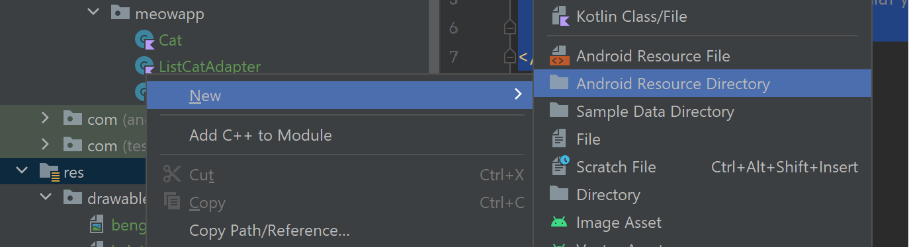

3. Setelah muncul dialog box seperti di bawah ini, ganti **Resource type** menjadi **menu** dan klik OK.

    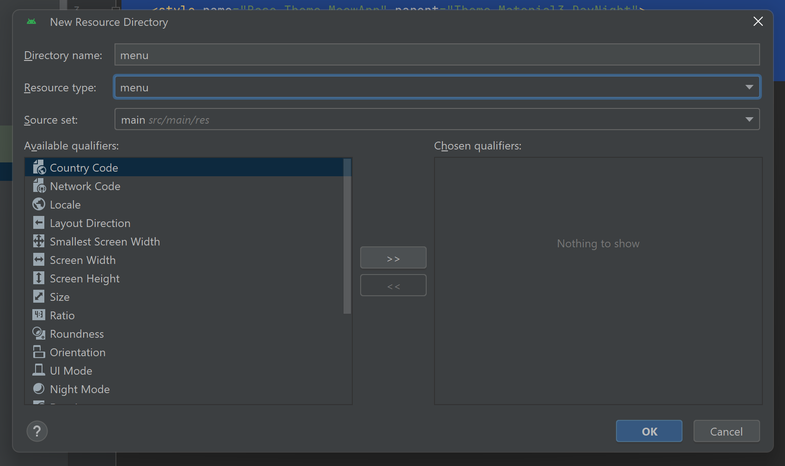

4. Kemudian klik kanan pada folder menu → New → Menu Resource File.

    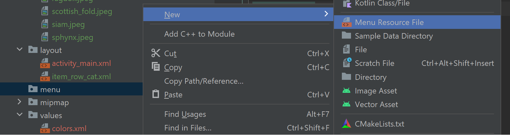

    Pada dialog box yang muncul, beri nama file **option_menu** dan klik OK

    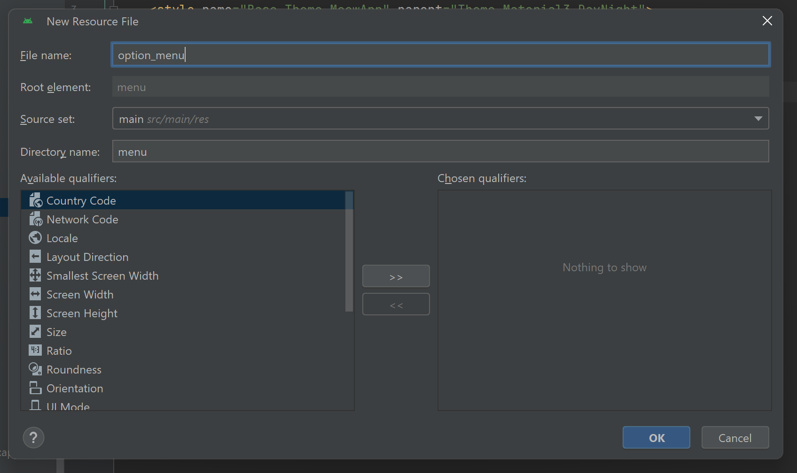

    Tampilan file akan menjadi seperti gambar berikut : 

    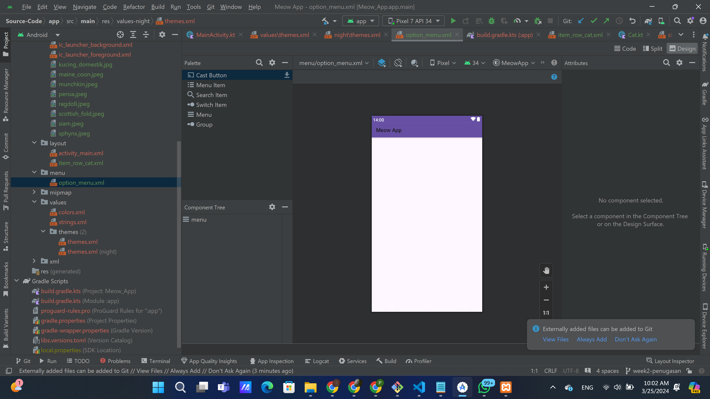

5. Selanjutnya, tambahkan pilihan menu pada `option_menu.xml` seperti berikut 

    ```xml
    <?xml version="1.0" encoding="utf-8"?>
    <menu xmlns:android="http://schemas.android.com/apk/res/android"
        xmlns:app="http://schemas.android.com/apk/res-auto">
        <item
            android:id="@+id/action_list"
            android:title="@string/list"
            app:showAsAction="never"/>
        <item
            android:id="@+id/action_grid"
            android:title="@string/grid"
            app:showAsAction="never"/>
    </menu>
    ```

    Jangan lupa untuk menambahkan string yang dibutuhkan pada `strings.xml`

    ```kotlin
        <string name="list">List</string>
        <string name="grid">Grid</string>
    ```

6. Setelah selesai, saatnya kita pasang menu tersebut di **MainActivity** dengan menambahkan metode fungsi `onCreateOptionsMenu`. Untuk menambahkannya, ketik `onCreateOptionMenu` di dalam **MainActivity** sehingga snippet akan muncul untuk meng-override fungsi yang sesuai.

    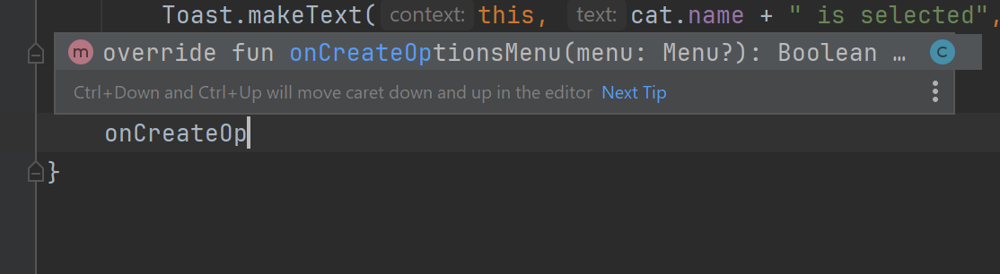

    Tekan enter dan ubah kodenya sehingga menjadi seperti berikut : 

    ```kotlin
    override fun onCreateOptionsMenu(menu: Menu?): Boolean {
        menuInflater.inflate(R.menu.option_menu, menu)
        return super.onCreateOptionsMenu(menu)
    }
    }
    ```

    Ketika aplikasi dijalankan, menu sudah dapat terlihat. Namun, tidak terjadi perubahan apapun ketika kita mengeklik salah satu menu. Hal ini dikarenakan kita belum menambahkan aksi pada menu.

7. Untuk menambahkan aksi pada menu, kita akan menambahkan fungsi `onOptionsItemSelected()` pada **MainActivity** seperti ini

    ```kotlin
    override fun onOptionsItemSelected(item: MenuItem): Boolean {
        when (item.itemId) {
            R.id.action_list -> {
                rvCats.layoutManager = LinearLayoutManager(this)
            }
            R.id.action_grid -> {
                rvCats.layoutManager = GridLayoutManager(this, 2)
            }
        }
        return super.onOptionsItemSelected(item)
    }
    ```

8. Berikut adalah kode lengkap dari **MainActivity**

    ```kotlin
    class MainActivity : AppCompatActivity() {

        private lateinit var rvCats: RecyclerView
        private val list = ArrayList<Cat>()

        override fun onCreate(savedInstanceState: Bundle?) {
            super.onCreate(savedInstanceState)
            enableEdgeToEdge()
            setContentView(R.layout.activity_main)
            ViewCompat.setOnApplyWindowInsetsListener(findViewById(R.id.main)) { v, insets ->
                val systemBars = insets.getInsets(WindowInsetsCompat.Type.systemBars())
                v.setPadding(systemBars.left, systemBars.top, systemBars.right, systemBars.bottom)
                insets
            }

            rvCats = findViewById(R.id.rv_cats)
            rvCats.setHasFixedSize(true)

            list.addAll(getListCats())
            showRecyclerList()
        }

        fun getListCats() : ArrayList<Cat> {
            val dataName = resources.getStringArray(R.array.data_name)
            val dataDesc = resources.getStringArray(R.array.data_desc)
            val dataImg = resources.obtainTypedArray(R.array.data_img)
            val listHero = ArrayList<Cat>()
            for (i in dataName.indices) {
                val hero = Cat(dataName[i], dataDesc[i], dataImg.getResourceId(i, -1))
                listHero.add(hero)
            }
            return listHero
        }

        private fun showRecyclerList() {
            rvCats.layoutManager = LinearLayoutManager(this)
            val listCatAdapter = ListCatAdapter(list)
            rvCats.adapter = listCatAdapter

            listCatAdapter.setOnItemClickCallback(object : ListCatAdapter.OnItemClickCallback {
                override fun onItemClicked(data: Cat) {
                    showSelectedCat(data)
                }

            })
        }

        private fun showSelectedCat(cat: Cat) {
            Toast.makeText(this, cat.name + " is selected", Toast.LENGTH_SHORT).show()
        }

        override fun onCreateOptionsMenu(menu: Menu?): Boolean {
            menuInflater.inflate(R.menu.option_menu, menu)
            return super.onCreateOptionsMenu(menu)
        }

        override fun onOptionsItemSelected(item: MenuItem): Boolean {
            when (item.itemId) {
                R.id.action_list -> {
                    rvCats.layoutManager = LinearLayoutManager(this)
                }
                R.id.action_grid -> {
                    rvCats.layoutManager = GridLayoutManager(this, 2)
                }
            }
            return super.onOptionsItemSelected(item)
        }
    }
    ```

Ketika menu "Grid" dijalankan, maka tampilan akan menjadi seperti ini

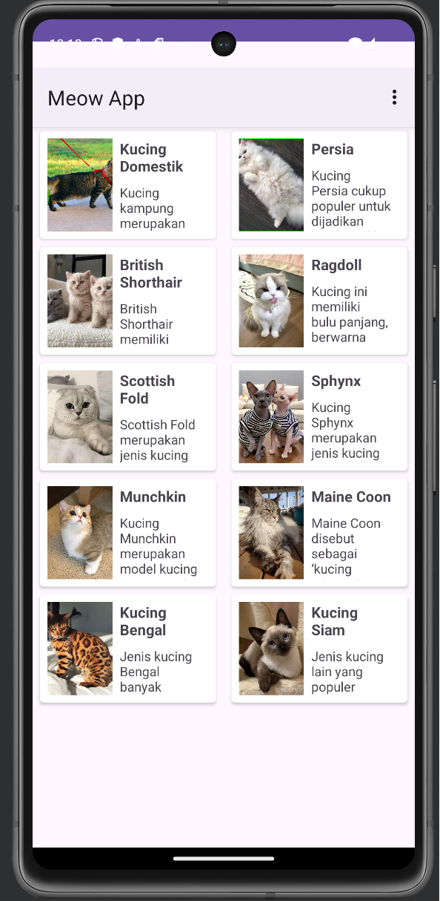

**Note** : Agar _action bar_ tidak menutupi RecyclerView, kalian dapat menghapus fungsi `enableEdgeToEdge()`

<<<<<<< HEAD

=======
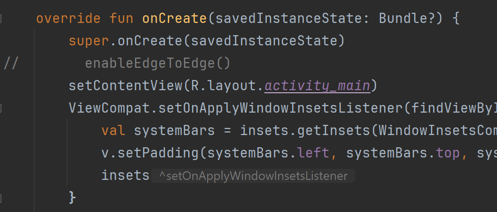
>>>>>>> b60e21a88c5039d112b6bef04fb8e16e4e8ca258
