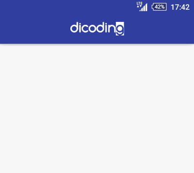
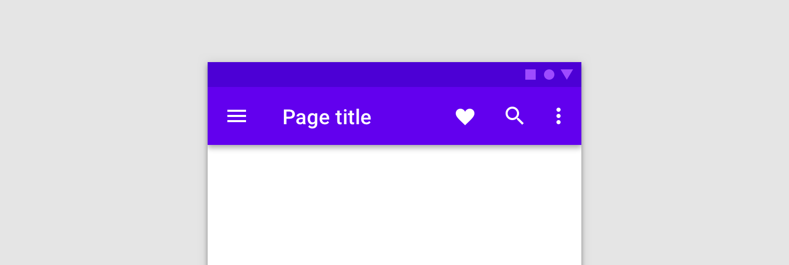
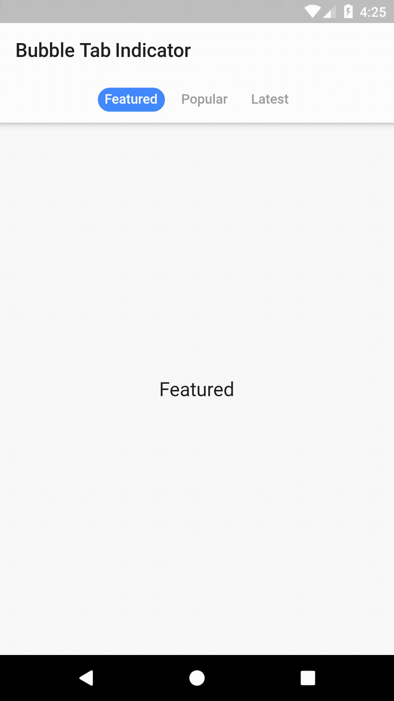

# Teori App Bar, Navigation Drawer, dan Bottom Navigation
Pada section ini, kita akan membahas mengenai App Bar, Toolbar, Navigation Drawer, Bottom Navigation, dan Tab Layout.

1. **App Bar**

    

    **App Bar** adalah komponen UI yang kerap digunakan dalam aplikasi Android untuk menampilkan navigation element dan action yang berkaitan dengan konten screen saat ini. App Bar sering diimplementasikan sebagai Toolbar yang diposisikan pada bagian atas dari screen. Dalam App Bar dapat ditampilkan judul screen, tombol navigation, seperti back dan action seperti save atau share. App Bar meningkatkan user experience user dengan menyediakan quick access ke fungsi-fungsi penting dalam aplikasi. 

    **Salah satu fitur utama dari App Bar** dalah kemampuannya untuk berinteraksi dengan navigation component. Dengan adanya App Bar, dapat dengan mudah menentukan action dari navigation, seperti back ke screen sebelumnya, menggunakan navigation component, sehingga memungkikan navigation yang konsisten dan terstruktur pada aplikasi. Dengan demikian, App Bar tidak hanya berfungsi sebagai container untuk title dan actions saja, tetapi juga bagian dari navigation's experience pada aplikasi. 

2. **Toolbar**

    

    **Toolbar** adalah salah UI Component yang versatile yang digunakan untuk menampilkan titles, actions, dan navigation dalam Aplikasi Android. Toolbar dapat digunakan secara independen atau menjadi bagian dari Appp Bar pada bagian atas dari screen. Keuntungan utama dari penggunaan Toolbar adalah fleksibilitas tinggi dan memberikan kebebasan developer untuk _customize_ sesuai dengan desain aplikasi yang dibuat. Kita dapat dengan mudah menambahkan _element_ seperti action button, overflows menu, dan custom view pada Toolbar.

    Toolbar flexibility juga mencakup dengan integrasi Navigation component. Kita dapat membuat _cohesive navigation_ dengan mengkombinasikan dua hal tersebut. Selain itu, Toolbar dapat berdaptasi dengan ukuran dan orientasi layar yang berbeda, memastikan adanya _seamless navigation experience_ untuk berbagai variasi perangkat Android.
3. **Navigation Drawer**

    

    **Navigation Drawer** adalah UI component yang biasanya digunakan di Android Aplikasi menuju house app navigation, seperti menus atau daftar dari destinasi pada aplikasi. Biasanya terletak pada bagian kiri atau kanan dari screen, navigation drawer dapat disembunyikan atau ditampilkan oleh user. Navigation Drawer memberikan quick access ke berbagai variasi main sections dari aplikasi, seperti main menu, settings, atau user profile. Penggunaan Navigation drawer akan meningkatkan user experience dengan menawarkan cara yang mudah dan terstruktur untuk mengeksplor berbagai fitur dan screen dalam aplikasi.

    Salah satu kelebihan dari penggunaan navigation drawer adalah adanya kemampuan untuk menyembunyikan complex navigation di balik icon atau text dan menjaga clean dan organized dari user interface. Akan tetapi, saat ini sudah jarang aplikasi yang menggunakan navigation drawer.

4. **Bottom Navigation**

    

    **Bottom Navigation** merupakan salah satu UI component yanng biasa berada pada bottom screen dari aplikasi, biasanya digunakan untuk menavigasi antar _multiple primary destination_ dalam aplikasi Android. Biasanya ini terdapat icons atau text yang merepresentasikan key app destinations, seperti home, search, notifications, dan profile. Bottom Navigation akan meningkatkan user experience dari pengguna dengan menawarkan quick dan easy access menuju essential part dari aplikasi, dimana ini memungkinkan pengguna untuk beralih antar screen dengan cepat. 

    Bottom navigation juga berpasangan dengan smooth animation seperti transition animations atau perubahan warna, untuk memberikan visual feedback kepada user sebagai navigasi antar destinations. Tentunya ini membantu menjadikan navigasi dalam aplikasi lebih intuitif dan menarik. Bottom navigation juga dapat intergrasi dengan navigation component untuk menyederhanakan navigations management dan memastikan konsisten di seluruh aplikasi.

5. **Tab Layout**

    

    **Tab Layout** merupakan UI component yang digunakan untuk menampilkan multiple tabs yang berisi konten yang berkaitan atau destinations dalam Aplikasi Android. Setiap tab biasanya berisi teks atau icon yang mewakiliki sebuah kategori spesifik atau action dan user dana beralih di antara tab ini untuk mengakses konten yang berbeda. Tab layout biasanya digunakan untuk organize dan navigate antar various section dari aplikasi, seperti news pages, product categories, atau different display mode.

    Salah satu manfaat dari pengggunaan Tab Layout memberikan kemampuan untuk direct access menuju konten yang relevan dengan cepat, tanpa perlu melakukan navigasi melalui menus atau list. 

Cakupan masing-masing sub-materi cukup luas, sehingga terdapat beberapa konsep yang mungkin belum terdapat pada pembahasan ini. Untuk itu, kalian bisa belajar mandiri melalui link yang terlampir :D

### Referensi Tambahan
- [Working with the AppBar](https://developer.android.com/guide/fragments/appbar)
- [Toolbar](https://developer.android.com/reference/android/widget/Toolbar)
- [Tips membuat Toolbar Android](https://www.dicoding.com/blog/tips-membuat-toolbar-android/)
- [Membuat Aplikasi Android Dengan Fitur Navigation Drawer](https://medium.com/@mazriela/membuat-aplikasi-android-dengan-fitur-navigation-drawer-f79d963999c5)
- [Tab Layout](https://developer.android.com/reference/com/google/android/material/tabs/TabLayout)