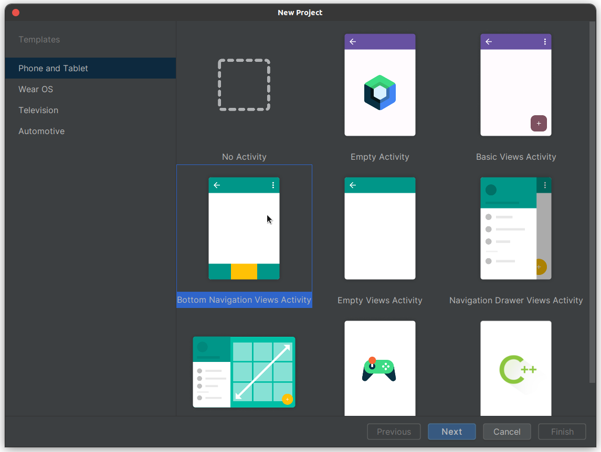
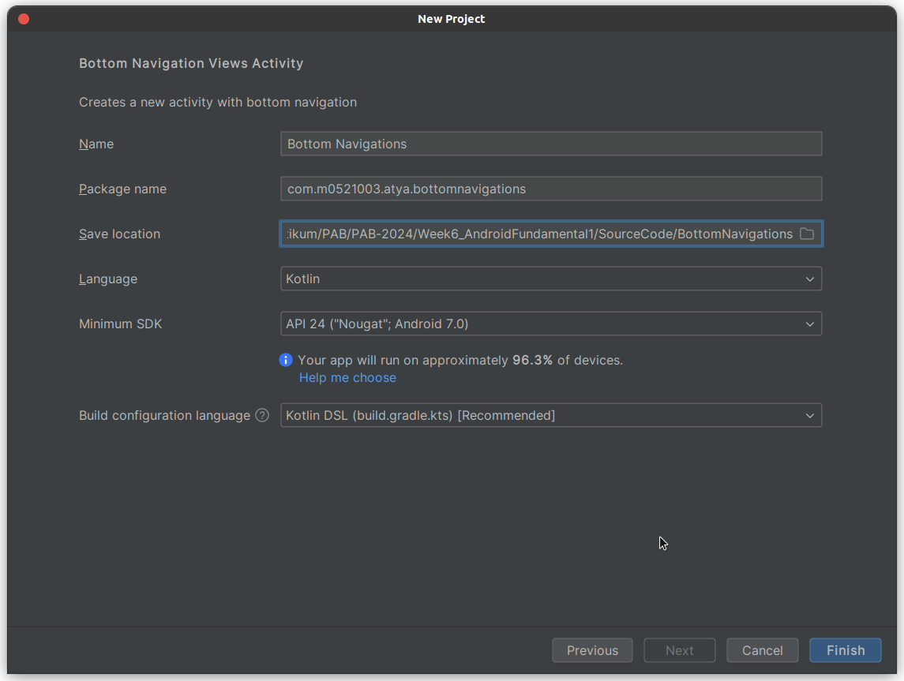
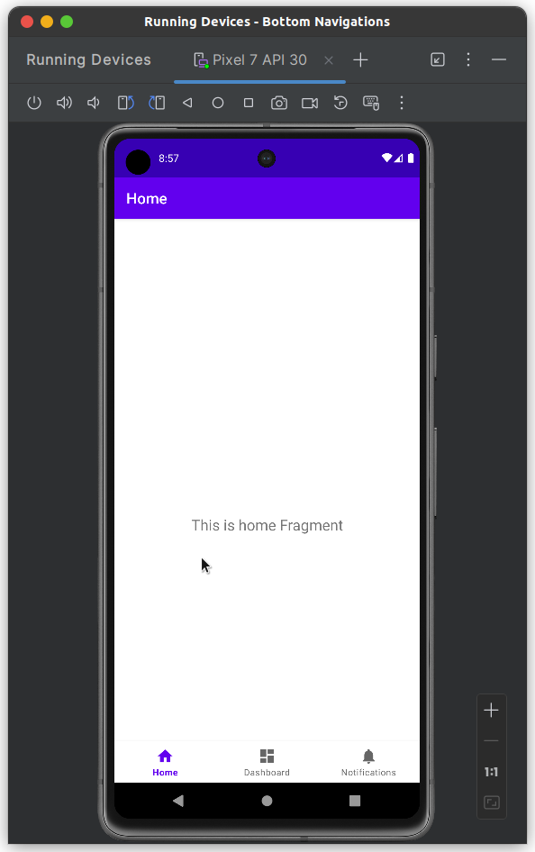
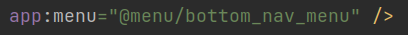
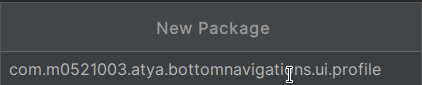
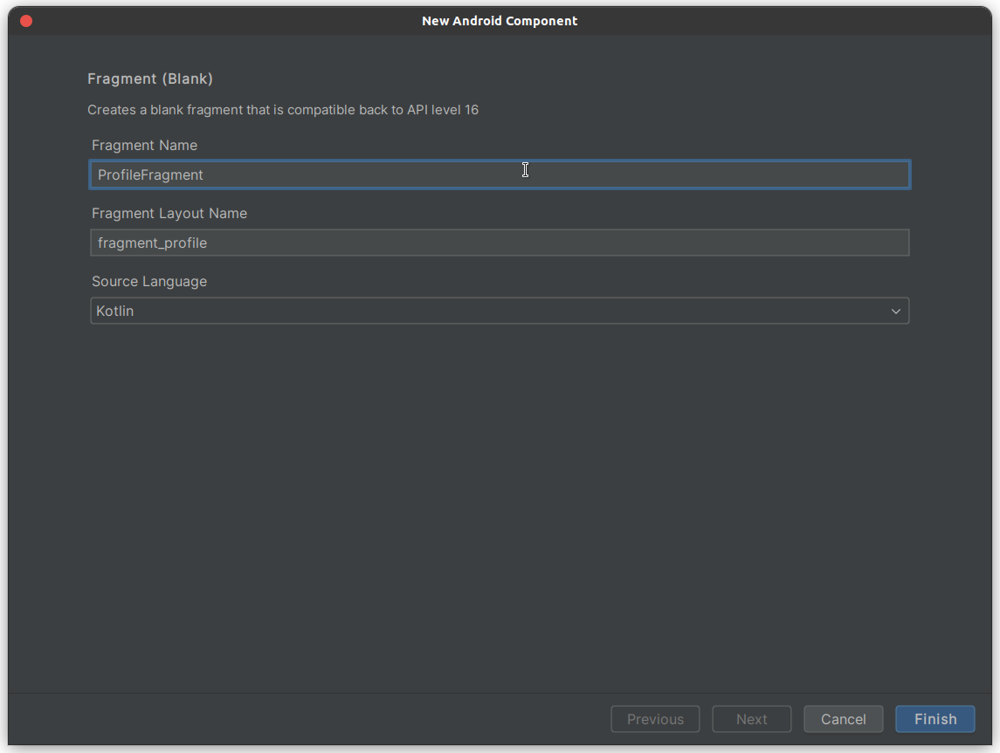
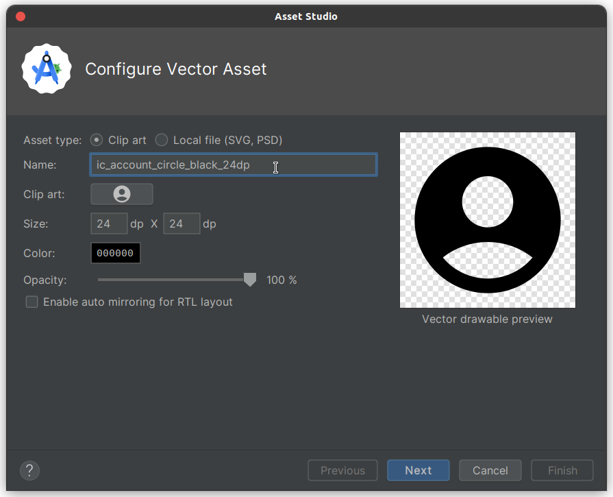
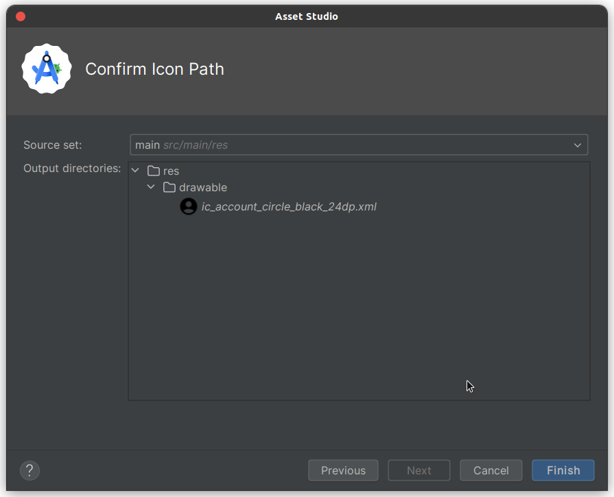
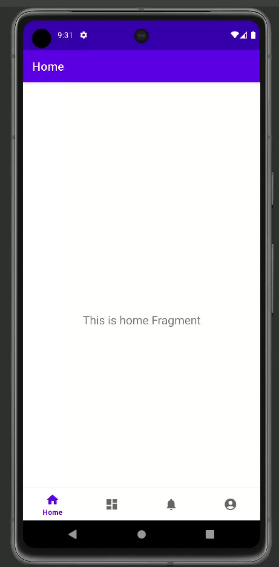

# BOTTOM NAVIGATION PRACTICE

Pastikan bahwa kalian sudah menginstall Android Studio pada device kalian masing-masing yaa!

1. Kalian bisa **Running** Android Studio terlebih dahulu, maka akan menampilkan tampilan kurang lebih seperti ini. Kemudian, kalian bisa pilih **New Project**.

2. Kemudian, ditampilkan seperti di bawah ini. Dikarenkakan kita hanya membuat **BOTTOM NAVIGATION project** saja maka kalian bisa memilih yang **BOTTOM NAVIGATION VIEWS ACTIVITY**. Kemudian, bisa klik **Next**.

    

3. Maka, akan ditampilkan window seperti berikut ini. Untuk **nama**, **Language**, **Minimum SDK**, dan **Build configuration language** bisa mengikuti seperti pada gambar, sedangkan untuk package bisa disesuaikan dengan format berikut ini: 

    **com.nim.2namapertama.bottomnavigations**.

    

4. Kemudian, untuk save location bisa disesuaikan sesuai dengan path pada device masing-masing. Lalu bisa pilih **Finish**.

5. Jika sudah, **tunggu build.gradles hingga selesai** dan jika di-running maka tampilannya kurang lebih akan seperti ini.

    

6. Sekarang kita coba cek pada **activity_main.xml**. Di situ akan terdapat source code berikut ini.
    ```xml
    <?xml version="1.0" encoding="utf-8"?>
    <androidx.constraintlayout.widget.ConstraintLayout xmlns:android="http://schemas.android.com/apk/res/android"
        xmlns:app="http://schemas.android.com/apk/res-auto"
        android:id="@+id/container"
        android:layout_width="match_parent"
        android:layout_height="match_parent"
        android:paddingTop="?attr/actionBarSize">

        <com.google.android.material.bottomnavigation.BottomNavigationView
            android:id="@+id/nav_view"
            android:layout_width="0dp"
            android:layout_height="wrap_content"
            android:layout_marginStart="0dp"
            android:layout_marginEnd="0dp"
            android:background="?android:attr/windowBackground"
            app:layout_constraintBottom_toBottomOf="parent"
            app:layout_constraintLeft_toLeftOf="parent"
            app:layout_constraintRight_toRightOf="parent"
            app:menu="@menu/bottom_nav_menu" />

        <fragment
            android:id="@+id/nav_host_fragment_activity_main"
            android:name="androidx.navigation.fragment.NavHostFragment"
            android:layout_width="match_parent"
            android:layout_height="match_parent"
            app:defaultNavHost="true"
            app:layout_constraintBottom_toTopOf="@id/nav_view"
            app:layout_constraintLeft_toLeftOf="parent"
            app:layout_constraintRight_toRightOf="parent"
            app:layout_constraintTop_toTopOf="parent"
            app:navGraph="@navigation/mobile_navigation" />

    </androidx.constraintlayout.widget.ConstraintLayout>
    ```

    Jika kita lihat lebih detail, maka terdapat code yang berkaitan dengan **bottom navigation**, yaitu kode berikut ini.

    ```xml
    <com.google.android.material.bottomnavigation.BottomNavigationView
        android:id="@+id/nav_view"
        android:layout_width="0dp"
        android:layout_height="wrap_content"
        android:layout_marginStart="0dp"
        android:layout_marginEnd="0dp"
        android:background="?android:attr/windowBackground"
        app:layout_constraintBottom_toBottomOf="parent"
        app:layout_constraintLeft_toLeftOf="parent"
        app:layout_constraintRight_toRightOf="parent"
        app:menu="@menu/bottom_nav_menu" />
    ```

    Dapat terlihat bahwa terdapat a**pp:menu="@menu/bottom_nav_menu"** yang digunakan untuk memasukkan item-item yang ada di **menu/bottom_nav_menu.xml** ke dalam **BottomNavigationView.**
        

    Kemudian, jika kita cek pada **bottom_nav_menu.xml** di dalam **res/menu** maka kita akan menemukan code berikut ini. Pada masing-masing item tersebut terdapat **id, icon, dan title**.

    Lalu coba kita cek lagi pada **activity_main.xml**. Jika kita lihat dengan lebih detail, terdapat komponen fragment yang berfungsi sebagai **NavHostFragment**, yaitu salah satu dari komponen Navigation yang berfungsi sebagai host dari fragment-fragment yang lainnya. Fragment akan diletakkan di sini dan **nvigation graph** dapat dilihat pada **navigation/mobile_navigation.xml**.

    ```xml
    <fragment
        android:id="@+id/nav_host_fragment_activity_main"
        android:name="androidx.navigation.fragment.NavHostFragment"
        android:layout_width="match_parent"
        android:layout_height="match_parent"
        app:defaultNavHost="true"
        app:layout_constraintBottom_toTopOf="@id/nav_view"
        app:layout_constraintLeft_toLeftOf="parent"
        app:layout_constraintRight_toRightOf="parent"
        app:layout_constraintTop_toTopOf="parent"
        app:navGraph="@navigation/mobile_navigation" />
    ```
    Dapat dilihat di dalam Navigation Graph ada tiga destination fragment sesuai dengan tiga id yang ada di menu Bottom Navigation, yaitu navigation_home, navigation_dashboard, navigation_notifications.

    ```xml
    <?xml version="1.0" encoding="utf-8"?>
    <navigation xmlns:android="http://schemas.android.com/apk/res/android"
        xmlns:app="http://schemas.android.com/apk/res-auto"
        xmlns:tools="http://schemas.android.com/tools"
        android:id="@+id/mobile_navigation"
        app:startDestination="@+id/navigation_home">

        <fragment
            android:id="@+id/navigation_home"
            android:name="com.m0521003.atya.bottomnavigations.ui.home.HomeFragment"
            android:label="@string/title_home"
            tools:layout="@layout/fragment_home" />

        <fragment
            android:id="@+id/navigation_dashboard"
            android:name="com.m0521003.atya.bottomnavigations.ui.dashboard.DashboardFragment"
            android:label="@string/title_dashboard"
            tools:layout="@layout/fragment_dashboard" />

        <fragment
            android:id="@+id/navigation_notifications"
            android:name="com.m0521003.atya.bottomnavigations.ui.notifications.NotificationsFragment"
            android:label="@string/title_notifications"
            tools:layout="@layout/fragment_notifications" />
    </navigation>
    ```

    Untuk tahu bagaimana cara penerapan dari Navigation tersebut, kita bisa membuka **MainActivity**.

    ```kotlin
    val navView: BottomNavigationView = binding.navView

    val navController = findNavController(R.id.nav_host_fragment_activity_main)
    // Passing each menu ID as a set of Ids because each
    // menu should be considered as top level destinations.
    val appBarConfiguration = AppBarConfiguration(
        setOf(
            R.id.navigation_home, R.id.navigation_dashboard, R.id.navigation_notifications
        )
    )
    setupActionBarWithNavController(navController, appBarConfiguration)
    navView.setupWithNavController(navController)
    ```

    **AppBarConfiguration** adalah daftar ID yang merujuk ke item-item menu dalam BottomNavigation. Ini digunakan khususnya untuk mengkonfigurasi tampilan AppBar agar sesuai dengan menu tersebut. Jika suatu ID tidak dimasukkan ke dalam konfigurasi ini, AppBar akan menampilkan ikon panah kembali secara otomatis. Fungsi **setupActionBarWithNavController** digunakan untuk menyesuaikan judul AppBar dengan Fragment yang sedang ditampilkan. Sedangkan **setupWithNavController** berfungsi agar Bottom Navigation dapat menampilkan Fragment yang sesuai ketika suatu menu dipilih.
    
7. Kita akan coba tambahkan satu item menu lagi ke BottomNavigation. Langkah pertama adalah membuat sebuah Fragment baru. Caranya sebagai berikut ini.
    -  **mengklik kanan pada directory UI, kemudian pilih "New" → "Package" → isi nama package dengan "profile" → selanjutnya klik "Enter"**

        

    -  **mengklik kanan pada directory profile, kemudian pilih "New" → "Fragment" → "Fragment (Blank)" → Masukkan Nama sebagai ProfileFragment → selanjutnya klik "Finish"**.

        

8. Selanjutnya Anda ubah tampilan di fragment_profile.xml supaya sesuai dengan tampilan menu lainnya.

    ```xml
    <?xml version="1.0" encoding="utf-8"?>
    <androidx.constraintlayout.widget.ConstraintLayout xmlns:android="http://schemas.android.com/apk/res/android"
        xmlns:app="http://schemas.android.com/apk/res-auto"
        android:layout_width="match_parent"
        android:layout_height="match_parent">
        <TextView
            android:id="@+id/text_profile"
            android:layout_width="match_parent"
            android:layout_height="wrap_content"
            android:layout_marginStart="8dp"
            android:layout_marginTop="8dp"
            android:layout_marginEnd="8dp"
            android:textAlignment="center"
            android:textSize="20sp"
            android:text="This is profile fragment"
            app:layout_constraintBottom_toBottomOf="parent"
            app:layout_constraintEnd_toEndOf="parent"
            app:layout_constraintStart_toStartOf="parent"
            app:layout_constraintTop_toTopOf="parent" />
    </androidx.constraintlayout.widget.ConstraintLayout>
    ```
9. Selanjutnya, **tambahkan ikon dengan mengklik kanan pada folder "drawable", lalu pilih "Baru" → "Pilih Vector Asset"**. Pada Clip Art, cari ikon dengan nama "account circle" dalam mode Filled. Setelah itu, klik "Next" dan "Finish".

    

    

9. Kemudian **tambahkan menu baru di menu/bottom_nav_menu.xml** dengan kode berikut:
    ```xml
    <?xml version="1.0" encoding="utf-8"?>
    <menu xmlns:android="http://schemas.android.com/apk/res/android">
    
        <item
            android:id="@+id/navigation_home"
            android:icon="@drawable/ic_home_black_24dp"
            android:title="@string/title_home" />
    
        <item
            android:id="@+id/navigation_dashboard"
            android:icon="@drawable/ic_dashboard_black_24dp"
            android:title="@string/title_dashboard" />
    
        <item
            android:id="@+id/navigation_notifications"
            android:icon="@drawable/ic_notifications_black_24dp"
            android:title="@string/title_notifications" />
    
        <item
            android:id="@+id/navigation_profile"
            android:icon="@drawable/ic_account_circle_black_24dp"
            android:title="@string/title_profile" />
    
    </menu>
    ```

    **Tambahkan juga string pada res -> values -> strings.xml**
    ```xml
    <resources>
        <string name="app_name">MyBottomNavigation</string>
        <string name="title_home">Home</string>
        <string name="title_dashboard">Dashboard</string>
        <string name="title_notifications">Notifications</string>
        <string name="title_profile">Profile</string>
    
        <!-- TODO: Remove or change this placeholder text -->
        <string name="hello_blank_fragment">Hello blank fragment</string>
    </resources>
    ```

10. Selanjutnya **tambahkan menu tersebut ke Navigation Component pada navigation → mobile_navigation.xml**. Jangan lupa untuk menyesuaikan nama package pada attribute name.

    ```xml
    <?xml version="1.0" encoding="utf-8"?>
    <navigation xmlns:android="http://schemas.android.com/apk/res/android"
        xmlns:app="http://schemas.android.com/apk/res-auto"
        xmlns:tools="http://schemas.android.com/tools"
        android:id="@+id/mobile_navigation"
        app:startDestination="@+id/navigation_home">

        <fragment
            android:id="@+id/navigation_home"
            android:name="com.m0521003.atya.bottomnavigations.ui.home.HomeFragment"
            android:label="@string/title_home"
            tools:layout="@layout/fragment_home" />

        <fragment
            android:id="@+id/navigation_dashboard"
            android:name="com.m0521003.atya.bottomnavigations.ui.dashboard.DashboardFragment"
            android:label="@string/title_dashboard"
            tools:layout="@layout/fragment_dashboard" />

        <fragment
            android:id="@+id/navigation_notifications"
            android:name="com.m0521003.atya.bottomnavigations.ui.notifications.NotificationsFragment"
            android:label="@string/title_notifications"
            tools:layout="@layout/fragment_notifications" />
        
        <fragment
            android:id="@+id/navigation_profile"
            android:name="com.m0521003.atya.bottomnavigations.ui.profile.ProfileFragment"
            android:label="@string/title_profile"
            tools:layout="@layout/fragment_profile" />
    </navigation>
    ```

11. Selanjutnya supaya AppBar pada fragment profile memiliki behaviour yang sesuai dengan Bottom Navigation, tambahkan id tersebut di AppConfiguration yang ada di MainActivity.

    ```kotlin
    override fun onCreate(savedInstanceState: Bundle?) {
        super.onCreate(savedInstanceState)
        setContentView(R.layout.activity_main)
        ...
        val appBarConfiguration = AppBarConfiguration(
            setOf(
                R.id.navigation_home,
                R.id.navigation_dashboard,
                R.id.navigation_notifications,
                R.id.navigation_profile
            )
        )
        ...
    }
    ```

12. Berikut ini aplikasi berhasil dijalankan!

    

