# NAVIGATION COMPONENT PRACTICE

Pastikan bahwa kalian sudah menginstall Android Studio pada device kalian masing-masing yaa!

1. Kalian bisa **Running** Android Studio terlebih dahulu, maka akan menampilkan tampilan kurang lebih seperti ini. Kemudian, kalian bisa pilih **New Project**.

    

2. Kemudian, ditampilkan seperti di bawah ini. Dikarenkakan kita hanya membuat **basic project** saja maka kalian bisa memilih yang **Empty View Activity**. Kemudian, bisa klik **Next**.

    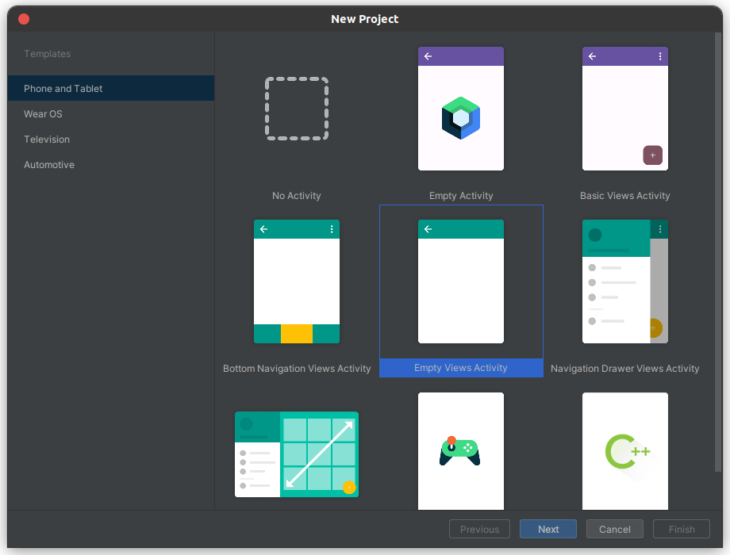

3. Maka, akan ditampilkan window seperti berikut ini. Untuk **nama**, **Language**, **Minimum SDK**, dan **Build configuration language** bisa mengikuti seperti pada gambar, sedangkan untuk package bisa disesuaikan dengan format berikut ini: 

    **com.nim.2namapertama.navigationcomponent**.

4. Kemudian, untuk save location bisa disesuaikan sesuai dengan path pada device masing-masing. Lalu bisa pilih **Finish**.

5. Jika sudah, **tunggu build.gradles hingga selesai**.

6. Sebelum memulai menggunakan navigation, kalian bisa melakukan konfigurasi pada build.gradles.kts(Module:app) dan libs.version.toml (Khusus Android Studio Iguana). Konfigurasinya sebagai berikut.

    **Tambahkan View Binding pada file build.gradles.kts (Module:app)**

    ```kotlin
        android {
            ... 
            buildFeatures {
                viewBinding = true
            }
        }
    ```

    **Terdapat 2 Cara untuk menambahkan library pada Android Studio, jika kalian menggunakan Android Studio versi Iguana maka kalian bisa menggunakan cara baru atau cara lama, tetapi jika menggunakan Android Studio selain Iguana, maka kalian harus mengikuti cara lama**

    ### Cara Baru (khusus Android Studio versi Iguana)

    **Tambahkan version dan libraries pada file libs.version.toml**

    ```kotlin
    [versions]
    ...
    navigation = "2.7.7"

    [libraries]
    ...
    androidx-navigation-fragment = {module = "androidx.navigation:navigation-fragment-ktx", version.ref = "navigation"}
    androidx-navigation-ui = {module = "androidx.navigation:navigation-ui-ktx", version.ref="navigation"}
    ```
    **Jika sudah, maka tampilannya akan menjadi seperti ini dan jangan lupa untuk klik "Sync Now"**

    

    ```kotlin
    [versions]
    agp = "8.3.1"
    kotlin = "1.9.0"
    coreKtx = "1.12.0"
    junit = "4.13.2"
    junitVersion = "1.1.5"
    espressoCore = "3.5.1"
    appcompat = "1.6.1"
    material = "1.11.0"
    activity = "1.8.0"
    constraintlayout = "2.1.4"
    navigation = "2.7.7"

    [libraries]
    androidx-core-ktx = { group = "androidx.core", name = "core-ktx", version.ref = "coreKtx" }
    junit = { group = "junit", name = "junit", version.ref = "junit" }
    androidx-junit = { group = "androidx.test.ext", name = "junit", version.ref = "junitVersion" }
    androidx-espresso-core = { group = "androidx.test.espresso", name = "espresso-core", version.ref = "espressoCore" }
    androidx-appcompat = { group = "androidx.appcompat", name = "appcompat", version.ref = "appcompat" }
    material = { group = "com.google.android.material", name = "material", version.ref = "material" }
    androidx-activity = { group = "androidx.activity", name = "activity", version.ref = "activity" }
    androidx-constraintlayout = { group = "androidx.constraintlayout", name = "constraintlayout", version.ref = "constraintlayout" }
    androidx-navigation-fragment = {module = "androidx.navigation:navigation-fragment-ktx", version.ref = "navigation"}
    androidx-navigation-ui = {module = "androidx.navigation:navigation-ui-ktx", version.ref="navigation"}

    ```

    **Kemudian, pada file build.gradle.kts bisa ditambahkan dependencies seperti berikut ini.**

    ```kotlin
    dependencies {

        // Dependencies yang ditambahkan
        implementation(libs.androidx.navigation.fragment)
        implementation(libs.androidx.navigation.ui)

    }
    ```

    **Jangan Lupa untuk menekan "Sync Now"** 

    

    ### Cara Lama (Berlaku untuk Android Studio versi Iguana dan Sebelumnya)

    **Pada cara ini, kita hanya perlu menambahkan pada Dependenciesnya saja, tanpa perlu melakukan konfigurasi pada file lainnya.**

    ```kotlin
    dependencies {

        // Dependencies yang ditambahkan
        implementation("androidx.navigation:navigation-fragment-ktx:2.7.7")
        implementation("androidx.navigation:navigation-ui-ktx:2.7.7")

    }
    ```

    **Jangan Lupa untuk menekan "Sync Now"** 

    

7. Setelah itu, kita harus membuat sebuah fragment yang nantinya akan menjadi **startDestination** (tujuan awal) dari **Navigation Graph** nanti, caranya sebagai berikut.

    #### Klik kanan pada package utama pada proyek -> New -> Fragment -> Fragment(Blank)

    Kemudian isi HomeFragment pada Fragment Name, kemudian klik Finish.


8. Lalu, kita buat layout di dalam **fragment_home** yang berisi dua **button** sebagai berikut.

    ```xml
    <LinearLayout xmlns:android="http://schemas.android.com/apk/res/android"
    xmlns:tools="http://schemas.android.com/tools"
    android:layout_width="match_parent"
    android:layout_height="match_parent"
    android:orientation="vertical"
    tools:context=".HomeFragment">
 
    <TextView
        android:layout_width="match_parent"
        android:layout_height="wrap_content"
        android:layout_margin="16dp"
        android:text="@string/hello_home_fragment" />
    <Button
        android:id="@+id/btn_category"
        android:layout_width="match_parent"
        android:layout_height="wrap_content"
        android:layout_marginLeft="16dp"
        android:layout_marginRight="16dp"
        android:text="@string/to_category" />
    <Button
        android:id="@+id/btn_profile"
        android:layout_width="match_parent"
        android:layout_height="wrap_content"
        android:layout_marginLeft="16dp"
        android:layout_marginRight="16dp"
        android:text="@string/to_profile" />
    </LinearLayout>
    ```

    **Jangan lupa untuk menambahkan resources yang ada pada file strings.xml pada directory res**
    ```xml
    <resources>
        <string name="app_name">MyNavigation</string>
        <string name="hello_home_fragment">Hello Ini Home Fragment</string>
        <string name="to_profile">Ke Activity Profile Activity</string>
        <string name="to_category">Ke fragment Category</string>
        <string name="this_profile">Ini activity Profile</string>
        <string name="this_category">Ini fragment Category</string>
        <string name="category_lifestyle">Ke fragment Lifestyle</string>
        <string name="category_sport">Ke fragment Sport</string>
        <string name="category_name">Category Name</string>
        <string name="category_description">Category Description</string>
        <string name="to_home">Ke fragment Home</string>
    </resources>
    ```

9. Kemudian, kita akan membuat navigation dengan caranya sebagai berikut.

    #### Klik kanan pada folder res -> New -> Android resource file

    Kemudian beri nama **main_navigation** dan pada **Resource Type pilih Navigation**. Terakhir, kita bisa **klik Ok**.

    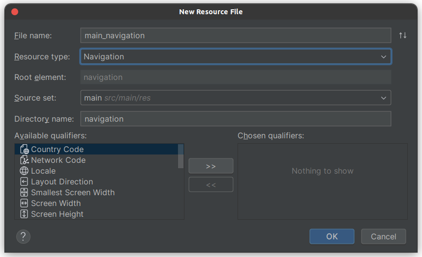

10. Pada **main_navigation**, pada bagian **Design**, kita bisa memulai dengan menambahkan **startDestination** atau **fragment awal** yang akan ditampilkan, caranya dengan klik **icon add destination -> pilih fragment_home.**

    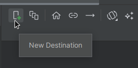

    Kemudian, bisa pilih yang **fragment_home**

    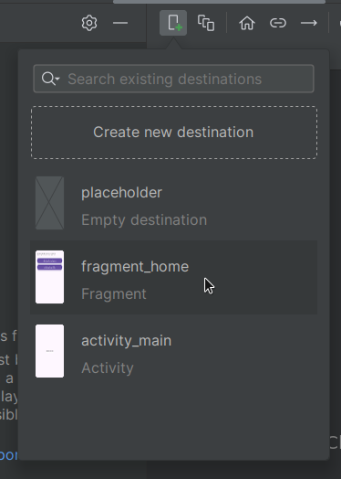

    Lalu, tampilannya akan menjadi seperti ini.

    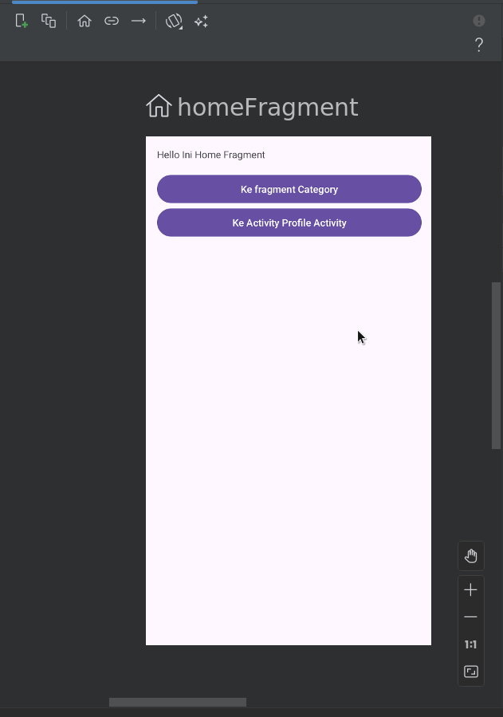

    Jika sudah, kita bisa **pilih bagian tab code** seperti di bawah ini.

    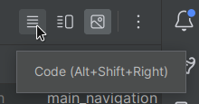

    Modifikasi **code XML** pada **main_navigation** menjadi seperti di bawah ini.

    ```xml
    <?xml version="1.0" encoding="utf-8"?>
    <navigation xmlns:android="http://schemas.android.com/apk/res/android"
        xmlns:app="http://schemas.android.com/apk/res-auto"
        xmlns:tools="http://schemas.android.com/tools"
        android:id="@+id/main_navigation"
        app:startDestination="@id/homeFragment">
    
        <fragment
            android:id="@+id/homeFragment"
            android:name="com.m0521003.atya.navigationcomponent.HomeFragment"
            android:label="fragment_home"
            tools:layout="@layout/fragment_home">
        </fragment>
    
    </navigation>
    ```

11. Setelah itu, kita bisa membuat **NavHostFragment** di layout **activity_main.xml** dengan **cara menambahkan cod**e berikut ini.

    **Sebelum**
    ```xml
    <?xml version="1.0" encoding="utf-8"?>
    <androidx.constraintlayout.widget.ConstraintLayout xmlns:android="http://schemas.android.com/apk/res/android"
        xmlns:app="http://schemas.android.com/apk/res-auto"
        xmlns:tools="http://schemas.android.com/tools"
        android:id="@+id/main"
        android:layout_width="match_parent"
        android:layout_height="match_parent"
        tools:context=".MainActivity">

        <TextView
            android:layout_width="wrap_content"
            android:layout_height="wrap_content"
            android:text="Hello World!"
            app:layout_constraintBottom_toBottomOf="parent"
            app:layout_constraintEnd_toEndOf="parent"
            app:layout_constraintStart_toStartOf="parent"
            app:layout_constraintTop_toTopOf="parent" />

    </androidx.constraintlayout.widget.ConstraintLayout>
    ```

    **Sesudah**
    ```xml
    <?xml version="1.0" encoding="utf-8"?>
    <RelativeLayout xmlns:android="http://schemas.android.com/apk/res/android"
        xmlns:app="http://schemas.android.com/apk/res-auto"
        xmlns:tools="http://schemas.android.com/tools"
        android:layout_width="match_parent"
        android:layout_height="match_parent"
        tools:context=".MainActivity">
    
        <fragment
            android:id="@+id/container"
            android:name="androidx.navigation.fragment.NavHostFragment"
            android:layout_width="match_parent"
            android:layout_height="match_parent"
            app:defaultNavHost="true"
            app:navGraph="@navigation/main_navigation" />
    
    </RelativeLayout>
    ```

12. Basic Configuration untuk navigation sudah selesai, lalu tambahkan **fragment baru** dan **navigation** di antara keduanya dalam **main_navigation** pada **tab Design**. Lalu, **klik icon Add Destination** dan piih **Create new destination**

    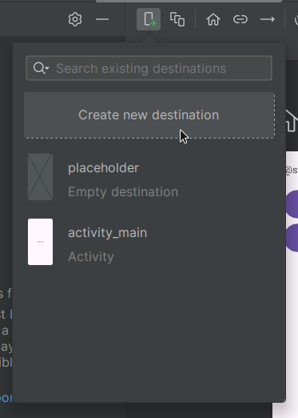

    Kemudian, akan muncul *popup** seperti saat membuat fragment baru, pilih yang **Fragment (Blank)**.
    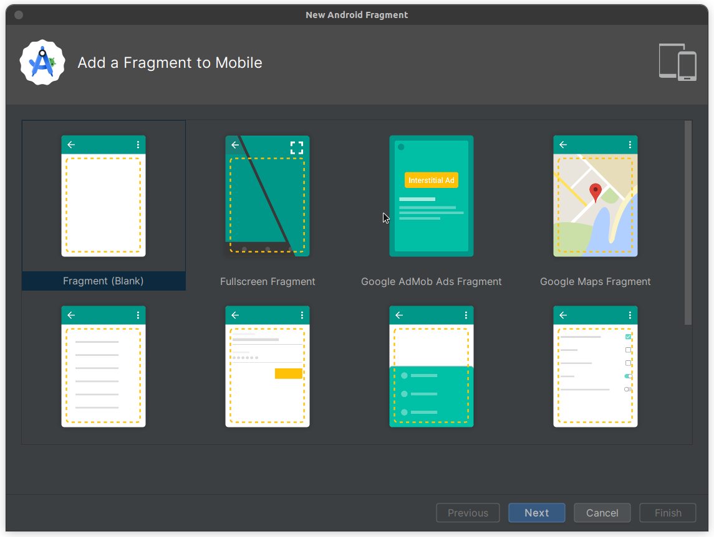

     Lalu beri nama **CategoryFragment** dan klik **Finish**

    

    Maka, tampilannya akan menjadi seperti ini sekarang

    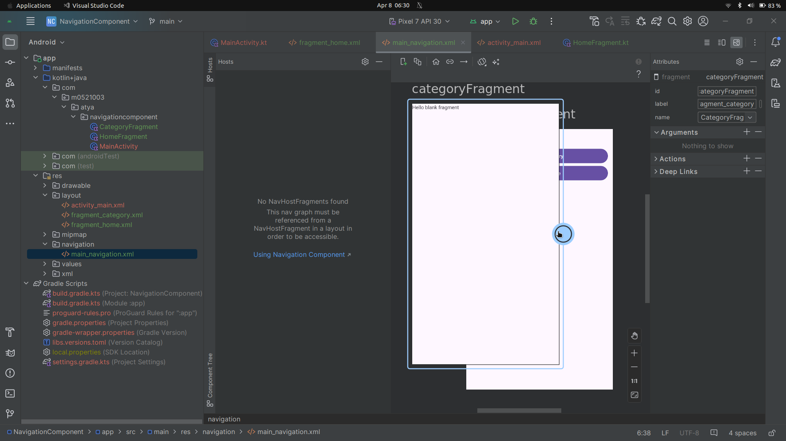

    Ubah kode pada **fragment_category.xml** menjadi seperti berikut ini.
    ```xml
    <LinearLayout xmlns:android="http://schemas.android.com/apk/res/android"
    xmlns:tools="http://schemas.android.com/tools"
    android:layout_width="match_parent"
    android:layout_height="match_parent"
    android:orientation="vertical"
    android:padding="16dp"
    tools:context=".CategoryFragment">
 
    <TextView
        android:layout_width="match_parent"
        android:layout_height="wrap_content"
        android:layout_marginBottom="16dp"
        android:text="@string/this_category" />
 
    </LinearLayout>
    ```

13. Kemudian, kita bisa menambahkan **Activity Baru**
     #### Klik kanan pada nama package -> New -> Activity -> Empty Views Activity

     Beri nama **ProfileActivity** dan klik **Finish**

     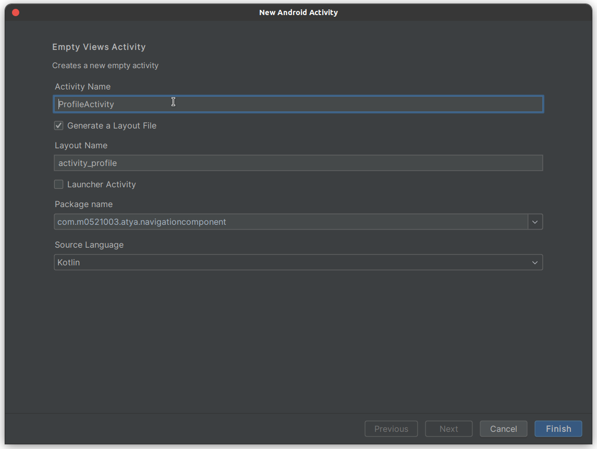

     Lalu, **ubah layout pada activity_profile** menjadi seperti ini.

    ```xml
    <?xml version="1.0" encoding="utf-8"?>
    <RelativeLayout xmlns:android="http://schemas.android.com/apk/res/android"
        xmlns:tools="http://schemas.android.com/tools"
        android:layout_width="match_parent"
        android:layout_height="match_parent"
        android:padding="16dp"
        tools:context=".ProfileActivity">
    
        <TextView
            android:layout_width="match_parent"
            android:layout_height="wrap_content"
            android:text="@string/this_profile" />
    
    </RelativeLayout>
    ```

14. Lalu, **tambahkan ProfileActivity** ke dalam **main_navigation** dengan cara **klik AddDestination** dan pilih **activity_profile**.

    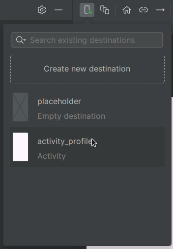

15. Kita dapat **membuat action** dari **homeFragment** ke **cateogoryFragment** dengan cara **klik lingkaran bulat pada homeFragment** kemudian **tarik garis ke categoryFragment**, lalu sekali lagi **tarik garis ke ProfileActivity**

    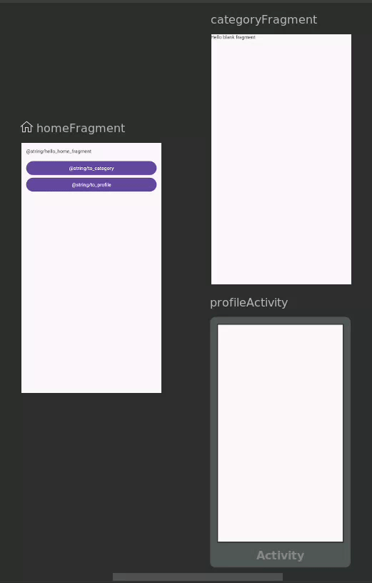

    Code pada **main_navigation.xml** akan ditambahkan secara otomatis menjadi berikut ini.

    ```xml
    <?xml version="1.0" encoding="utf-8"?>
    <navigation xmlns:android="http://schemas.android.com/apk/res/android"
        xmlns:app="http://schemas.android.com/apk/res-auto"
        xmlns:tools="http://schemas.android.com/tools"
        android:id="@+id/main_navigation"
        app:startDestination="@id/homeFragment">

        <fragment
            android:id="@+id/homeFragment"
            android:name="com.m0521003.atya.navigationcomponent.HomeFragment"
            android:label="fragment_home"
            tools:layout="@layout/fragment_home">
            <action
                android:id="@+id/action_homeFragment_to_categoryFragment"
                app:destination="@id/categoryFragment" />
            <action
                android:id="@+id/action_homeFragment_to_profileActivity"
                app:destination="@id/profileActivity" />
        </fragment>
        <fragment
            android:id="@+id/categoryFragment"
            android:name="com.m0521003.atya.navigationcomponent.CategoryFragment"
            android:label="fragment_category"
            tools:layout="@layout/fragment_category" />
        <activity
            android:id="@+id/profileActivity"
            android:name="com.m0521003.atya.navigationcomponent.ProfileActivity"
            android:label="activity_profile"
            tools:layout="@layout/activity_profile" />

    </navigation>
    ```

16. Jika sudah selesai, lanjutkan dengan memanggil **action** yang sudah dibuat dengan menggunakan **NavController** di dalam **HomeFragment** seperti berikut ini.

    ```kotlin
    class HomeFragment : Fragment() {
    
        private var _binding: FragmentHomeBinding? = null
        private val binding get() = _binding!!
    
        override fun onCreateView(inflater: LayoutInflater, container: ViewGroup?,
                                savedInstanceState: Bundle?): View {
            // Inflate the layout for this fragment
            _binding = FragmentHomeBinding.inflate(inflater, container, false)
            val view = binding.root
            return view
        }
    
        override fun onViewCreated(view: View, savedInstanceState: Bundle?) {
            super.onViewCreated(view, savedInstanceState)
    
            binding.btnCategory.setOnClickListener(
                    Navigation.createNavigateOnClickListener(R.id.action_homeFragment_to_categoryFragment)
            )
            binding.btnProfile.setOnClickListener { view ->
                view.findNavController().navigate(R.id.action_homeFragment_to_profileActivity)
            }
        }
    
        override fun onDestroy() {
            super.onDestroy()
            _binding = null
        }
    }
    ```

    Jika ada error seperti ini, kalian bisa pilih yg **Import Class**

    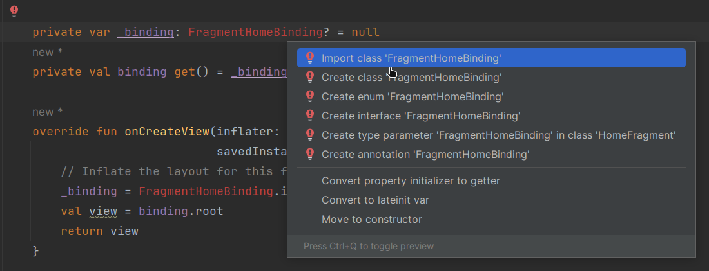

17. Jika berhasil, maka tampilannya akan menjadi seperti berikut ini.

    


    Jika terjadi permasalahan, jangan lupa untuk **comment kode ini** pada **ProfileActivity** dan **MainActivity**

    **MainActivity**

    ```kotlin
    class MainActivity : AppCompatActivity() {
    override fun onCreate(savedInstanceState: Bundle?) {
        super.onCreate(savedInstanceState)
        //   enableEdgeToEdge()
        setContentView(R.layout.activity_main)
        //   ViewCompat.setOnApplyWindowInsetsListener(findViewById(R.id.main)) { v, insets ->
        //      val systemBars = insets.getInsets(WindowInsetsCompat.Type.systemBars())
        //      v.setPadding(systemBars.left, systemBars.top, systemBars.right, systemBars.bottom)
        //      insets
        //   }
        }
    }
    ```

    **ProfileActivity**

    ```kotlin
    class ProfileActivity : AppCompatActivity() {
    override fun onCreate(savedInstanceState: Bundle?) {
        super.onCreate(savedInstanceState)
        //   enableEdgeToEdge()
        setContentView(R.layout.activity_main)
        //   ViewCompat.setOnApplyWindowInsetsListener(findViewById(R.id.main)) { v, insets ->
        //      val systemBars = insets.getInsets(WindowInsetsCompat.Type.systemBars())
        //      v.setPadding(systemBars.left, systemBars.top, systemBars.right, systemBars.bottom)
        //      insets
        //   }
        }
    }
    ```


