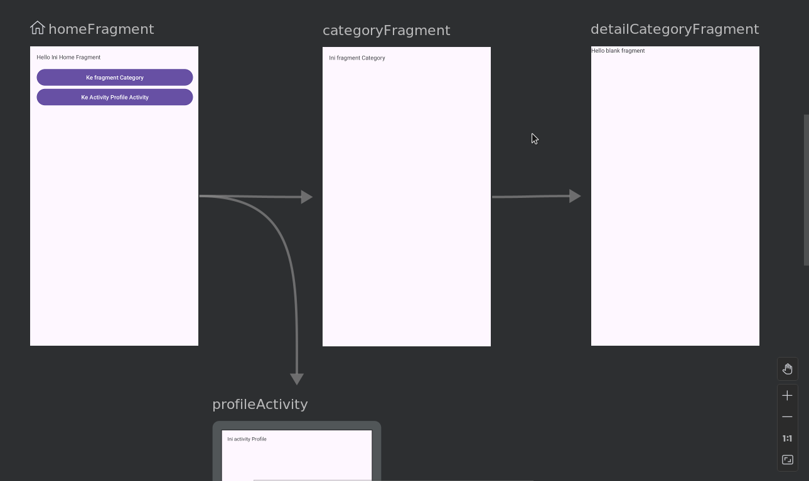
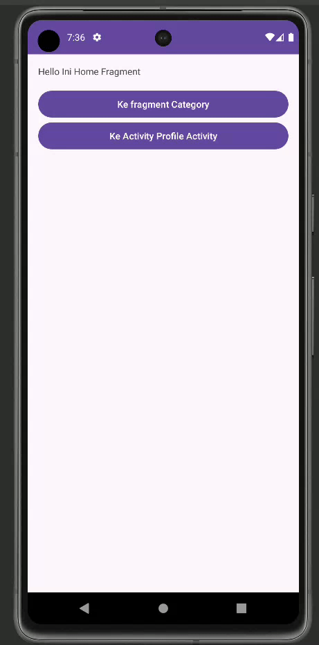

# SEND DATA USING BUNDLE PRACTICE

### Pastikan sudah melakukan Practice Navigation Component yaa!

1. Kita bisa tambahkan button baru pada **fragment_category** seperti berikut ini.

    ```xml
    <LinearLayout xmlns:android="http://schemas.android.com/apk/res/android"
        xmlns:tools="http://schemas.android.com/tools"
        android:layout_width="match_parent"
        android:layout_height="match_parent"
        android:orientation="vertical"
        android:padding="16dp"
        tools:context=".CategoryFragment">
    
        <TextView
            android:layout_width="match_parent"
            android:layout_height="wrap_content"
            android:layout_marginBottom="16dp"
            android:text="@string/this_category" />
    
        <Button
            android:id="@+id/btn_category_lifestyle"
            android:layout_width="match_parent"
            android:layout_height="wrap_content"
            android:text="@string/category_lifestyle" />
    
    </LinearLayout>
    ```

2. Lalu, kita bisa membuat fragment baru dengan cara **addDestination**, kemudian pilih **Fragment(Blank)**, lalu beri nama **DetailCategoryFragment**, kemudian klik **Finish**. Jangan lupa untuk membuat **action dari categoryFragment ke detailCategoryFragment**.

    

3. Lalu, kita bisa membuat layout di **fragment_detail_category** menjadi seperti berikut ini.
    ```xml
    <LinearLayout xmlns:android="http://schemas.android.com/apk/res/android"
        xmlns:tools="http://schemas.android.com/tools"
        android:layout_width="match_parent"
        android:layout_height="match_parent"
        android:orientation="vertical"
        android:padding="16dp"
        tools:context=".DetailCategoryFragment">
    
        <TextView
            android:id="@+id/tv_category_name"
            android:layout_width="match_parent"
            android:layout_height="wrap_content"
            android:layout_marginBottom="16dp"
            android:text="@string/category_name" />
        <TextView
            android:id="@+id/tv_category_description"
            android:layout_width="match_parent"
            android:layout_height="wrap_content"
            android:layout_marginBottom="16dp"
            android:text="@string/category_description" />
    
    </LinearLayout>
    ```

4. Kemudian, kita bisa **mengatur proses send data** dengan *bundle* melalui kelas **CategoryFragment** dan modifikasi menjadi code berikut ini.

    ```kotlin
    class CategoryFragment : Fragment() {
    
        private var _binding: FragmentCategoryBinding? = null
        private val binding get() = _binding!!
        companion object {
            val EXTRA_NAME = "extra_name"
            val EXTRA_STOCK = "extra_stock"
        }
    
        override fun onCreateView(inflater: LayoutInflater, container: ViewGroup?,
                                savedInstanceState: Bundle?): View {
            // Inflate the layout for this fragment
            _binding = FragmentCategoryBinding.inflate(inflater, container, false)
            val view = binding.root
            return view
        }
    
        override fun onViewCreated(view: View, savedInstanceState: Bundle?) {
            super.onViewCreated(view, savedInstanceState)
    
        binding.btnCategoryLifestyle.setOnClickListener { view ->
                val mBundle = Bundle()
                mBundle.putString(EXTRA_NAME, "Lifestyle")
                mBundle.putLong(EXTRA_STOCK, 7)
                view.findNavController().navigate(R.id.action_categoryFragment_to_detailCategoryFragment, mBundle)
            }
        }
    
        override fun onDestroy() {
            super.onDestroy()
            _binding = null
        }
    }
    ```

5. Lalu, untuk proses penerimaan datanya, kita bisa akses DetailCategoryFragment class dan modifikasi code menjadi seperti berikut ini.

    ```kotlin
    class DetailCategoryFragment : Fragment() {
    
        private var _binding: FragmentDetailCategoryBinding? = null
        private val binding get() = _binding!!
    
        override fun onCreateView(inflater: LayoutInflater, container: ViewGroup?,
                                savedInstanceState: Bundle?): View {
            // Inflate the layout for this fragment
            _binding = FragmentDetailCategoryBinding.inflate(inflater, container, false)
            val view = binding.root
            return view
        }
    
        override fun onViewCreated(view: View, savedInstanceState: Bundle?) {
            super.onViewCreated(view, savedInstanceState)
    
            val dataName = arguments?.getString(CategoryFragment.EXTRA_NAME)
            val dataDescription = arguments?.getLong(CategoryFragment.EXTRA_STOCK)
    
            binding.tvCategoryName.text = dataName
            binding.tvCategoryDescription.text = "Stock : $dataDescription"
        }
    
        override fun onDestroy() {
            super.onDestroy()
            _binding = null
        }
    }
    ```

6. Jika berhasil, maka tampilan aplikasinya akan menjadi seperti berikut ini.

    
