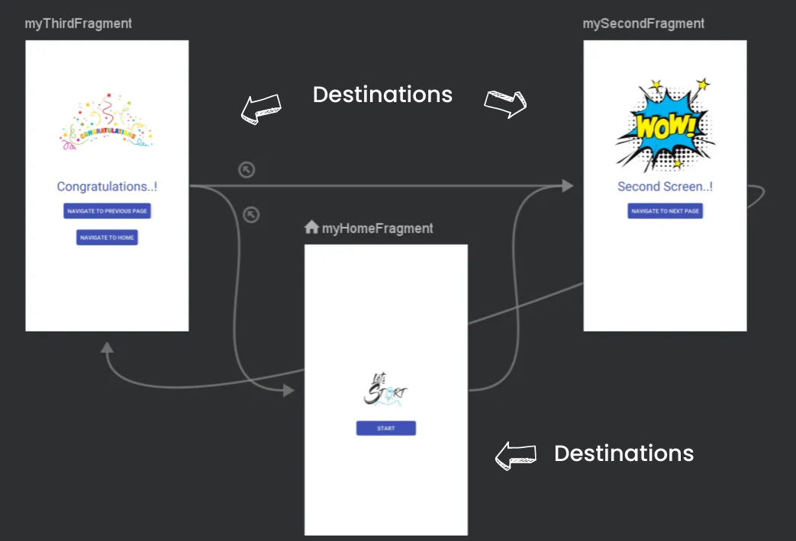
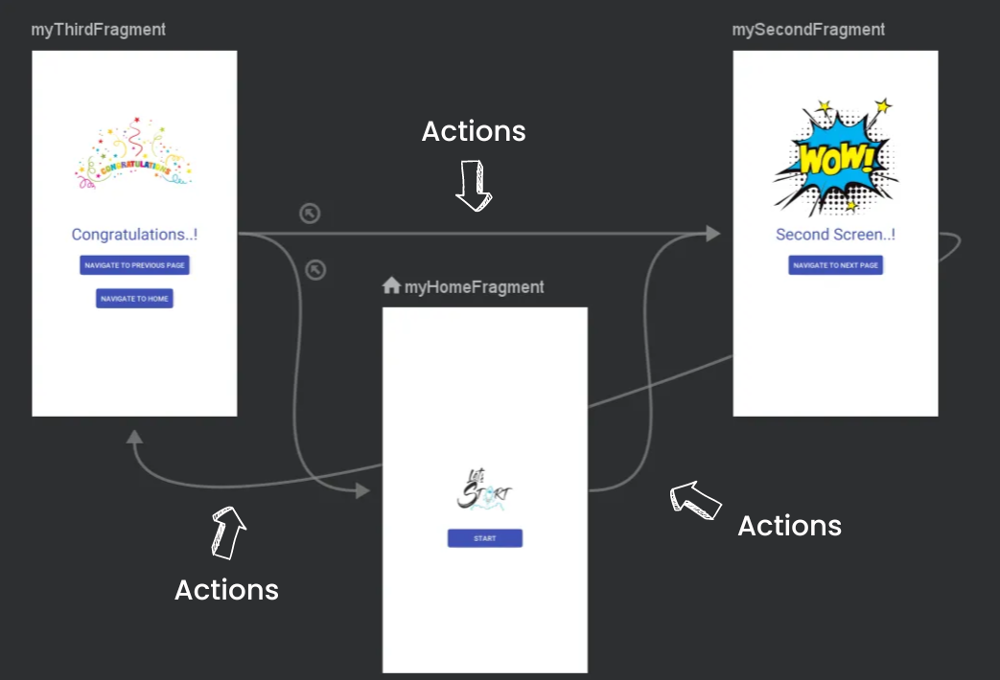

# Teori Navigation Component
Pada section ini, kita akan membahas terkait Navigation Component yang ada pada aplikasi Android. 

# **Navigation Component**

**Navigation Component** adalah bagian penting dari Android Jetpack yang dirancang untuk menyederhanakan manajemen navigasi dalam Aplikasi Android. Komponen ini menyediakan centralized structure untuk mengatur navigasi antar destination dalam aplikasi, termasuk navigasi antar fragment dan activity. Dengan menggunakan navigation component, dapat ditentukan **navigation graph aplikasi secara visual dengan XML sehingga dapat dengan mudah mengelola perubahan navigasi dan memperbarui action secara konsisten** di seluruh aplikasi. Selain itu, navigation component juga menawarkan fitur seperti back navigation dan mendukung untuk complex navigation pattern.

Selain kemudahan userannya, navigation component juga menawarkan integrasi yang sangat baik dengan komponen Jetpack yang lain seperti ViewModel dan LiveData untuk memberikan development experience yang lebih konsisten dan manageable. useran navigation component juga dapat memisahkan navigation logic dari UI dan bussiness logic, sehingga kode lebih mudah dipahami dan ditest. 

# **Manfaat Navigation**

1. Dapat melihat alur navigasi dengan lebih mudah dengan adanya visualisasi dari Android Studio

2. Menangani perpindahan Fragment dengan cepat.

3. Menangani aksi navigasi up dan back dengan tepat secara default.

4. Mengatur animasi saat transisi tanpa ribet.

5. Membantu proses saat ingin menerapkan DeepLink.

6. Terdapat NavigationUI, seperti navigation drawer dan bottom navigation. 

7. Safe Args, untuk mengirim data tanpa takut adanya error karena data null.

# **Prinsip Navigation**

Navigation merupakan elemen kunci dalam membangun pengalaman pengguna yang optimal dalam pengembangan aplikasi Android. Untuk memastikan kenyamanan pengguna, penting untuk memahami prinsip-prinsip dasar navigation yang akan menjaga konsistensi dan memenuhi harapan pengguna. Berikut adalah lima prinsip navigation menurut dokumentasi Android yang dapat membantu dalam pembangunan pengalaman pengguna yang baik:

1. **Start Destination yang Tetap:** Setiap aplikasi harus memiliki halaman awal yang konsisten, yang disebut sebagai start destination. Hal ini memastikan bahwa pengguna selalu melihat halaman yang sama setiap kali mereka membuka aplikasi untuk pertama kalinya.

2. **Pemeliharaan State dalam Stack:** Saat pengguna kembali dari halaman berikutnya, stack navigasi harus dapat memelihara state aplikasi. Dengan demikian, pengguna dapat kembali ke kondisi aplikasi yang sebelumnya tanpa kehilangan data atau progres yang telah dilakukan.

3. **Konsistensi Tombol Navigasi:** Tombol Up di Top App Bar dan tombol Back di bagian bawah layar harus sesuai dengan navigasi yang sedang dilakukan. Ini memastikan pengalaman navigasi yang intuitif dan mudah dipahami bagi pengguna.

4. **Tombol Up Tidak Keluar dari Aplikasi:** Saat berada di start destination, penggunaan tombol Up tidak seharusnya mengarahkan pengguna keluar dari aplikasi. Sebagai gantinya, tombol Back atau gesture kembali harus tersedia untuk memungkinkan pengguna keluar dari aplikasi dengan benar.

5. **Konsistensi Alur Deep Link:** Deep link dalam aplikasi harus memiliki alur backstack yang konsisten dengan navigasi manual. Ini berarti bahwa pengguna dapat menggunakan deep link untuk mencapai tujuan tertentu dalam aplikasi dan dapat dengan mudah kembali ke halaman sebelumnya menggunakan tombol Back. Dengan demikian, alur navigasi dalam aplikasi tetap terjaga, baik secara manual maupun melalui deep link.
14
# **Bagian-Bagian Navigation**

Terdapat 3 bagian dari Navigation Component yang harus diketahui sebagai berikut ini.

1. **Navigation Graph**

    Navigation Graph merupakan sebuah file XML yang digunakan untuk mendefinisikan struktur navigasi dalam aplikasi Android. File ini biasanya ditempatkan di dalam folder res/navigation. Navigation Graph berisi semua informasi yang diperlukan untuk mengatur navigasi dalam aplikasi, termasuk destinasi (Destinations), tindakan (Actions), argumen (Arguments), dan deep link.

    - **Destinations** dalam Navigation Graph adalah tujuan-tujuan yang dapat dicapai oleh pengguna dalam aplikasi. Destinasi ini bisa berupa fragment atau activity yang saling terhubung satu sama lain. Setiap destinasi memiliki ID yang unik yang digunakan untuk merujuknya dalam navigasi.

      

    - **Tindakan (Actions)** adalah navigasi dari satu destinasi ke destinasi lainnya. Actions menentukan hubungan antara destinasi mana yang akan dituju setelah melakukan suatu aksi tertentu, seperti menekan tombol atau menggeser layar. Di sini, Anda juga dapat mengatur animasi transisi, perilaku tombol kembali (pop behavior), dan opsi peluncuran lainnya.

        

    - **Argumen** digunakan untuk mengirimkan data antar fragment. Anda dapat mendefinisikan argumen-argumen yang akan dikirim bersama dengan navigasi antar fragment, seperti data nama atau deskripsi.

    - **Deep link** adalah mekanisme yang memungkinkan aplikasi dibuka melalui URL tertentu. Dengan deep link, Anda dapat mengatur agar pengguna dapat membuka suatu fragment langsung dari URL tanpa perlu membuka aplikasi terlebih dahulu.

2. **NavHostFragment**

    **NavHostFragment** adalah sebuah layout XML yang bertindak sebagai host untuk semua destinasi (fragmen) lainnya dalam aplikasi. Ini biasanya ditempatkan di dalam Activity dan berfungsi sebagai wadah tempat destinasi-destinasi lainnya ditampilkan. NavHostFragment harus memiliki atribut app:navGraph yang menunjukkan file Navigation Graph yang akan digunakan.

3. **NavControlller**

    **NavController** adalah kelas yang digunakan untuk mengeksekusi navigasi yang telah didefinisikan dalam Navigation Graph. Anda dapat menggunakan NavController untuk memulai navigasi antar destinasi, baik secara programatik maupun dengan menanggapi aksi pengguna seperti menekan tombol. NavController juga mengatur tumpukan kembali (back stack) dan menjaga konsistensi navigasi dalam aplikasi.

Cakupan masing-masing sub-materi cukup luas, sehingga terdapat beberapa konsep yang mungkin belum terdapat pada pembahasan ini. Untuk itu, kalian bisa belajar mandiri melalui link yang terlampir :D

### Referensi Tambahan
- [Navigation](https://developer.android.com/guide/navigation)
- [Navigation Component- The Complete Guide](https://medium.com/@muhamed.riyas/navigation-component-the-complete-guide-c51c9911684)
