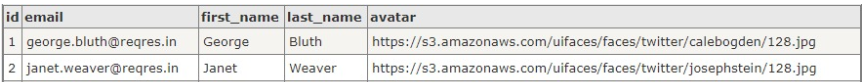

# Overview
Overview kali ini akan membahas secara singkat mengenai **Web API**, **JSON**, dan **Networking**. Hal ini penting karena seorang android developer nantinya akan sering menangani kasus dimana aplikasi membutuhkan **data dari server**, terutama interaksi dengan server melalui API.

## **Web API (Application Programming Interface) atau Web Service**
Merupakan layanan yang mengizinkan **dua aplikasi saling terhubung melalui jaringan**, sehingga kita dapat mengambil dan mengirim data ke layanan tersebut dengan mudah.

Berikut merupakan ilustrasinya:


Dengan menggunakan layanan ini, membuat proses development menjadi lebih efisien, karena **API cukup dibuat sekali**, tapi dapat dikonsumsi di berbagai macam platform, seperti mobile, desktop maupun web.

Di internet banyak bertebaran **public API** yang dapat digunakan oleh siapa saja sebagai bahan untuk belajar. Biasanya public API ini memiliki gaya standar perancangan (arsitektur), yaitu **REST** (REpresentation State Transfer). REST adalah salah satu pendekatan populer dalam pembuatan Web API yang menggunakan standar web (HTTP) untuk komunikasi, membuatnya menjadi pilihan yang efisien dan mudah diintegrasikan dalam berbagai platform. RESTful API biasanya menggunakan **format JSON** untuk pertukaran data, karena format ini lebih ringkas dan mudah dibaca dibandingkan dengan XML.

Web API memungkinkan komunikasi antara perangkat atau aplikasi melalui protokol web seperti **HTTP**, yang memungkinkan untuk saling bertukar data antara server dan client. Pada protokol ini terdapat beberapa **request method** yang biasa digunakan untuk proses CRUD, yaitu:
- POST : Untuk membuat data (Create)
- GET : Untuk membaca data (Read)
- PUT : Untuk mengubah data (Update)
- DELETE : Untuk menghapus data (Delete)

Berikut salah satu contoh dummy public API pada website reqres.in, yaitu https://reqres.in/api/users?page=1&per_page=10, dengan penjelasan **parameter-parameternya** sebagai berikut:
- Path : “users”
- Query 1 : “page” bernilai “1” 
- Query 2 : “per_page” bernilai “10”
- Gunakan “?” sebagai separator sebelum parameter pertama
- Gunakan “&” sebagai separator untuk parameter selanjutnya
- Gunakan “=” untuk mengisi query dengan suatu nilai/value

Ketika mengakses link di atas melalui browser, agar bisa dibaca dengan baik cobalah untuk menginstal ekstensi **JSON Formatter**. Bisa juga menggunakan **Postman**, yang merupakan GUI API Caller yang dapat memasukkan parameter atau body dengan mudah pada API melalui form tanpa perlu kode.

## **JSON (Javascript Object Notation)**
Merupakan **format pertukaran & penyimpanan data** yang ringan dan mudah dibaca (dibanding XML) yang dapat digunakan di hampir semua bahasa pemrograman. Kelebihan utama dari JSON adalah **kemudahannya untuk diurai (parse) dan digenerate** oleh sebagian besar bahasa pemrograman, yang membuatnya sangat populer dalam pengembangan API dan web services. Struktur berbasis teksnya yang sederhana membantu dalam pengiriman data melalui jaringan dan penyimpanan dalam bentuk yang efisien. Berikut merupakan contoh strukturnyanya:

Contoh tabel basis data:


Struktur format JSON berdasarkan basis data di atas, yaitu:


Berdasarkan gambar di atas terdapat 2 hal penting pada struktur format JSON, yaitu **JSONArray dan JSONObject**. Struktur dari JSON menggunakan **format key-value** untuk menampilkan field data. Berikut merupakan beberapa **tipe data** pada value JSON, yaitu:
- String : teks (dibungkus dengan “ “)
- Integer : angka bulat (misal: 0, 3, 40)
- Double : angka desimal (misal 0.2,  3.14, 40.0)
- Boolean : true/false
- Array : [“value1”, “value2”]
- Object : { “key” : “value” }
- Null : null

Agar JSON ini dapat dipakai sesuai bahasa pemrograman yang kita pakai, maka perlu melakukan **parsing JSON**. Dalam kasus ini akan digunakan bahasa pemrograman kotlin untuk melakukan parsing JSON dari dummy public API yang telah disebut di atas, yaitu https://reqres.in/api/users?page=1&per_page=10, sebagai berikut:
- JSON Field
Untuk method yang digunakan menyesuaikan dengan tipe data yang diambil. Misalnya ingin mengambil data “page” yang bernilai 1, berikut contoh kodenya:
    ```
    val jsonObject = JSONObject(response)
    val page = jsonObject.getInt("page")
    ```

- JSON Array
Untuk mengambil data yang bertanda [ ] (kurung siku), dapat menggunakan getJSONArray, berikut contoh kodenya:
    ```
    val jsonObject = JSONObject(response)
    val dataArray = jsonObject.getJSONArray("data")
    ```

- JSON Object
Untuk mengambil data yang bertanda { } (kurung kurawal), dapat menggunakan getJSONObject(index), misalnya ingin mengambil data email pada Object pertama (ke-0), berikut contoh kodenya:
    ```
    val jsonObject = JSONObject(response);
    val dataArray = jsonObject.getJSONArray("data")
    val dataObject = dataArray.getJSONObject(0)
    val email = dataObject.getString("email")
    ```

## **Networking**
Merupakan cara untuk **mengambil data** dari Web API. Untuk melakukannya diperlukan beberapa library, yaitu sebagai berikut:
1. [Networking dengan library LoopJ](../2.LoopJ/LoopJ.md)
2. [Networking dengan library Retrofit](../3.Retrofit/Retrofit.md)


## Penutup
Berhubung materi yang telah di sampaikan di atas merupakan hal dasar, kalian dapat mengeksplorasinya sendiri (artikel di internet, buku, atau yang lainnya) untuk menambah pengetahuan dan pemahaman masing-masing.

Atau bisa dibuka beberapa tautan berikut:
1. [Apa itu Web API? oleh Format Berita](https://formatberita.com/2020/04/29/apa-itu-web-api/)
2. [Web API oleh Wikipedia](https://en-m-wikipedia-org.translate.goog/wiki/Web_API?_x_tr_sl=en&_x_tr_tl=id&_x_tr_hl=id&_x_tr_pto=tc)
3. [What is a REST API? oleh IBM](https://www.ibm.com/topics/rest-apis)
4. [Apa itu API RESTful? oleh AWS Aazon](https://aws.amazon.com/id/what-is/restful-api/)
5. [JSON oleh Wikipedia](https://en.wikipedia.org/wiki/JSON)