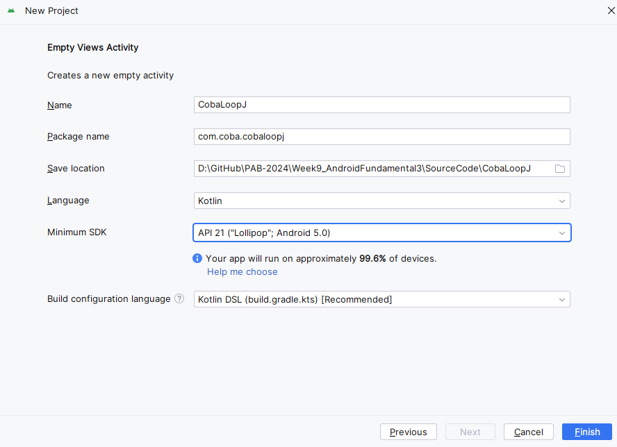
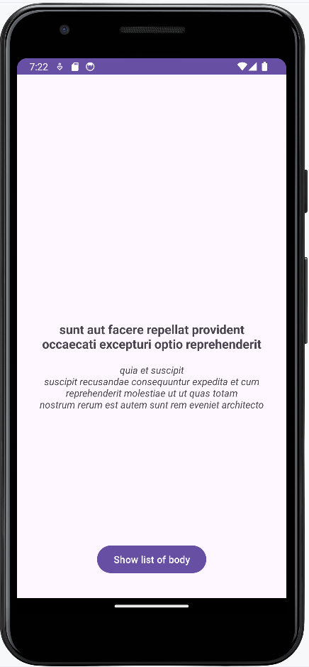
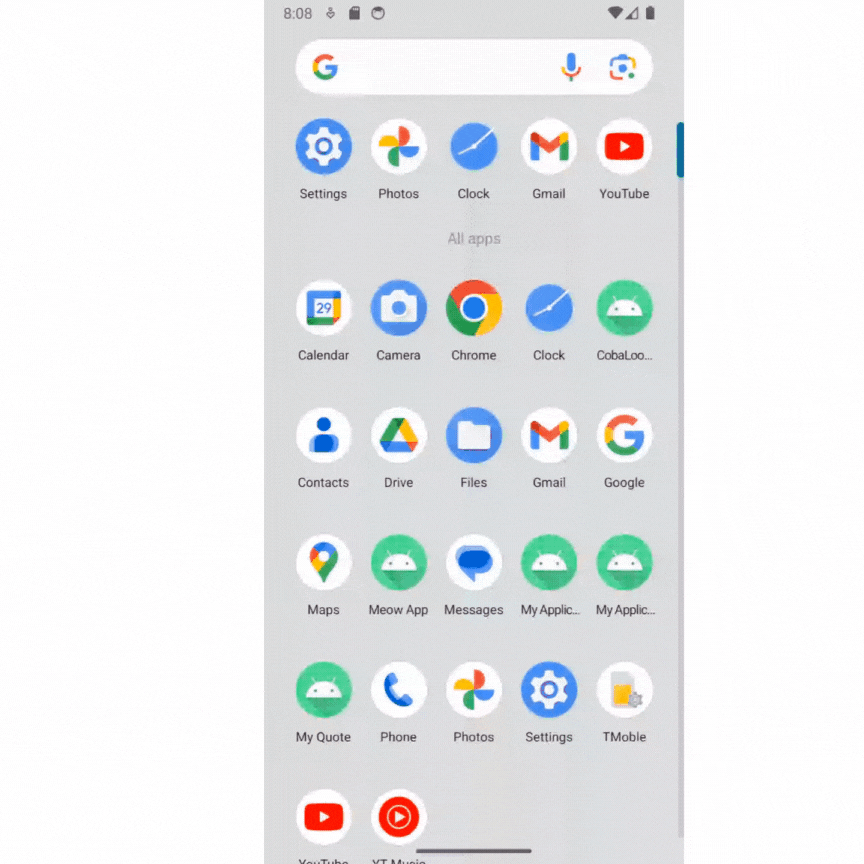

# CodeLab Networking dengan LoopJ

1. Buatlah project baru di android studio, dengan ketentuan seperti gambar berikut ini:
   
   Bisa diganti, jika ada yang perlu diganti.

2. API yang akan digunakan, yaitu:

   - https://jsonplaceholder.typicode.com/posts/1
   - https://jsonplaceholder.typicode.com/posts

3. Buka url dummy API di atas pada browser, instal ekstensi JSON Formatter agar lebih mudah untuk dibaca.

4. Tambahkan kode di bawah ini, yang merupakan library AsyncHttpClient (LoopJ), pada **build.gradle.kts(Module: app)**, lalu pilih **sync now** tunggu sampai proses sinkronisasi gradle selesai.

   ```
   dependencies {
       ...
       implementation("com.loopj.android:android-async-http:1.4.11")
   }
   ```

5. Buat desain aplikasi pada layout activity_main.xml dengan kode seperti berikut:

   ```
   <?xml version="1.0" encoding="utf-8"?>
   <androidx.constraintlayout.widget.ConstraintLayout xmlns:android="http://schemas.android.com/apk/res/android"
   xmlns:app="http://schemas.android.com/apk/res-auto"
   xmlns:tools="http://schemas.android.com/tools"
   android:id="@+id/activity_main"
   android:layout_width="match_parent"
   android:layout_height="match_parent"
   android:padding="16dp"
   android:orientation="vertical"
   tools:context="MainActivity">

   <TextView
       android:id="@+id/tvBody"
       android:layout_width="match_parent"
       android:layout_height="wrap_content"
       android:layout_margin="16dp"
       android:textAlignment="center"
       android:textSize="18sp"
       android:textStyle="bold"
       app:layout_constraintBottom_toBottomOf="parent"
       app:layout_constraintEnd_toEndOf="parent"
       app:layout_constraintStart_toStartOf="parent"
       app:layout_constraintTop_toTopOf="parent"
       tools:text="@string/body" />

   <TextView
       android:id="@+id/tvTitle"
       android:layout_width="match_parent"
       android:layout_height="wrap_content"
       android:layout_margin="16dp"
       android:textAlignment="center"
       android:textSize="14sp"
       android:textStyle="italic"
       app:layout_constraintTop_toBottomOf="@+id/tvBody"
       tools:layout_editor_absoluteX="16dp"
       tools:text="@string/title" />

   <ProgressBar
       android:id="@+id/progressBar"
       style="?android:attr/progressBarStyle"
       android:layout_width="wrap_content"
       android:layout_height="wrap_content"
       app:layout_constraintBottom_toBottomOf="parent"
       app:layout_constraintEnd_toEndOf="parent"
       app:layout_constraintStart_toStartOf="parent"
       app:layout_constraintTop_toTopOf="parent" />

   <Button
       android:id="@+id/btnAllBody"
       android:layout_width="wrap_content"
       android:layout_height="wrap_content"
       android:layout_margin="16dp"
       android:text="@string/show_list_body"
       app:layout_constraintBottom_toBottomOf="parent"
       app:layout_constraintEnd_toEndOf="parent"
       app:layout_constraintStart_toStartOf="parent" />

   </androidx.constraintlayout.widget.ConstraintLayout>
   ```

   Tambahkan juga resource di strings.xml seperti berikut:

   ```
   <resources>
       <string name="app_name">CobaLoopJ</string>
       <string name="body">Body</string>
       <string name="title">- Title</string>
       <string name="show_list_body">Show list of body</string>
   </resources>
   ```

   Tampilannya pada activity_main.xml akan seperti ini:

   

6. Tambahkan kode berikut pada MainActivity

   ```
   class MainActivity : AppCompatActivity() {

       companion object {
           private val TAG = MainActivity::class.java.simpleName
       }
       private lateinit var binding: ActivityMainBinding

       override fun onCreate(savedInstanceState: Bundle?) {
           super.onCreate(savedInstanceState)
           binding = ActivityMainBinding.inflate(layoutInflater)
           setContentView(binding.root)
           getRandomBody()
       }

       private fun getRandomBody() {

       }
   }
   ```

   Aktifkan juga ViewBinding pada **build.gradle(module: app)**, dengan menambahkan kode berikut:

   ```
   android {
       ...
       buildFeatures {
           viewBinding = true
       }
   }
   ```

7. Implementasikan LoopJ untuk mengambil data dari Web API dengan menambahkan kode berikut pada MainActivity seperti berikut:

   ```
   private fun getRandomBody() {
       binding.progressBar.visibility = View.VISIBLE
       val client = AsyncHttpClient()
       val url = "https://jsonplaceholder.typicode.com/posts/1"
       client.get(url, object : AsyncHttpResponseHandler() {
           override fun onSuccess(statusCode: Int, headers: Array<Header>, responseBody: ByteArray) {
               // Jika koneksi berhasil
           }
           override fun onFailure(statusCode: Int, headers: Array<Header>, responseBody: ByteArray, error: Throwable) {
               // Jika koneksi gagal
           }
       })
   }
   ```

   Berfungsi untuk menampikan ProgressBar yang mengindikasikan proses loading data. Loading ini akan hilang ketika data sudah ditampilkan.

8. Perhatikan JSON dari url dummy API poin 7:

   ```
   {
       "userId": 1,
       "id": 1,
       "title": "sunt aut facere repellat provident occaecati excepturi optio reprehenderit",
       "body": "quia et suscipit\nsuscipit recusandae consequuntur expedita et cum\nreprehenderit molestiae ut ut quas totam\nnostrum rerum est autem sunt rem eveniet architecto"
   }
   ```

   Terdapat 1 JSON Object, pada kasus ini diperlukan data dengan key "body" dan "title". Untuk itu, akan dilakukan parsing JSON data tersebut dengan menggunakan kode berikut pada method onSuccess dan onFailure di MainActivity:

   ```
   private fun getRandomBody() {
       binding.progressBar.visibility = View.VISIBLE
       val client = AsyncHttpClient()
       val url = "https://jsonplaceholder.typicode.com/posts/1"
       client.get(url, object : AsyncHttpResponseHandler() {
           override fun onSuccess(statusCode: Int, headers: Array<Header>, responseBody: ByteArray) {
               // Jika koneksi berhasil
               binding.progressBar.visibility = View.INVISIBLE
               val result = String(responseBody)
               Log.d(TAG, result)
               try {
                   val responseObject = JSONObject(result)
                   val body = responseObject.getString("body")
                   val title = responseObject.getString("title")
                   binding.tvBody.text = body
                   binding.tvTitle.text = title
               } catch (e: Exception) {
                   Toast.makeText(this@MainActivity, e.message, Toast.LENGTH_SHORT).show()
                   e.printStackTrace()
               }
           }
           override fun onFailure(statusCode: Int, headers: Array<Header>, responseBody: ByteArray, error: Throwable) {
               // Jika koneksi gagal
               binding.progressBar.visibility = View.INVISIBLE
               val errorMessage = when (statusCode) {
                   401 -> "$statusCode : Bad Request"
                   403 -> "$statusCode : Forbidden"
                   404 -> "$statusCode : Not Found"
                   else -> "$statusCode : ${error.message}"
               }
               Toast.makeText(this@MainActivity, errorMessage, Toast.LENGTH_SHORT).show()
           }
       })
   }
   ```

9. Karena dalam mengambil data melalui Web API ini memerlukan internet, maka tambahkan kode permission berikut pada AndroidManifest seperti berikut:

   ```
   <?xml version="1.0" encoding="utf-8"?>
   <manifest xmlns:android="http://schemas.android.com/apk/res/android"
       xmlns:tools="http://schemas.android.com/tools"

       <uses-permission android:name="android.permission.INTERNET" />

       <application
           ...
       </application>
   </manifest>
   ```

10. Jalankan aplikasi maka akan terlihat seperti ini:

    

11. Buatlah Activity baru dengan cara klik kanan pada nama package → New → Activity → Empty Views Activity. Kemudian beri nama ListBodyActivity
    

12. Buka activity_list_body.xml, kemudian tambahkan RecyclerView dan ProgressBar di dalamnya seperti ini:

    ```
    <?xml version="1.0" encoding="utf-8"?>
    <androidx.constraintlayout.widget.ConstraintLayout xmlns:android="http://schemas.android.com/apk/res/android"
        xmlns:app="http://schemas.android.com/apk/res-auto"
        xmlns:tools="http://schemas.android.com/tools"
        android:layout_width="match_parent"
        android:layout_height="match_parent"
        tools:context=".ListBodyActivity">

        <androidx.recyclerview.widget.RecyclerView
            android:id="@+id/listBody"
            android:layout_width="match_parent"
            android:layout_height="match_parent"
            app:layout_constraintBottom_toTopOf="parent"
            app:layout_constraintEnd_toEndOf="parent"
            app:layout_constraintStart_toStartOf="parent"
            app:layout_constraintTop_toTopOf="parent" />
        <ProgressBar
            android:id="@+id/progressBar"
            style="?android:attr/progressBarStyle"
            android:layout_width="wrap_content"
            android:layout_height="wrap_content"
            app:layout_constraintBottom_toBottomOf="parent"
            app:layout_constraintEnd_toEndOf="parent"
            app:layout_constraintStart_toStartOf="parent"
            app:layout_constraintTop_toTopOf="parent" />
    </androidx.constraintlayout.widget.ConstraintLayout>

    ```

13. Buatlah terlebih dahulu layout untuk item RecyclerView dengan cara klik kanan pada folder layout → New → Layout resource file dan beri nama item_body. Lalu buat desain seperti berikut:

    ```
    <?xml version="1.0" encoding="utf-8"?>
    <TextView xmlns:android="http://schemas.android.com/apk/res/android"
        xmlns:tools="http://schemas.android.com/tools"
        android:id="@+id/tvItem"
        android:layout_width="match_parent"
        android:layout_height="wrap_content"
        android:gravity="center_vertical"
        android:minHeight="?android:attr/listPreferredItemHeightSmall"
        android:paddingStart="?android:attr/listPreferredItemPaddingStart"
        android:paddingEnd="?android:attr/listPreferredItemPaddingEnd"
        android:textAppearance="?android:attr/textAppearanceListItemSmall"
        tools:text="Body" />
    ```

14. Buat class baru untuk adapter RecyclerView dengan nama BodyAdapter dan tuliskan kode berikut:

    ```
    class BodyAdapter(private val listReview: ArrayList<String>) : RecyclerView.Adapter<BodyAdapter.ViewHolder>() {
        override fun onCreateViewHolder(viewGroup: ViewGroup, viewType: Int): ViewHolder {
            val view = LayoutInflater.from(viewGroup.context).inflate(R.layout.item_body, viewGroup, false)
            return ViewHolder(view)
        }
        override fun onBindViewHolder(viewHolder: ViewHolder, position: Int) {
            viewHolder.tvItem.text = listReview[position]
        }
        override fun getItemCount(): Int {
            return listReview.size
        }
        class ViewHolder(view: View) : RecyclerView.ViewHolder(view) {
            val tvItem: TextView = view.findViewById(R.id.tvItem)
        }
    }
    ```

15. Buka ListBodyActivity dan buat method getListBody untuk mengambil data list body.

    ```
    class ListBodyActivity : AppCompatActivity() {

        companion object {
            private val TAG = ListBodyActivity::class.java.simpleName
        }
        private lateinit var binding: ActivityListBodyBinding

        override fun onCreate(savedInstanceState: Bundle?) {
            super.onCreate(savedInstanceState)
            binding = ActivityListBodyBinding.inflate(layoutInflater)
            setContentView(binding.root)
            val layoutManager = LinearLayoutManager(this)
            binding.listBody.setLayoutManager(layoutManager)
            val itemDecoration = DividerItemDecoration(this, layoutManager.orientation)
            binding.listBody.addItemDecoration(itemDecoration)
            getListBody()
        }

        private fun getListBody() {
            binding.progressBar.visibility = View.VISIBLE
            val client = AsyncHttpClient()
            val url = "https://jsonplaceholder.typicode.com/posts"
            client.get(url, object : AsyncHttpResponseHandler() {
                override fun onSuccess(statusCode: Int, headers: Array<Header>, responseBody: ByteArray) {
                    // Jika koneksi berhasil
                    binding.progressBar.visibility = View.INVISIBLE
                }
                override fun onFailure(statusCode: Int, headers: Array<Header>, responseBody: ByteArray, error: Throwable) {
                    // Jika koneksi gagal
                    binding.progressBar.visibility = View.INVISIBLE
                    val errorMessage = when (statusCode) {
                        401 -> "$statusCode : Bad Request"
                        403 -> "$statusCode : Forbidden"
                        404 -> "$statusCode : Not Found"
                        else -> "$statusCode : ${error.message}"
                    }
                    Toast.makeText(this@ListBodyActivity, errorMessage, Toast.LENGTH_SHORT).show()
                }
            })
        }
    }
    ```

16. Lihat kembali data JSON dummy API yang satunya pada url https://jsonplaceholder.typicode.com/posts, berikut tampilan sebagian datanya:
    
    Terdapat JSONArray yang berisi banyak JSON Object. Oleh karena itu, perlu melakukan perulangan untuk mendapatkan data tersebut dengan cara seperti berikut pada ListBodyActivity:

    ```
    override fun onSuccess(statusCode: Int, headers: Array<Header>, responseBody: ByteArray) {
        // Jika koneksi berhasil
        binding.progressBar.visibility = View.INVISIBLE

        val listBody = ArrayList<String>()
        val result = String(responseBody)
        Log.d(TAG, result)
        try {
            val jsonArray = JSONArray(result)
            for (i in 0 until jsonArray.length()) {
                val jsonObject = jsonArray.getJSONObject(i)
                val body = jsonObject.getString("body")
                val title = jsonObject.getString("title")
                listBody.add("\n$body\n — $title\n")
            }
            val adapter = BodyAdapter(listBody)
            binding.listBody.adapter = adapter
        } catch (e: Exception) {
            Toast.makeText(this@ListBodyActivity, e.message, Toast.LENGTH_SHORT).show()
            e.printStackTrace()
        }
    }
    ```

17. Tambahkan aksi pada Button btnAllBody di MainActivity untuk navigasi ke halaman list body.
    ```
    binding.btnAllBody.setOnClickListener {
        startActivity(Intent(this@MainActivity, ListBodyActivity::class.java))
    }
    ```

18. Jalankan aplikasi, maka akan seperti berikut:

    