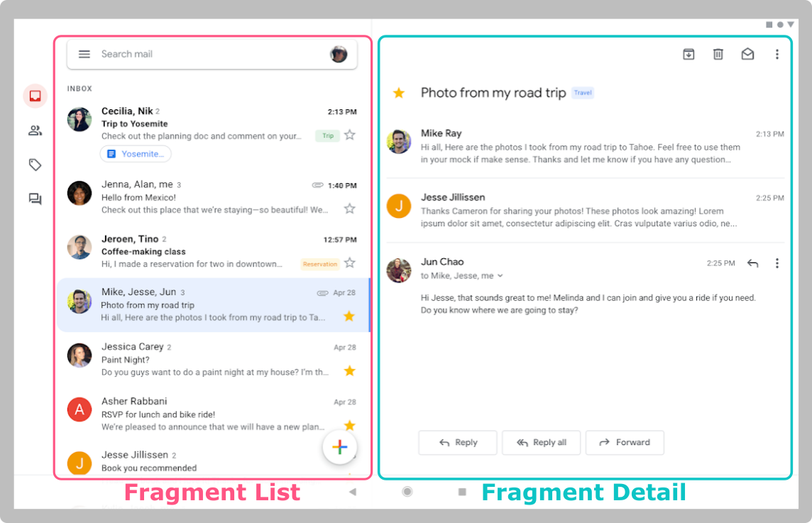

# Fragment

  Sebelum ke dasar teori dari materi ini, kalian bisa menonton video pengenalan Fragment di bawah ini.

-  [Pengenalan Fragment](https://youtu.be/5PBp6r3aZWU?si=F6CYhArN4nqMFoUU)

    Selain *Activity* terdapat *Fragment* sebagai salah satu bagian dari User Interface. Memiliki bentuk yang hampir mirip dengan *Activity*, yang mana *Fragment* ini memiliki class untuk menyimpan kode logika dan tampilan XML. Perbedaan antara kedua nya terletak pada kelasnya yang ***extends*** atau *inherit* ke Fragment dan tidak perlu dimasukkan ke dalam **AndroidManifest.xml** lagi.

    Fragment bersifat **modular** yang berarti satu activity bisa memiliki lebih dari satu fragment, sehingga tidak perlu repot-repot berpindah-pindah Activity lagi karena satu Activity tersebut dapat membuat banyak tampilan. Selain itu Fragment juga mempunyai sifat yang **reusable**, karena kita dapat memakai satu fragment dalam banyak Activity sekaligus. Untuk lebih jelasnya perhatikan gambar dibawah ini.

  

-  *contoh penerapan fragment pada aplikasi Gmail di tablet*
  
  

  List email dan detail email sama-sama memiliki fragment tersendiri. Kedua fragment tersebut dapat ditampilkan secara bersamaan pada satu Activity yang sama.

### Menambahkan Fragment

``` kotlin
val fragmentManager = supportFragmentManager
val exampleFragment = ExampleFragment()
 
fragmentManager
        .beginTransaction()
        .add(R.id.frame_container, exampleFragment)
        .addToBackStack(null)
        .commit()
```

FragmentManager adalah kelas yang bertanggung jawab untuk mengelola Fragment ke dalam Activity. Setelah menginisialisasi Fragment Manager, Anda bisa melakukan beberapa aksi terhadap Fragment seperti **add()**, **replace()**, dan **remove()**. Kemudian untuk mengaplikasikannya, Anda harus memanggil fungsi **commit()**. Sebelumnya, Anda dapat menambahkan kode **addToBackStack()** untuk menyimpan transaksi terakhir ke *back stack*.

*Back stack* dapat diilustrasikan seperti sebuah tumpukan buku, ketika melakukan transaksi seperti menambahkan buku baru di atasnya lalu menekan tombol back, maka buku yang paling atas diambil.


Terdapat video tambahan yang menjelaskan mengenai penerapan *back stack* ini, dapat dilihat di bawah ini.

-  [Dissecting back stack](https://youtu.be/KzHvtS3B5zk?si=GqdFTSDptTDeLWcQ)

## Fragment Lifecycle
  Berikut ada beberapa state yang perlu diperhatikan sebelum menggunakan fragment.

-  **Resumed**
  Ketika Activity sedang berjalan, fragment dapat dilihat.

-  **Paused**
  Ketika ada activity lain yang menutupi sebagian dari activity dimana fragment ditambahkan.

-  **Stopped**
  Ketika fragment tidak terlihat di layar. Banyak faktor seperti, ketika activity dimana fragment tersebut ditambahkan berhenti atau fragment itu sendiri telah dihapus dari activity. Pada kondisi ini fragment masih hidup dengan semua informasinya. Akan tetapi sudah tidak kelihatan di layar dan akan dihancurkan.

Skema di bawah ini menunjukkan callback method apa saja yang akan dipanggil di dalam fragment ketika terjadi perubahan pada sebuah activity.


Fragment merupakan komponen view yang dapat ditambahkan (*embed*) ke dalam activity maka dari itu, perubahan *state* dari sebuah activity akan memengaruhi *life cycle* dari sebuah *fragment*.

### Perbedaan Kode Activity dan Fragment

|      | Operasi | Fungsi |
|------|---------|---------|
| Context | this | requireActivity()/getActivity()|
| Fungsi Utama | onCreate | onViewCreated |
| Cara mengambil View | findViewById | view.findViewById |

  Jadi, ketika menggunakan **this** di activity dapat diubah menjadi **requireActivity()** untuk bahasa Kotlin dan *getActvity* untuk bahasa Java. Sebagai contoh dalam penerapan pada kode nya sebagai berikut:

*sebelum*
``` kotlin
override fun onCreate(savedInstanceState: Bundle?) {
    super.onCreate(savedInstanceState)
    setContentView(R.layout.activity_main)
 
    val btnProfile = findViewById(R.id.btn_profile)
    btnProfile.setOnClickListener{
        Toast.makeText(this@MainActivity, "Halo", Toast.LENGTH_SHORT).show()
    }
}
```

*sesudah*
``` kotlin
override fun onViewCreated(view: View, savedInstanceState: Bundle?) {
    super.onViewCreated(view, savedInstanceState)
 
    val btnProfile = view.findViewById(R.id.btn_profile)
    btnProfile.setOnClickListener{
        Toast.makeText(requireActivity(), "Halo", Toast.LENGTH_SHORT).show()
    }
}
```

Untuk lebih detail mengenai materi Fragment, kalian dapat belajar mandiri melalui tautan berikut:

-  [Fragment](https://developer.android.com/guide/fragments)
