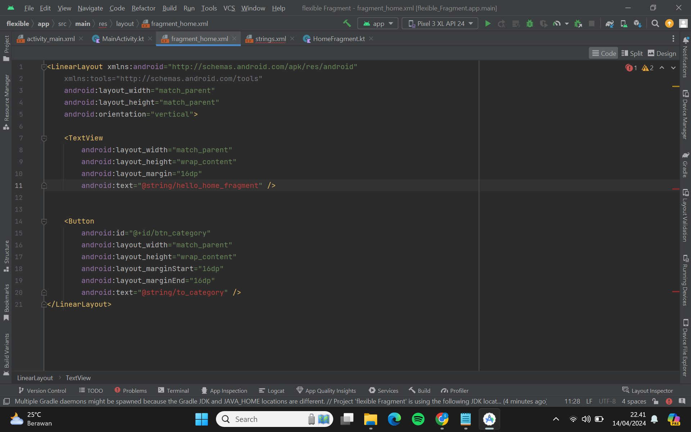
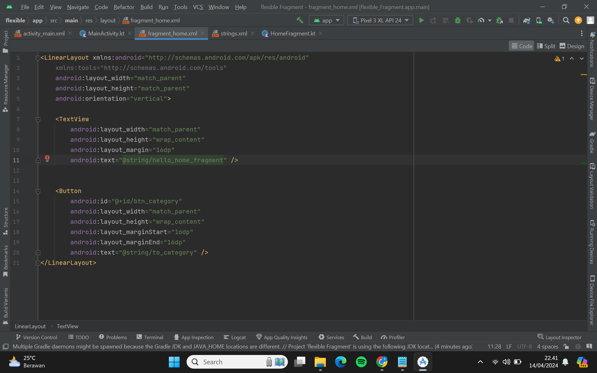

# FRAGMENT DI ACTIVITY PRACTICE

Pastikan bahwa kalian sudah menginstall Android Studio pada device kalian masing-masing yaa!

1. Kalian bisa **Running** Android Studio terlebih dahulu, maka akan menampilkan tampilan kurang lebih seperti ini. Kemudian, kalian bisa pilih **New Project**.

   

2. Dikarenkakan kita hanya membuat basic project saja maka kalian bisa memilih yang **Empty View Activity** seperti biasa. Kemudian, bisa klik Next.

3. Maka, akan ditampilkan window seperti berikut ini. Untuk nama, Language, Minimum SDK, dan Build configuration language bisa mengikuti seperti pada gambar, sedangkan untuk package bisa disesuaikan dengan format berikut ini:

    **com.nim.2namapertama.flexibleFragment.**

  

4. Kemudian, untuk save location bisa disesuaikan sesuai dengan path pada device masing-masing. Lalu bisa pilih Finish.

5. Pada **activity_main.xml**, silakan kondisikan kode pada berkas tersebut menjadi seperti berikut:

``` kotlin
<?xml version="1.0" encoding="utf-8"?>
<FrameLayout xmlns:android="http://schemas.android.com/apk/res/android"
    xmlns:tools="http://schemas.android.com/tools"
    android:id="@+id/frame_container"
    android:layout_width="match_parent"
    android:layout_height="match_parent"
    tools:context="com.m0521074.ayuk.flexiblefragment.MainActivity">

</FrameLayout>
```

6. Kemudian kita buat beberapa fragment untuk mengimplementasikan perpindahan tampilan tanpa perpindahan activity. Pertama kita buat fragment dengan nama **HomeFragment**. Caranya : klik kanan pada package utama pada proyek aplikasi Anda → **New** → **Fragment** → **Fragment (Blank)**.

   

7. Setelah tampil dialog untuk fragment, isikan **HomeFragment** pada kolom **Fragment Name** dan Klik **Finish** untuk melanjutkan penciptaan fragment.

8. Setelahnya, sesuaikan tampilannya dengan menambahkan sebuah objek textview dan button pada file **fragment_home.xml**, seperti berikut:
```kotlin
<LinearLayout xmlns:android="http://schemas.android.com/apk/res/android"
    xmlns:tools="http://schemas.android.com/tools"
    android:layout_width="match_parent"
    android:layout_height="match_parent"
    android:orientation="vertical">
 
    <TextView
        android:layout_width="match_parent"
        android:layout_height="wrap_content"
        android:layout_margin="16dp"
        android:text="@string/hello_home_fragment" />
    <Button
        android:id="@+id/btn_category"
        android:layout_width="match_parent"
        android:layout_height="wrap_content"
        android:layout_marginStart="16dp"
        android:layout_marginEnd="16dp"
        android:text="@string/to_category" />
</LinearLayout>
```
 
 
9.  Akan ada *error* pada bagian **android:text**. Tambahkan beberapa baris kode di bawah ini ke dalam **res** -> **values** -> **strings.xml**
```kotlin
<resources>
    <string name="app_name">flexible Fragment</string>
    <string name="hello_blank_fragment">Hello blank fragment</string>
    <string name="this_profile">Ini activity Profile</string>
    <string name="this_category">Ini fragment Category</string>
    <string name="category_lifestyle">Ke fragment Lifestyle</string>
    <string name="category_name">Category Name</string>
    <string name="category_description">Category Description</string>
    <string name="to_profile">Ke Halaman Profile Activity</string>
    <string name="show_dialog">Tampilkan sebuah dialog</string>
    <string name="hello_home_fragment">Hello Ini Home Fragment</string>
    <string name="to_category">Ke fragment Category</string>
    <string name="question_coach">Siapa pelatih tersukses Machester United?</string>
    <string name="sir_alex_ferguson">Sir Alex Ferguson</string>
    <string name="jose_mourinho">Jose Mourinho</string>
    <string name="louis_van_gaal">Louis Van Gaal</string>
    <string name="david_moyes">David Moyes</string>
    <string name="choose">Pilih</string>
    <string name="close">Tutup</string>
</resources>
```

 

10.  Pada **HomeFragment** hapus kode yang tidak digunakan dan sesuaikan kode nya dengan bawah ini:
```kotlin
class HomeFragment : Fragment(), View.OnClickListener {
 
    override fun onCreateView(inflater: LayoutInflater, container: ViewGroup?,
                              savedInstanceState: Bundle?): View? {
        // Inflate the layout for this fragment
        return inflater.inflate(R.layout.fragment_home, container, false)
    }
 
    override fun onViewCreated(view: View, savedInstanceState: Bundle?) {
        super.onViewCreated(view, savedInstanceState)
        val btnCategory:Button = view.findViewById(R.id.btn_category)
        btnCategory.setOnClickListener(this)    
    }
    override fun onClick(v: View) {
       
    }
}
```
Di sini kita juga siapkan kode listener **onClick**. Listener di sini akan kita gunakan pada latihan berikutnya.

11.  Selanjutnya pada **MainActivity** masukkan **HomeFragment** tadi ke dalam activity tersebut hingga tampil ke layar pengguna dengan menambahkan baris kode berikut:
```kotlin
...
override fun onCreate(savedInstanceState: Bundle?) {
    super.onCreate(savedInstanceState)
    setContentView(R.layout.activity_main)
 
    val fragmentManager = supportFragmentManager
    val homeFragment = HomeFragment()
    val fragment = fragmentManager.findFragmentByTag(HomeFragment::class.java.simpleName)
    if (fragment !is HomeFragment) {
        Log.d("MyFlexibleFragment", "Fragment Name :" + HomeFragment::class.java.simpleName)
        fragmentManager
            .beginTransaction()
            .add(R.id.frame_container, homeFragment, HomeFragment::class.java.simpleName)
            .commit()
    }
}
...
```

12. Setelah selesai dan jalankan aplikasi, tampilannya akan seperti gambar di bawah ini.


