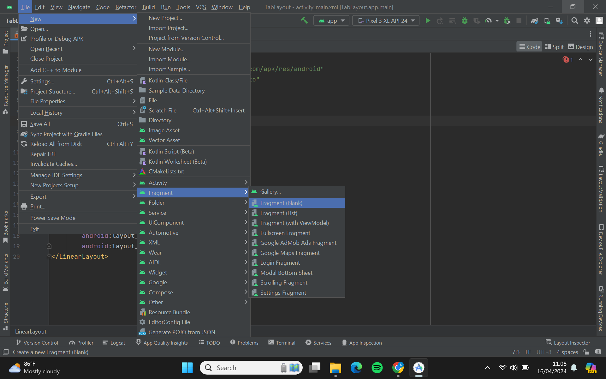
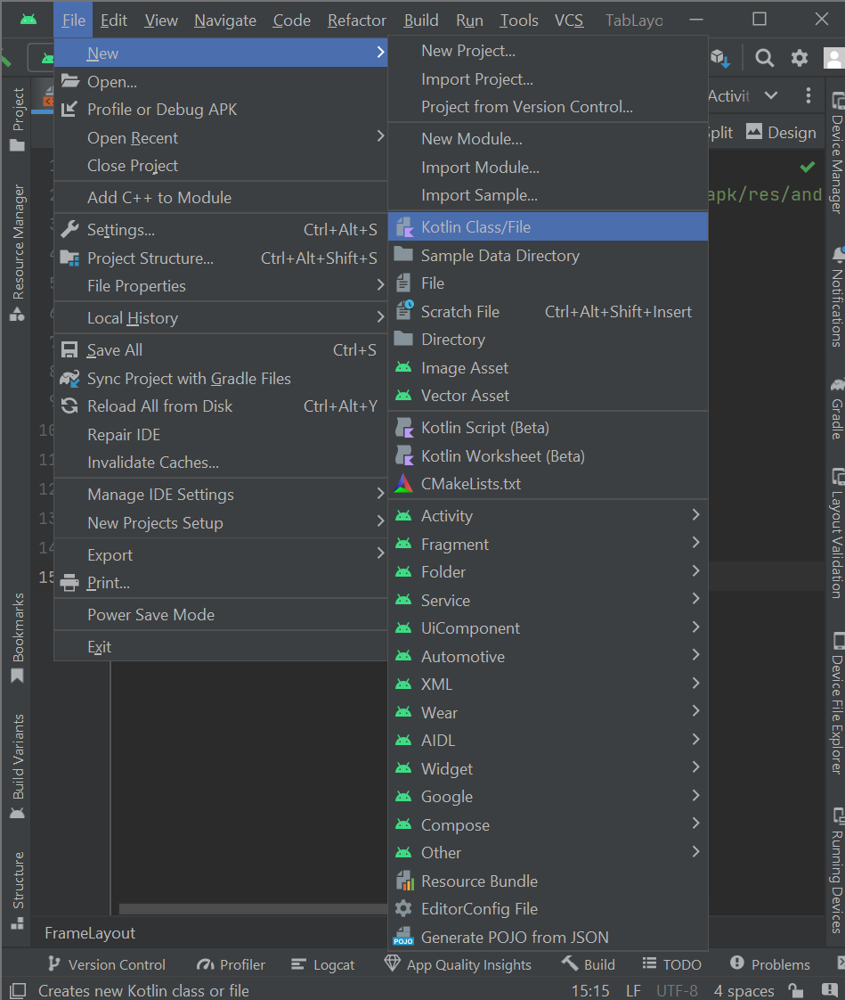
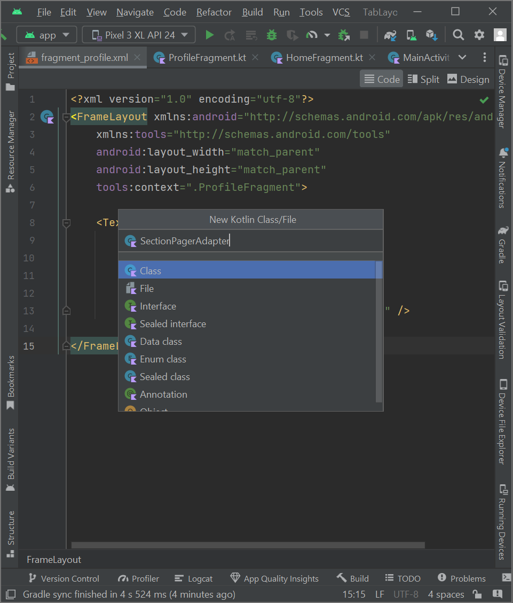
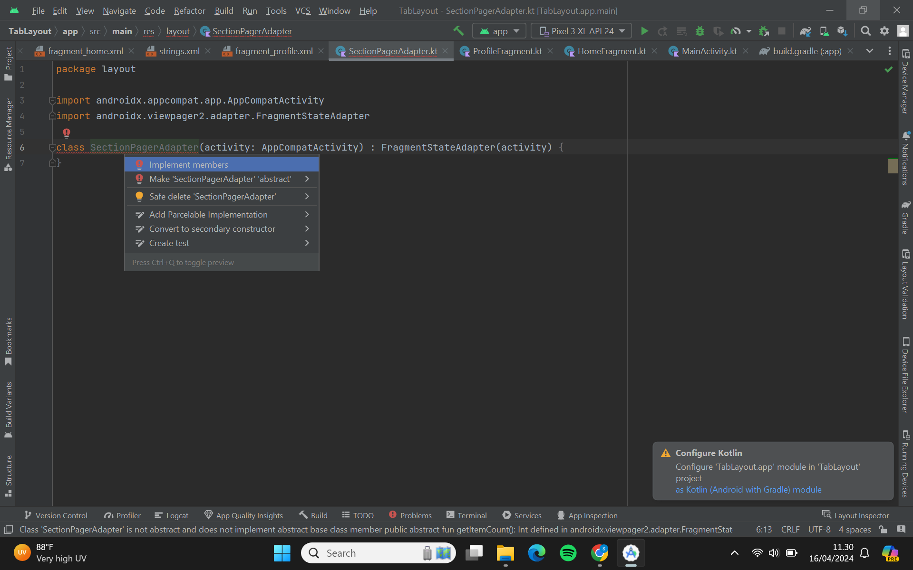

# TabLayout

***Pemahaman singkat mengenai Tab Layout***


  Tab Layout adalah salah satu bagian dari Android Design Support Library yang menyediakan UI untuk menavigasi antara beberapa tab dengan konten yang terkait dalam aplikasi Android. Dengan TabLayout, pengguna dapat dengan mudah beralih antara berbagai bagian atau fitur dalam aplikasi tanpa perlu meninggalkan tampilan utama. Setiap tab biasanya memiliki label yang deskriptif dan bisa memiliki ikon sebagai representasi visual dari konten yang terkait.

  TabLayout biasanya digunakan bersama dengan ViewPager, yang memungkinkan pengguna untuk menggeser antara tab atau dengan FragmentContainerView untuk menampilkan konten yang terkait dengan setiap tab. Berikut adalah beberapa kegunaan umum TabLayout dalam pengembangan aplikasi Android:

-  ***Navigasi antara bagian aplikasi***
-  ***Pengaturan***
-  ***Profil pengguna***

Untuk selengkapnya dapat dilihat dan belajar mandiri melalui tautan di bawah ini.

[Tab Layout](https://developer.android.com/reference/com/google/android/material/tabs/TabLayout)

## PRACTICE TAB LAYOUT WITH VIEWPAGER2

Pastikan bahwa kalian sudah menginstall Android Studio pada device kalian masing-masing yaa!

1. Kalian bisa Running Android Studio terlebih dahulu, maka akan menampilkan tampilan kurang lebih seperti ini. Kemudian, kalian bisa pilih New Project.


2. Dikarenkakan kita hanya membuat basic project saja maka kalian bisa memilih yang Empty View Activity seperti biasa. Kemudian, bisa klik Next.

3. Maka, akan ditampilkan window seperti berikut ini. Untuk nama, Language, Minimum SDK, dan Build configuration language bisa mengikuti seperti pada gambar, sedangkan untuk package bisa disesuaikan dengan format berikut ini:

**com.nim.namapertama.tablayout**


4. Kemudian, untuk save location bisa disesuaikan sesuai dengan path pada device masing-masing. Lalu bisa pilih Finish.

5. Dimulai dengan menambahkan library ViewPager2 dan material design untuk membuat TabLayout. Silahkan ke **Gradle Scripts** →  **build.gradle.kts(Module: app)** dan tambahkan kode seperpti di bawah ini.

```kotlin
implementation("com.google.android.material:material:1.11.0") //jika belum ada
implementation("androidx.viewpager2:viewpager2:1.0.0")
```


Jangan lupa untuk **sync project** yang berada dipojok kanan atas agar library tersebut dapat berfungsi pada projek kalian.

6. Setelah itu tambahkan *TabLayout* dan *viewPager2* ke **activity_main.xml** seperti kode di bawah ini.

```kotlin
<?xml version="1.0" encoding="utf-8"?>
<LinearLayout xmlns:android="http://schemas.android.com/apk/res/android"
    xmlns:app="http://schemas.android.com/apk/res-auto"
    xmlns:tools="http://schemas.android.com/tools"
    android:layout_width="match_parent"
    android:layout_height="match_parent"
    android:orientation="vertical"
    tools:context=".MainActivity">
 
    <com.google.android.material.tabs.TabLayout
        android:id="@+id/tabs"
        android:layout_width="match_parent"
        android:layout_height="wrap_content"
        android:background="?attr/colorPrimary"
        app:tabTextColor="@android:color/white"/>
    <androidx.viewpager2.widget.ViewPager2
        android:id="@+id/view_pager"
        android:layout_width="match_parent"
        android:layout_height="match_parent" />
</LinearLayout>
```


7.  Kemudian buat *fragment* baru terlebih dahulu yang akan dipakai untuk isi dari TabLayout. Caranya sama seperti sebelumnya yaitu **klik kanan pada nama package  → new → Fragment → Fragment (Blank)**.




8.  Selanjutnya ubah layout pada file **fragment_home.xml** menjadi seperti di bawah ini.

```kotlin
<?xml version="1.0" encoding="utf-8"?>
<FrameLayout xmlns:android="http://schemas.android.com/apk/res/android"
    xmlns:tools="http://schemas.android.com/tools"
    android:layout_width="match_parent"
    android:layout_height="match_parent"
    tools:context=".HomeFragment">
 
    <TextView
        android:id="@+id/section_label"
        android:layout_width="wrap_content"
        android:layout_height="wrap_content"
        android:layout_marginStart="16dp"
        android:layout_marginTop="16dp"
        android:text="@string/content_tab_home" />
 
</FrameLayout>
```
Jangan lupa untuk menambahkan resource teks pada **res → value → strings.xml.** Resource ini akan dipakai sampai akhir latihan.

```kotlin
<resources>
    <string name="app_name">MyTabLayout</string>
    <string name="tab_text_1">Home</string>
    <string name="tab_text_2">Profile</string>
    <string name="tab_text_3">Setting</string>
    <string name="content_tab_home">Welcome Home</string>
    <string name="content_tab_profile">Change your Profile here</string>
    <string name="content_tab_text">This is Tab %1$d</string>
</resources>
```

9. Buat fragment sekali lagi dengan cara yang sama, yaitu **klik kanan pada nama package → new → Fragment → Fragment (Blank)**. Beri nama **ProfileFragment** dan klik Finish. Kemudian ubah layout pada **fragment_profile.xml** menjadi seperti berikut:


```kotlin
<?xml version="1.0" encoding="utf-8"?>
<FrameLayout xmlns:android="http://schemas.android.com/apk/res/android"
    xmlns:tools="http://schemas.android.com/tools"
    android:layout_width="match_parent"
    android:layout_height="match_parent"
    tools:context=".ProfileFragment">
 
    <TextView
        android:layout_width="wrap_content"
        android:layout_height="wrap_content"
        android:layout_marginStart="16dp"
        android:layout_marginTop="16dp"
        android:text="@string/content_tab_profile" />
 
</FrameLayout>
```

10. Selanjutnya kita akan membuat kelas baru untuk mengatur ViewPager2 dan TabLayout. Caranya, **klik kanan pada nama package → new → Kotlin Class / Java Class**. Beri nama **SectionsPagerAdapter**.





Pertama buat terlebih dahulu *constructor* dengan menambahkan kode berikut:

```kotlin
class SectionsPagerAdapter(activity: AppCompatActivity) : FragmentStateAdapter(activity) {
}
```
11. Jika muncul baris merah, jangan khawatir. **Arahkan kursor** pada SectionsPagerAdapter, tekan **Alt+Enter** untuk mendapatkan suggestion, dan pilih **implement members**.




Kemudian pilih kedua method dan klik **OK**.


12.  Selanjutnya ubah kode didalamnya, sehingga kelas **SectionPagerAdapter** secara keseluruhan menjadi seperti di bawah ini.

```kotlin
package layout

import androidx.appcompat.app.AppCompatActivity
import androidx.fragment.app.Fragment
import androidx.viewpager2.adapter.FragmentStateAdapter
import com.m0521074.ayuk.tablayout.HomeFragment
import com.m0521074.ayuk.tablayout.ProfileFragment

class SectionPagerAdapter(activity: AppCompatActivity) : FragmentStateAdapter(activity) {
    override fun getItemCount(): Int {
        return 2
    }

    override fun createFragment(position: Int): Fragment {
        var fragment: Fragment? = null
        when (position) {
            0 -> fragment = HomeFragment()
            1 -> fragment = ProfileFragment()
        }
        return fragment as Fragment
    }

}
```

13.Kemudian panggil kelas yang baru dibuat. Mulai dengan *setup* ViewPager2 dan TabLayout pada kelas **MainActivity** dengan kode di bawah ini.

```kotlin
package com.m0521074.ayuk.tablayout

import androidx.appcompat.app.AppCompatActivity
import android.os.Bundle
import androidx.annotation.StringRes
import androidx.viewpager2.widget.ViewPager2
import com.google.android.material.tabs.TabLayout
import com.google.android.material.tabs.TabLayoutMediator
import layout.SectionPagerAdapter

class MainActivity : AppCompatActivity() {

    companion object {
        @StringRes
        private val TAB_TITLES = intArrayOf(
            R.string.tab_text_1,
            R.string.tab_text_2
        )
    }

    override fun onCreate(savedInstanceState: Bundle?) {
        super.onCreate(savedInstanceState)
        setContentView(R.layout.activity_main)

        val sectionsPagerAdapter = SectionPagerAdapter(this)
        val viewPager: ViewPager2 = findViewById(R.id.view_pager)
        viewPager.adapter = sectionsPagerAdapter
        val tabs: TabLayout = findViewById(R.id.tabs)
        TabLayoutMediator(tabs, viewPager) { tab, position ->
            tab.text = resources.getString(TAB_TITLES[position])
        }.attach()

        supportActionBar?.elevation = 0f
    }
}
```

14. Jalankan aplikasi kalian. Dan tampilannya akan menjadi seperti di bawah ini.


//nyusul

15. 
16. 
17. 
18. 

